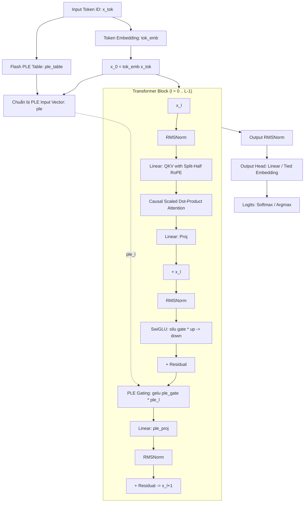

# Chuyên Đề 1: Kiến Trúc Transformer & Cơ Chế Per-Layer Embeddings (PLE)

> **Tập tin phân tích**: [`esp32-ai/src/model.py`](file:///E:/UIT/stm32-develop/esp32-ai/src/model.py), [`esp32-ai/runtime/llm.h`](file:///E:/UIT/stm32-develop/esp32-ai/runtime/llm.h), [`esp32-ai/RESULTS.md`](file:///E:/UIT/stm32-develop/esp32-ai/RESULTS.md)  
> **Chủ đề**: Giải mã kiến trúc mạng nơ-ron Transformer tùy biến và cơ chế tiêm tri thức theo tầng (PLE) mượn từ Google Gemma 3n.

---

## 1. Giới Thiệu Vấn Đề: Nghịch Lý Mô Hình Nhỏ (The Small-Model Paradox)

Trong các kiến trúc Transformer truyền thống (như GPT-2, LLaMA), toàn bộ tri thức tĩnh (factual knowledge, syntactic patterns) và năng lực lập luận (reasoning capacity) bị bó chặt vào:
1. **Bảng nhúng đầu vào (Token Embedding Table)**: Chỉ được tra cứu một lần duy nhất ở lớp đáy cùng (Layer 0).
2. **Các lớp biến đổi dày đặc (Dense Transformer Layers)**: Gồm Self-Attention và Feed-Forward Network (FFN/SwiGLU).

Khi đưa mô hình lên vi điều khiển (MCU) với bộ nhớ SRAM chỉ vài trăm KB:
- Nếu ta làm **mô hình nhỏ đều** (giảm số tầng $L$, giảm số chiều $D$), dung lượng tham số giảm xuống dưới 1M. Mô hình mất hoàn toàn tính mạch lạc ngữ pháp và khả năng duy trì ngữ cảnh.
- Nếu ta **tăng chiều rộng của các lớp biến đổi** để mô hình thông minh hơn, mọi trọng số trong các lớp này đều bắt buộc phải được CPU đọc và tính toán (MatMul) ở **từng token một**. Bộ nhớ PSRAM/SRAM không đủ chỗ chứa, hoặc vi điều khiển sẽ bị bóp nghẽn tốc độ tính toán nghiêm trọng.

**Giải pháp đột phá**: Google giới thiệu **Per-Layer Embeddings (PLE)** trong dòng mô hình [Gemma 3n](https://ai.google.dev/gemma/docs/gemma-3n). Dự án `esp32-ai` đã đưa ý tưởng này xuống mức vi điều khiển: **Tách biệt rạch ròi giữa Năng lực tính toán (Compute Core) và Dung lượng lưu trữ tri thức (Lookup Table)**.

---

## 2. Chi Tiết Kiến Trúc Mạng TinyLM Trong `esp32-ai`

Mô hình trong [`src/model.py`](file:///E:/UIT/stm32-develop/esp32-ai/src/model.py) là một Decoder-only Transformer hiện đại với các thành phần tinh gọn:



### Các Siêu Tham Số Mặc Định (Cấu Hình Deployable TinyStories)
- **Kích thước từ vựng ($V_{\text{in}}$)**: 32,768 (Active output vocabulary $V_{\text{out}} = 25,353$).
- **Số lớp ($L$)**: 6 layers.
- **Số chiều ẩn ($D = d_{\text{model}}$)**: 96.
- **Số đầu Attention ($H$)**: 4 heads $\rightarrow$ Kích thước mỗi đầu $D_h = D / H = 24$.
- **Chiều rộng FFN ẩn ($F = \text{ffn\_hidden}$)**: 66 (SwiGLU gồm 3 ma trận: `gate`, `up`, `down`).
- **Số chiều PLE ($P = \text{ple\_dim}$)**: 128.
- **Độ dài chuỗi tối đa ($S = \text{seq\_len}$)**: 512.
- **Hệ số RoPE ($\theta$)**: 10,000.0.

---

## 3. Cơ Chế Toán Học Của Per-Layer Embeddings (PLE)

Cơ chế PLE can thiệp vào mô hình ở hai vị trí: **Giai đoạn tiền xử lý vector tầng (Pre-computation)** và **Giai đoạn tiêm tri thức vào từng Block Transformer (Layer Gating)**.

### Bước 1: Tính Toán Vector Nhúng Tầng (Per-Layer Input Preparation)

Tại mỗi bước giải mã token thứ $t$ có ID là $k$:

$$x = \text{tok\_emb}[k] \in \mathbb{R}^D$$

Vector đại diện PLE được tổng hợp từ hai thành phần:
1. **Thành phần bối cảnh hóa (Context-aware projection)**: Chiếu từ $x$ lên không gian đa tầng $L \times P$:
   $$v_{\text{proj}} = \frac{1}{\sqrt{D}} \cdot \left( W_{\text{model\_proj}} \cdot x \right) \in \mathbb{R}^{L \times P}$$
   Mỗi lát cắt theo tầng $l$ ($v_{\text{proj}, l} \in \mathbb{R}^P$) được chuẩn hóa độc lập bằng RMSNorm:
   $$\hat{v}_{\text{proj}, l} = \text{RMSNorm}(v_{\text{proj}, l}, W_{\text{ple\_proj\_norm}})$$

2. **Thành phần tra cứu tĩnh (Static Table Lookup)**: Đọc trực tiếp từ bảng nhúng khổng lồ lưu trên Flash:
   $$v_{\text{table}} = \text{ple\_table}[k] \in \mathbb{R}^{L \times P}$$

Hai thành phần được kết hợp theo công thức:

$$\text{ple}_l = \frac{\hat{v}_{\text{proj}, l} + v_{\text{table}, l} \cdot \sqrt{P}}{\sqrt{2}} \quad \in \mathbb{R}^P \quad (\forall l \in [0, L-1])$$

> [!IMPORTANT]
> **Điểm mấu chốt trong cài đặt:**
> - Nhân tố tỉ lệ $\sqrt{P}$ được áp dụng trực tiếp cho giá trị tra bảng $v_{\text{table}}$ trong lúc forward (chứ không phải khởi tạo trọng số nhỏ). Đây là chi tiết không được tài liệu hóa rõ ràng trong config của Google Gemma nhưng có tính chất quyết định sự hội tụ (load-bearing factor).
> - Nhân tố $1/\sqrt{2}$ giữ cho phương sai tổng thể luôn ổn định quanh mức 1.

### Bước 2: Điều Kiện Hóa Động Tại Từng Block (Layer Conditioning & Gating)

Khác với cách cộng vector thiên vị (bias) đơn thuần, PLE sử dụng cơ chế **nhân tương tác (Multiplicative Gating)**:

Tại tầng $l$, sau khi trạng thái ẩn $x$ đã đi qua Self-Attention và SwiGLU FFN:

$$g = \text{GELU}(W_{\text{ple\_gate}} \cdot x) \in \mathbb{R}^P$$

Trạng thái ẩn được điều chế trực tiếp bởi vector nhúng tầng $\text{ple}_l$:

$$h = g \odot \text{ple}_l \in \mathbb{R}^P$$

Sau đó được chiếu ngược lại về không gian $D$, chuẩn hóa và cộng vào đường tắt residual:

$$x \leftarrow x + \text{RMSNorm}(W_{\text{ple\_proj}} \cdot h, W_{\text{ple\_norm}})$$

```text
Ý nghĩa vật lý:
Phép nhân nguyên tố (element-wise multiplication g * ple_l) cho phép mạng:
- Nếu g[i] gần 0: Tầng này hoàn toàn triệt tiêu tri thức từ bảng nhúng tại chiều i.
- Nếu ple_l[i] gần 0: Trạng thái ẩn hiện tại không bị ảnh hưởng.
=> Đây là cơ chế điều chế chọn lọc ngữ cảnh thực sự, chứ không phải một hằng số cộng thô thiển.
```

### Bí Quyết Khởi Tạo Trọng Số (Initialization Trick)
Trong hàm khởi tạo `_init` của `TinyLM`:
```python
if cfg.uses_per_layer:
    nn.init.zeros_(block.ple_norm.weight)
```
Trọng số $W_{\text{ple\_norm}}$ của mỗi block được **khởi tạo toàn bộ bằng 0**.
- Điều này biến nhánh PLE thành một **hàm no-op (đồng nhất) tuyệt đối ở bước huấn luyện 0**.
- Nhờ vậy, mọi nhánh mô hình (có PLE hay không) đều bắt đầu tại cùng một điểm xuất phát, triệt tiêu sự may rủi do khởi tạo ngẫu nhiên.

---

## 4. Bằng Chứng Thực Nghiệm: Các Nhánh Kiểm Chứng (Ablation Arms)

Để chứng minh rằng hiệu quả của mô hình đến từ bảng tra cứu trong Flash chứ không phải do "mẹo vặt" kiến trúc, tác giả đã thiết kế 5 nhánh kiểm chứng (Ablation Arms) nghiêm ngặt với **ngân sách Core Parameter được khống chế tương đương nhau (~559K tham số)**:

### 1. Định Nghĩa 5 Nhánh Kiểm Chứng
- `baseline`: Transformer tiêu chuẩn không có PLE, không có bảng phụ.
- `ple`: Kiến trúc đầy đủ gồm Per-layer adapters + Bảng tra cứu Flash 25M tham số.
- `ple_notable`: Giữ nguyên toàn bộ cấu trúc chiếu và cổng gating của PLE, nhưng **bỏ hoàn toàn bảng tra cứu**. Nhánh này dùng để kiểm tra: liệu việc thêm các phép tính nhân tầng có tự mang lại hiệu quả mà không cần bảng Flash hay không?
- `fatembed`: Giữ nguyên tổng số tham số bằng `ple`, nhưng dồn toàn bộ tham số phụ vào bảng nhúng đầu vào siêu rộng ($V \times (L \cdot P)$), sau đó chiếu xuống $d_{\text{model}}$ một lần duy nhất ở đáy (Bottom Injection).
- `bigcore`: Tiêu toàn bộ ngân sách tham số để làm dày các lớp biến đổi lõi (Dense Core).

### 2. Kết Quả Đo Đạc Perplexity (2 Seeds Ngẫu Nhiên)

#### Bảng 1: Cấu hình Deployable (Từ vựng $V = 32,768$, Core $\approx 559\text{K}$)

| Nhánh thí nghiệm | Tham số Core (PSRAM/SRAM) | Tổng tham số | Perplexity (PPL) | Chênh lệch so với Baseline |
|---|---:|---:|---:|---:|
| `baseline` | 559K | 3.7M | 12.58 | — |
| **`ple`** | **558K** | **28.9M** | **11.41** | **+0.098 nats / Cải thiện 9.3% PPL** |
| `fatembed` | 559K | 28.9M | 11.94 | +0.052 nats |

> **Phân tích cốt lõi:**
> 1. `ple` vượt qua `baseline` tới **0.098 nats** (gấp 16 lần độ nhiễu seed $\pm 0.006$).
> 2. `ple` vượt qua `fatembed` tới **0.046 nats**. Điều này chứng minh: **Vị trí tiêm tri thức (Per-layer injection) mang lại giá trị gấp đôi so với việc chỉ nhét tham số ở đáy (Bottom injection)**.

#### Bảng 2: Thí nghiệm kiểm soát Từ vựng nhỏ ($V = 4,096$, Core $\approx 1.5\text{M}$)

| Nhánh thí nghiệm | Perplexity (PPL) | Chênh lệch so với Baseline |
|---|---:|---:|
| `baseline` | 8.21 | — |
| `ple_notable` | 8.35 | **-0.017 (Tệ hơn baseline!)** |
| `fatembed` | 8.26 | -0.006 (Không có tác dụng) |
| `ple` | 8.00 | +0.025 |
| `bigcore` (gấp đôi core) | 6.93 | +0.170 |

---

## 5. Ba Kết Luận Quyết Định Từ Nghiên Cứu

### Kết luận 1: Bảng tra cứu làm việc, không phải hệ thống đường ống (The Table Does The Work, Not The Plumbing)
Nhánh `ple_notable` (có các lớp adapter nhưng không có bảng tra Flash) có kết quả **tệ hơn cả baseline (-0.017 nats)**.
- Lý do: Hệ thống adapter tiêu tốn tham số lõi của mạng vào các ma trận chuyển đổi nhưng không nhận được thông tin đầu vào tương ứng.
- Đóng góp thuần túy của bảng tra cứu Flash ($\text{ple} - \text{ple\_notable}$) là **+0.043 nats**. Bảng trên Flash chính là nguồn gốc duy nhất tạo nên sự cải thiện vượt bậc.

### Kết luận 2: Mở rộng chiều rộng hàng bị bão hòa, nhưng tăng số lượng hàng (Từ vựng) thì không
Thực nghiệm quét chiều rộng bảng (`ple_dim` từ 64 đến 512):
- Tăng `ple_dim` từ 64 $\rightarrow$ 256 làm tăng hiệu quả từ $+0.045 \rightarrow +0.094$ nats, nhưng đến 512 thì chững lại ở $+0.087$ nats.
- Ngược lại, khi mở rộng số hàng qua việc tăng kích thước từ vựng ($V = 4,096 \rightarrow 32,768$), lợi thế của PLE tăng vọt từ **+0.025 nats lên +0.098 nats (tăng gấp gần 4 lần)**.
- **Quy tắc thiết kế cho vi điều khiển**: Hãy dùng từ vựng lớn (32k) để biến Flash thành kho lưu trữ tri thức thưa, vừa rẻ về băng thông, vừa mở rộng quy mô tham số hiệu quả nhất.

### Kết luận 3: PLE là giải pháp tối ưu cho vi điều khiển, dù không phải là năng lực tính toán miễn phí
Trên máy tính để bàn (Desktop/Server), ta có thể đơn giản là mua thêm GPU để mở rộng Dense Core (`bigcore` đạt +0.170 nats). Nhưng trên vi điều khiển như ESP32-S3, kích thước Core bị giới hạn cứng bởi băng thông tính toán và dung lượng SRAM/PSRAM (vài trăm KB đến vài MB). Trong khi đó, bộ nhớ Flash SPI/QIO lại dồi dào (16MB). PLE là kỹ thuật biến đổi phần cứng hoàn hảo để tận dụng lợi thế không gian Flash của MCU.
