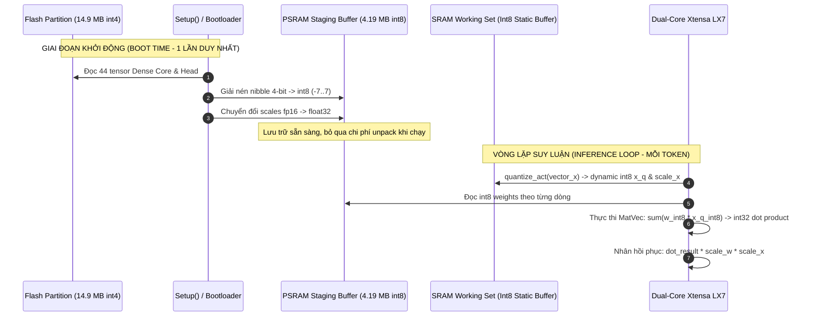

# Chuyên Đề 2: Phân Tầng Bộ Nhớ & Kỹ Thuật Lượng Tử Hóa Trên ESP32-S3

> **Tập tin phân tích**: [`esp32-ai/src/quantize.py`](file:///E:/UIT/stm32-develop/esp32-ai/src/quantize.py), [`esp32-ai/research/tinystories/quantize_eval.py`](file:///E:/UIT/stm32-develop/esp32-ai/research/tinystories/quantize_eval.py), [`esp32-ai/RESULTS.md`](file:///E:/UIT/stm32-develop/esp32-ai/RESULTS.md)  
> **Chủ đề**: Thiết kế phân tầng lưu trữ (SRAM - PSRAM - Flash), đo đạc băng thông thực tế trên chip Xtensa, cơ chế lượng tử hóa 4-bit PTQ, Int8 Staging và Dynamic Int8 Activations.

---

## 1. Cấu Trúc Phần Cứng ESP32-S3 & Bức Tường Bộ Nhớ

Vi điều khiển **ESP32-S3** (bản N16R8) sở hữu cấu hình bộ nhớ phức hợp gồm 3 cấp bậc vật lý hoàn toàn khác biệt:

```text
+---------------------------------------------------------------------------------+
| TẦNG 1: INTERNAL SRAM (512 KB)                                                 |
| - Tốc độ đọc tuần tự: ~240 MB/s (Cực nhanh, truy cập trực tiếp bus nội bộ)       |
| - Đặc điểm: Rất khan hiếm, chia sẻ giữa code hệ thống FreeRTOS, WiFi, stack    |
+---------------------------------------------------------------------------------+
                                      |
                                      v
+---------------------------------------------------------------------------------+
| TẦNG 2: EXTERNAL PSRAM / SPIRAM (8 MB Octal-SPI @ 80MHz)                       |
| - Tốc độ đọc tuần tự: ~60.7 MB/s (Chậm hơn SRAM ~4 lần)                          |
| - Đặc điểm: Đọc tuần tự khá tốt, nhưng đọc ngẫu nhiên có độ trễ lớn            |
+---------------------------------------------------------------------------------+
                                      |
                                      v
+---------------------------------------------------------------------------------+
| TẦNG 3: EXTERNAL FLASH (16 MB Quad/Octal-SPI via MMU XIP)                       |
| - Độ trễ đọc ngẫu nhiên: ~20.3 µs cho mỗi hàng 512 Bytes                        |
| - Đặc điểm: Rất lớn (16 MB), lưu trữ vĩnh viễn, nhưng đọc chậm nhất              |
+---------------------------------------------------------------------------------+
```

Nếu tiếp cận theo cách truyền thống của các thư viện như `llama2.c` hoặc `ggml`:
- Toàn bộ trọng số được coi như một khối dữ liệu phẳng và cố ép vào PSRAM hoặc SRAM.
- Hậu quả: Mô hình bị giới hạn ở mức vài trăm nghìn tham số (chỉ khoảng 260K tham số).

---

## 2. Nguyên Lý Phân Bổ: Ánh Xạ Theo Tần Suất Truy Cập (Access-Frequency Tiering)

Dự án `esp32-ai` đã thiết lập một bảng kế toán bộ nhớ 3 tầng (3-tier accounting) dựa trên **tần suất truy cập thực tế của từng tham số trên mỗi token**:

```mermaid
graph TD
    subgraph TIER1["TẦNG 1: INTERNAL SRAM (Hot Working Set)"]
        SRAM_BUF["- Scratch Activation Buffers: x, qkv, att, g1, g2, ple (21,128 B)\n- Static Int8 Activation Buffers: 2 x 4096 B (8,192 B)\n- RMSNorm Weight Vectors: 20 vectors (4-byte aligned)\n=> TỔNG CỘNG: 29,320 Bytes (~28.6 KB)\n=> SRAM TRỐNG CÒN LẠI: ~294 KB"]
    end

    subgraph TIER2["TẦNG 2: EXTERNAL PSRAM (Sequential Scan & Dynamic State)"]
        PSRAM_BUF["- Staged Int8 Dense Core & Head: 44 tensors (4.19 MB)\n- KV Cache (L=6, S=512, D=96): 1.1 MB\n- Logits Array (25,353 floats): 99 KB\n=> TỔNG CỘNG: ~4.19 MB\n=> PSRAM TRỐNG CÒN LẠI: ~3.74 MB"]
    end

    subgraph TIER3["TẦNG 3: EXTERNAL FLASH (Sparse Random Read)"]
        FLASH_BUF["- 25M-Parameter PLE Lookup Table (int4): ~12.1 MB\n- Token Embedding Table: ~1.6 MB\n- Firmware Application Binary: ~619 KB\n=> Phân vùng model: 0x110000 (15.6 MB mmap)"]
    end

    TIER1 -.->|Truy cập hàng nghìn lần / token| CPU[2x Xtensa LX7 Cores @ 240MHz]
    TIER2 -.->|Quét tuần tự 1 lần / token| CPU
    TIER3 -.->|Đọc thưa ~6 hàng (~450 B) / token| CPU
```

### Tại Sao Bảng Tra Cứu 25M Tham Số Trong Flash Không Làm Nghẽn Hệ Thống?
Phép đo thực tế trên phần cứng thật (`firmware/benchmarks/bandwidth`, đo bằng thanh ghi chu kỳ xung nhịp phần cứng Xtensa `ccount`):

| Phép đo phần cứng | Giá trị đo đạc | Ý nghĩa kỹ thuật |
|---|---|---|
| **PSRAM sequential read** | **60.7 MB/s** | Băng thông đọc quét tuần tự trọng số lõi |
| **Internal SRAM read** | **240.0 MB/s** | Băng thông các vector kích hoạt nóng |
| **Flash random-read (512B row)** | **20.3 µs** | Độ trễ đọc ngẫu nhiên qua cache MMU của Flash |
| **Chi phí đọc TABLE (6 hàng ngẫu nhiên)** | **~0.12 ms / token** | **Chỉ chiếm ~0.7% thời gian truy xuất bộ nhớ** |
| **Chi phí quét HEAD (1.5 MB PSRAM)** | **~17.3 ms / token** | Chiếm đến ~99.3% lưu lượng bộ nhớ |
| **Trần lý thuyết băng thông (Ceiling)** | **~58 tok/s** | Giới hạn tối đa nếu không bị nghẽn tính toán |

> [!NOTE]
> **Điểm mấu chốt**: Vì bảng PLE là bảng tra cứu (Lookup Table), mỗi token mới sinh ra chỉ cần đọc đúng hàng tương ứng với ID token đó tại mỗi tầng. Với 6 tầng và `ple_dim=128`, mô hình chỉ rút ra $6 \times 64 = 384$ bytes dữ liệu nén. Thời gian rút 384 bytes từ Flash chỉ tốn **0.12 ms**. Trọng số Flash là **hoàn toàn miễn phí về mặt băng thông**!

---

## 3. Chiến Lược Lượng Tử Hóa: 4-Bit Group-Wise PTQ

Mô hình sử dụng chuẩn lượng tử hóa đối xứng sau huấn luyện (Post-Training Quantization - PTQ) tương tự chuẩn GGUF Q4:

### 1. Công Thức Toán Học ([`src/quantize.py`](file:///E:/UIT/stm32-develop/esp32-ai/src/quantize.py))
Chia mỗi hàng trọng số thành các nhóm (groups) có kích thước cố định $G = 128$:
- Với mỗi nhóm $j$, tìm giá trị tuyệt đối lớn nhất:
  $$\text{scale}_j = \frac{\max_{w \in \text{group}_j} |w|}{q_{\max}} \quad (\text{với } q_{\max} = 2^{4-1} - 1 = 7)$$
- Giá trị scale được làm tròn về chuẩn số thực nửa chính xác **IEEE fp16 (16-bit float)** trước khi lượng tử hóa để đảm bảo kết quả nén khớp hoàn toàn bit-level với phần cứng:
  $$\text{scale}_{j, \text{fp16}} = \text{float16}(\text{scale}_j)$$
- Lượng tử hóa từng trọng số về giá trị nguyên có dấu $[-7, 7]$:
  $$q = \text{clamp}\left( \text{round}\left( \frac{w}{\text{scale}_{j, \text{fp16}}} \right), -7, 7 \right)$$
- Khôi phục (Dequantize):
  $$\hat{w} = q \cdot \text{scale}_{j, \text{fp16}}$$

### 2. Định Dạng Đóng Gói Nhị Phân Ragged Nibbles
Trọng số 4-bit được dịch mức về $[0, 15]$ (`code = q + 8`) và đóng gói 2 giá trị vào 1 byte (`uint8_t`):
```text
Byte i:
+-------------------+-------------------+
|  Hi-Nibble (4-bit)|  Lo-Nibble (4-bit)|
|    Weight[2*i+1]  |     Weight[2*i]   |
+-------------------+-------------------+
```
- Không thêm byte đệm (zero padding) ở cuối hàng nếu số cột lẻ $\rightarrow$ Tiết kiệm từng byte để tổng kích thước mô hình 28.9M tham số ép vừa vặn trong **14.91 MB** (khớp với phân vùng Flash 15.6 MB).
- Các vector RMSNorm và bias được giữ nguyên ở dạng **fp32** vì dung lượng của chúng không đáng kể.

---

## 4. Hiện Tượng Kỳ Diệu: PLE Bền Vững Kỳ Lạ Với Lượng Tử Hóa 4-Bit

Khi chuyển đổi mô hình từ `fp32` sang `int4` (PTQ), toàn bộ các mô hình đều bị suy giảm chất lượng (Perplexity tăng). Tuy nhiên, thực nghiệm trên 2 hạt giống ngẫu nhiên (seeds) cho thấy:

| Nhánh kiến trúc | Độ suy hao khi chuyển fp32 $\rightarrow$ int4 (Group 64) | Độ suy hao sang định dạng phân phối (Group 128, fp16) |
|---|---|---|
| `baseline` (Mô hình chuẩn) | **+0.079 / +0.088 nats** (~1.1 PPL) | **+0.089 / +0.109 nats** |
| `ple` (Mô hình có bảng Flash) | **+0.055 / +0.061 nats** (~0.7 PPL) | **+0.063 / +0.089 nats** |
| `fatembed` (Mô hình bảng ở đáy) | **+0.046 / +0.050 nats** | **+0.056 / +0.061 nats** |

> [!IMPORTANT]
> **Phân tích hiện tượng:**
> - Khoảng cách chênh lệch chất lượng giữa `ple` và `baseline`:
>   * Ở dạng `fp32`: Ưu thế của PLE là **+0.101 / +0.095 nats**.
>   * Ở dạng `int4` Group 128: Ưu thế của PLE là **+0.127 / +0.115 nats** $\rightarrow$ **Giữ lại 121% - 126% ưu thế!**
> - **Nguyên nhân toán học**: Các lớp biến đổi lõi dày đặc (Dense Layers) chịu áp lực biểu diễn rất cao, việc cắt giảm từ 32-bit xuống 4-bit gây mất mát thông tin nghiêm trọng. Ngược lại, bảng tra cứu PLE khổng lồ (25M tham số) đóng vai trò như một **bộ nhớ liên kết phân tán (distributed associative memory)** có tính dư thừa tự nhiên. Mất mát một vài bit bậc thấp trong từng hàng không làm sai lệch hướng biểu diễn ngữ nghĩa.
> - **Hệ quả thực tiễn**: Không cần dùng đến kỹ thuật Huấn luyện Nhận thức Lượng tử hóa (Quantization-Aware Training - QAT) tốn kém; chỉ cần PTQ trực tiếp là đủ triển khai.

---

## 5. Tối Ưu Tốc Độ: Int8 Staging & Dynamic Int8 Activations

Mặc dù Flash lưu trữ ở chuẩn 4-bit, việc giải nén (unpack) từng cặp nibble và chuyển đổi `fp16` sang `fp32` trong vòng lặp sinh token làm giảm tốc độ suy luận xuống chỉ còn **0.57 tok/s**.

Để đạt tốc độ **9.88 tok/s**, runtime áp dụng 2 bước chuyển hóa trọng số:



### 1. Int8 Staging Trong PSRAM Khi Khởi Động ([`llm_stage_int8`](file:///E:/UIT/stm32-develop/esp32-ai/runtime/llm.h#L370-L387))
- Khi hệ thống khởi động (`setup()`), hàm `llm_stage_core_int8_alloc` quét toàn bộ 44 tensor của Dense Core và Output Head.
- Trọng số 4-bit được bung thành `int8_t` (chiếm gấp đôi dung lượng, tốn 4.19 MB PSRAM). Vì PSRAM có tới 8 MB nên việc tiêu tốn 4.19 MB là hoàn toàn hợp lý.
- Toàn bộ giá trị scale `fp16` được giải mã thành số thực `float32` một lần duy nhất.
- Khi bước vào vòng lặp giải mã, vi điều khiển đọc thẳng mảng `int8_t*` mà không tốn một chu kỳ CPU nào cho việc dịch bit.

### 2. Lượng Tử Hóa Vector Kích Hoạt Động (Dynamic Int8 Activations - [`quantize_act`](file:///E:/UIT/stm32-develop/esp32-ai/runtime/llm.h#L180-L189))
Trong mỗi phép nhân ma trận - vector ($y = W \cdot x$):
1. Vector đầu vào $x$ (float32) được quét để tìm giá trị biên lớn nhất $x_{\max} = \max_i |x_i|$.
2. Tính tỉ lệ nén: $s_x = x_{\max} / 127.0$.
3. Lượng tử hóa nhanh sang số nguyên có dấu 8-bit:
   $$x_{q}[i] = \text{int8}\left( \text{round}\left( \frac{x_i}{s_x} \right) \right)$$
4. Phép tích vô hướng giữa hàng ma trận và vector chuyển thành phép toán số nguyên:
   $$\text{acc}_{\text{int32}} = \sum_{j} w_{\text{int8}}[j] \cdot x_q[j]$$
5. Kết quả float32 được khôi phục ở cấp độ nhóm (group):
   $$y[r] = \left( \sum_{\text{groups}} \text{acc}_g \cdot \text{scale}_g \right) \cdot s_x$$

### Kiểm Chứng Độ Chính Xác (Perplexity Validation)
Việc chuyển từ float32 sang int8 activation có làm mô hình nói nhảm không?
- Kiểm chứng trên 32,768 dự đoán (`runtime/host_verify/ppl.c`):
  * Mất mát Cross-Entropy gốc (fp32): **2.4793**
  * Mất mát Cross-Entropy khi dùng int8 activation: **2.4796**
  * Chênh lệch: **+0.0003 nats** (Perplexity từ 11.93 sang 11.94 $\rightarrow$ **Sai số gần như bằng 0 tuyệt đối**).
- Đổi lại: Tốc độ tăng từ **6.22 tok/s lên 9.88 tok/s**!
