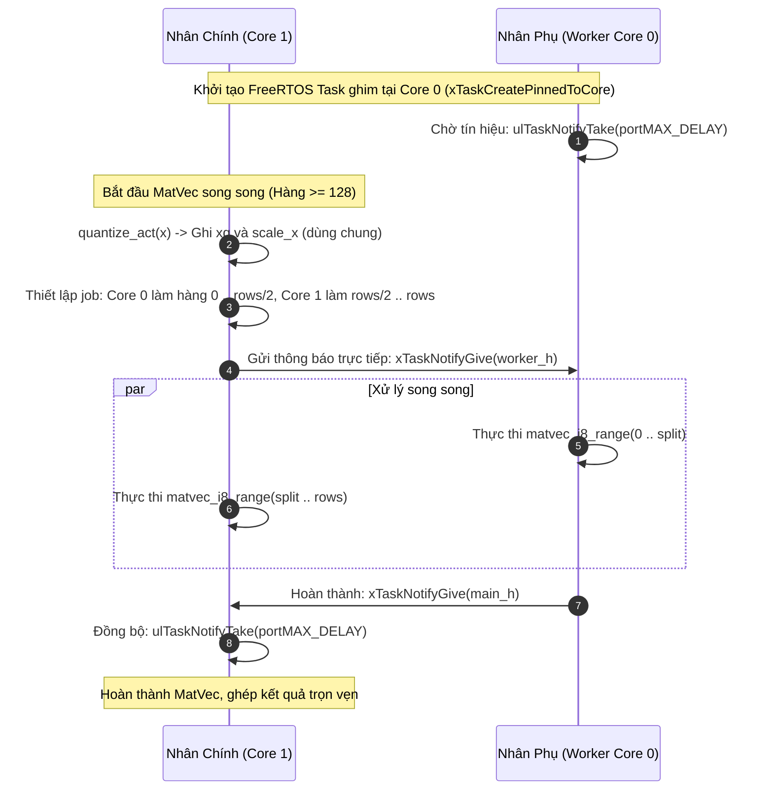

# Chuyên Đề 3: Kiến Trúc C-Runtime Engine Tối Giản (`runtime/llm.h`)

> **Tập tin phân tích**: [`esp32-ai/runtime/llm.h`](file:///E:/UIT/stm32-develop/esp32-ai/runtime/llm.h), [`esp32-ai/firmware/esp32_tinystories/esp32_tinystories.ino`](file:///E:/UIT/stm32-develop/esp32-ai/firmware/esp32_tinystories/esp32_tinystories.ino)  
> **Chủ đề**: Phân tích chi tiết engine suy luận thuần C99 (Zero-dependency Single-Header), định dạng nhị phân, xử lý số học, đa luồng đa nhân FreeRTOS và phân tích điểm nghẽn hiệu năng (Profiling).

---

## 1. Triết Lý Thiết Kế Của `llm.h`

Khác với các thư viện cồng kềnh như ONNX Runtime, TFLite-Micro hay GGML (với hàng nghìn dòng code trừu tượng, cây toán tử động và cơ chế cấp phát động phức tạp), tập tin [`runtime/llm.h`](file:///E:/UIT/stm32-develop/esp32-ai/runtime/llm.h) chỉ vỏn vẹn **561 dòng C chuẩn (C99)** với các nguyên tắc khắc kỷ:

1. **Single-Header Library**: Toàn bộ định nghĩa cấu trúc, parser nhị phân, các phép toán đại số tuyến tính và vòng lặp giải mã nằm trọn trong 1 file `.h`.
2. **Khả Năng Chạy Kép (Dual-Environment Portability)**:
   - Cùng một file `llm.h` được biên dịch trên máy trạm (Host: Linux/macOS/Windows) để đối chiếu sai số với PyTorch golden tensor (`runtime/host_verify/verify.c`).
   - Cùng code đó được biên dịch bằng GCC Xtensa trên ESP32-S3 mà không cần sửa đổi logic tính toán.
3. **Không Cấp Phát Động Khi Đang Giải Mã (Zero Dynamic Allocation During Decode)**:
   - Toàn bộ bộ nhớ trung gian (scratch buffers) và KV Cache được cấp phát một lần duy nhất lúc khởi động (`setup()`).
   - Trong suốt quá trình sinh token (`llm_forward`), tuyệt đối không có lệnh `malloc()`, `free()` hay tái định cỡ mảng nào, triệt tiêu nguy cơ phân mảnh heap (heap fragmentation) và tràn stack.

---

## 2. Cấu Trúc Nhị Phân Định Dạng Mô Hình (`model.bin`)

Định dạng mô hình được thiết kế để nạp trực tiếp qua cơ chế **Memory-Mapped I/O (mmap / XIP)**:

```text
Offset (Bytes)   Kích thước     Kiểu dữ liệu     Nội dung
0                4              uint32           Magic: 0x00454C50 ("PLE\0")
4                4              uint32           Phiên bản định dạng (Version = 1)
8                4              uint32           Độ dài Header (Header Bytes = 56)
12               4              uint32           Cờ cấu hình (Bit 0: TIED_HEAD)
16               4              uint32           Kích thước từ vựng đầu vào (Vin)
20               4              uint32           Kích thước từ vựng đầu ra (Vout)
24               4              int32            d_model (D)
28               4              int32            n_layers (L)
32               4              int32            n_heads (H)
36               4              int32            ffn_hidden (F)
40               4              int32            ple_dim (P)
44               4              int32            seq_len (S)
48               4              int32            group size (G = 128)
52               4              float32          rope_theta (10000.0)
---------------------------------------------------------------------------------
56               Biến thiên     Chuỗi Tensor     Các tensor được sắp xếp cố định:
                                                 1. tok_emb (Q)
                                                 2. ple_model_proj (Q)
                                                 3. ple_proj_norm (F)
                                                 4. ple_table (Q)
                                                 5. Lặp L tầng:
                                                    - attn_norm (F)
                                                    - qkv (Q)
                                                    - attn_proj (Q)
                                                    - ffn_norm (F)
                                                    - gate, up, down (Q)
                                                    - ple_gate, ple_proj (Q)
                                                    - ple_norm (F)
                                                 6. out_norm (F)
                                                 7. out_head (Q, nếu untied)
```

### Cơ Chế Liên Kết Trọng Số Tại Chỗ (`bind_q` & `bind_f`)
Khi gọi hàm `llm_load(base, &model)`:
- Runtime duyệt con trỏ `p` qua mảng byte được mmap từ Flash partition `0x110000`.
- Các tensor lượng tử hóa (`QT`) chỉ lưu lại con trỏ `codes` và `scales` trỏ thẳng vào Flash, không sao chép dữ liệu.
- Xử lý bất đối xứng căn chỉnh bộ nhớ (Unaligned memory access): Vì các tensor `fp32` (như RMSNorm) nằm ngay sau các tensor nén byte lẻ, địa chỉ của chúng có thể không chia hết cho 4. Hàm `rmsnorm()` kiểm tra địa chỉ con trỏ: nếu bị lệch 4-byte, hàm dùng `memcpy` an toàn để nạp dữ liệu vào thanh ghi float, tránh lỗi ngoại lệ truy cập bộ nhớ phần cứng (alignment fault).

---

## 3. Các Phép Toán Cốt Lõi Trong `llm.h`

### 1. Split-Half RoPE (Rotary Positional Embedding) Tối Ưu
Trong kiến trúc Transformer hiện đại, mã hóa vị trí RoPE áp dụng xoay vector 2D trên từng cặp chiều.
Trong `llm.h`, bảng sin/cos cho RoPE được tính **một lần duy nhất cho mỗi vị trí token** thay vì tính lặp đi lặp lại $L \times H$ lần:
```c
// Tái sử dụng vùng đệm s->trow đã hết nhiệm vụ sau bước PLE
float *rope_c = s->trow, *rope_s = s->trow + Dh / 2;
for (int i = 0; i < Dh / 2; i++) {
  float freq = powf(m->c.rope_theta, -2.f * i / Dh);
  rope_c[i] = cosf(pos * freq);
  rope_s[i] = sinf(pos * freq);
}
```
Khi áp dụng lên từng đầu Attention, phép xoay split-half được thực hiện trực tiếp:
```c
float q1 = qh[i], q2 = qh[i + Dh / 2];
qh[i] = q1 * c - q2 * sn;
qh[i + Dh / 2] = q2 * c + q1 * sn;
```

### 2. Causal Self-Attention Ổn Định Số Học (Numerically Stable Softmax)
Nhằm tránh tràn số khi tính $\exp(x)$, phép Attention được tách thành 2 lượt quét:
- **Lượt 1**: Tính tích vô hướng $q \cdot k^T / \sqrt{D_h}$, lưu vào `scores[t]` và tìm giá trị lớn nhất $S_{\max} = \max_t \text{scores}[t]$.
- **Lượt 2**: Tính trọng số chuẩn hóa $\exp(\text{scores}[t] - S_{\max})$, tính tổng mẫu số và tích lũy trực tiếp vector $v$ vào vector đầu ra `att`.

### 3. SwiGLU FFN
Hàm kích hoạt SwiGLU sử dụng công thức SiLU xấp xỉ nhanh:
$$\text{silu}(x) = \frac{x}{1 + e^{-x}}$$
```c
static inline float silu(float x) { return x / (1.f + expf(-x)); }
// Trong vòng lặp FFN:
for (int i = 0; i < F; i++) s->g1[i] = silu(s->g1[i]) * s->g2[i];
```

---

## 4. Tối Ưu Hóa Đa Nhân Trên Xtensa LX7 (Dual-Core Execution)

Chip ESP32-S3 tích hợp 2 nhân xử lý Tensilica Xtensa LX7 chạy ở xung nhịp 240 MHz. Để khai thác tối đa năng lực phần cứng, `esp32-ai` triển khai mô hình song song đa nhân nhẹ (Lightweight Core Fork-Join):



### Tại Sao Dùng Direct Task Notifications Thay Vì Mutex / Semaphore?
- FreeRTOS Mutex hoặc Queue tiêu tốn hàng trăm chu kỳ CPU cho mỗi lần khóa/mở khóa và chuyển đổi ngữ cảnh (context switch).
- Hàm `xTaskNotifyGive()` và `ulTaskNotifyTake()` ghi trực tiếp vào trường cờ hiệu trong TCB (Task Control Block) của tác vụ, độ trễ đánh thức chỉ mất **vài micro giây**.
- **Ngưỡng kích hoạt**: Chỉ các ma trận có $\ge 128$ hàng (`ple_model_proj` 768 hàng, `qkv` 288 hàng, `ple_gate` 128 hàng, và đặc biệt là `out_head` 25,353 hàng) mới kích hoạt song song đa nhân. Dưới 128 hàng, chi phí đánh thức nhân phụ tốn nhiều thời gian hơn là tính tuần tự trên 1 nhân!

### Cảnh Báo Sống Còn Về Trình Biên Dịch: Cấm Inline `matvec_i8_range`
Trong file `llm.h`, hàm nhân ma trận số nguyên được khai báo đặc biệt:
```c
#if defined(__GNUC__)
__attribute__((noinline))
#endif
static void matvec_i8_range(const QT *t, const int8_t *xq, float x_scale,
                            float *y, int row_begin, int row_end)
```
> [!CAUTION]
> **Thực nghiệm đo đạc chỉ ra**: Với Arduino-ESP32 3.3.10 tại cờ tối ưu `-O3`, nếu cho phép trình biên dịch tự ý `inline` hàm này, thời gian suy luận bị **suy giảm nghiêm trọng từ 95.0 ms lên 155.2 ms/token (tệ hơn 63%)**.  
> **Nguyên nhân**: Việc inline hàm nhân ma trận vào nhiều vị trí làm phình to mã máy, gây áp lực tràn thanh ghi (register spilling) ra stack và làm trật bộ nhớ đệm lệnh (Instruction Cache miss) của vi điều khiển. Bắt buộc phải giữ thuộc tính `noinline`.

---

## 5. Phân Tích Điểm Nghẽn Hiệu Năng (Profiling & Bottleneck Analysis)

Đo đạc chi tiết thời gian tiêu tốn cho từng công đoạn trên phần cứng thật (ESP32-S3 240MHz, int8-staged head, dual-core):

```text
TỔNG THỜI GIAN TÍNH TOÁN: 94.9 ms / token (End-to-end: 9.88 tok/s)

+-----------------------+------------+--------------------+
| Công đoạn             | Thời gian  | Tỉ lệ phần trăm   |
+-----------------------+------------+--------------------+
| Output Head (Dual-core)| 59.4 ms   | 62.6%  ███████████ |
| Attention             | 20.5 ms    | 21.6%  ████        |
| SwiGLU FFN            |  6.5 ms    |  6.8%  █           |
| PLE Path              |  6.4 ms    |  6.7%  █           |
| Input Embedding       |  2.2 ms    |  2.3%              |
+-----------------------+------------+--------------------+
```

### Phát Hiện Quan Trọng Nhất: Output Head Bị Nghẽn Bởi Băng Thông PSRAM!
Tại sao tầng Output Head lại chiếm tới **59.4 ms** (gần 63% toàn bộ thời gian suy luận)?
- Kích thước Output Head: $25,353 \times 96 = 2,433,888$ trọng số.
- Ở định dạng `int8`, mỗi token mô hình phải đọc tuần tự **2.43 MB** từ PSRAM.
- Băng thông đọc tuần tự tối đa đo được của PSRAM ESP32-S3 là **60.7 MB/s**.
- Do đó, **giới hạn vật lý tối thiểu (Theoretical Floor)** chỉ để chuyển 2.43 MB qua bus SPI là:
  $$t_{\min} = \frac{2.43 \text{ MB}}{60.7 \text{ MB/s}} \approx 40.0 \text{ ms}$$
- Trong tổng số 59.4 ms của Output Head:
  * **~40.0 ms là thời gian chờ dữ liệu từ PSRAM di chuyển vào chip**.
  * Chỉ có **~19.4 ms là thời gian tính toán thực tế của 2 nhân CPU**.

### Bài Học Định Hướng Tối Ưu
1. **SIMD Assembly đơn thuần không còn là chìa khóa vàng**: Dù ta có tối ưu hàm nhân tích vô hướng bằng lệnh SIMD hợp ngữ của Xtensa nhanh gấp đôi, ta cũng chỉ rút ngắn được phần tính toán 19.4 ms xuống ~9 ms, trong khi mức sàn 40 ms của băng thông PSRAM vẫn giữ nguyên (tổng cải thiện bị chặn trần ở mức $\approx 15\%$).
2. **Đòn bẩy thực sự để tăng tốc**:
   - **Giảm số byte cần đọc qua bus PSRAM**: Giữ nguyên trọng số Head ở dạng nén 4-bit trong PSRAM và dùng lệnh SIMD để bung nibble trực tiếp trên thanh ghi SRAM.
   - **Tái cấu trúc kiến trúc mô hình**: Áp dụng kỹ thuật **Từ vựng Bất đối xứng (Asymmetric Vocabulary)** như mô hình Barista (chỉ quét 854 class thay vì 25,353 hàng), giúp giảm ngay thời gian Head từ 59.4 ms xuống còn vài micro giây!
