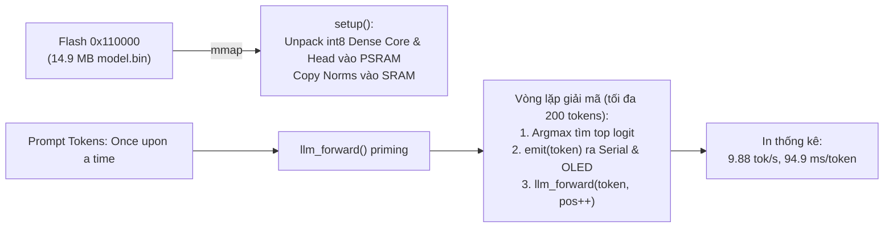
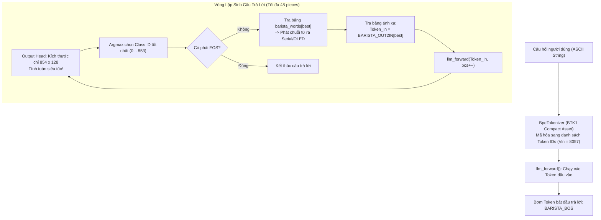

# Chuyên Đề 4: Các Ứng Dụng Thực Tiễn: TinyStories, Barista & Fruit Fly Connectome

> **Tập tin phân tích**: [`esp32-ai/firmware/esp32_tinystories/`](file:///E:/UIT/stm32-develop/esp32-ai/firmware/esp32_tinystories/), [`esp32-ai/firmware/esp32_barista/`](file:///E:/UIT/stm32-develop/esp32-ai/firmware/esp32_barista/), [`esp32-ai/docs/fly-connectome/README.md`](file:///E:/UIT/stm32-develop/esp32-ai/docs/fly-connectome/README.md)  
> **Chủ đề**: Phân tích chi tiết 3 mô hình triển khai thực tế trên vi điều khiển: Mô hình sinh truyện tự do (TinyStories), Mô hình hỏi đáp chuyên biệt với Từ vựng bất đối xứng (Barista), và Mô phỏng mạng nơ-ron sinh học thời gian thực (Fruit Fly Connectome).

---

## 1. Ứng Dụng 1: TinyStories (TinyLM) — Sinh Văn Bản Tự Do

### 1. Mục Tiêu & Dữ Liệu Huấn Luyện
Mô hình TinyStories chứng minh khả năng một vi điều khiển giá rẻ có thể tự mình sinh ra những đoạn văn xuôi tiếng Anh lưu loát, đúng ngữ pháp và duy trì ngữ cảnh mà không cần kết nối Internet:
- **Tập dữ liệu**: Huấn luyện trên 300 MB đầu tiên của bộ dữ liệu nổi tiếng [TinyStories](https://huggingface.co/datasets/roneneldan/TinyStories) (Microsoft Research - Eldan & Li). Bộ dữ liệu gồm các câu chuyện ngắn được sinh bởi GPT-3.5/GPT-4 với từ vựng đơn giản, phù hợp để các mạng nơ-ron nhỏ học sâu về cấu trúc ngữ nghĩa.
- **Quy mô mô hình**: **28.9 triệu tham số**, trong đó 25M tham số là bảng PLE lưu trên Flash (14.9 MB nhị phân 4-bit).

```text
Ví dụ đoạn văn do ESP32-S3 sinh ra hoàn toàn độc lập (tốc độ 9.88 tokens/s):
"Once upon a time, there was a little girl named Lily. She loved to play
outside in the sunshine. One day, she saw a big tree with a hole in it. She
was curious and wanted to see what was inside..."
```

### 2. Luồng Thực Thi Trên Phần Cứng


---

## 2. Ứng Dụng 2: Barista — Hệ Thống Hỏi Đáp Chuyên Miền Với Từ Vựng Bất Đối Xứng (Asymmetric Vocabulary)

Nếu TinyStories đại diện cho tác vụ sinh ngôn ngữ tự do, thì **Barista** là hình mẫu lý tưởng cho các ứng dụng nhúng công nghiệp và thiết bị gia dụng thông minh (Smart Appliances).

```text
+-----------------------------------------------------------------------------------+
| GIAO DIỆN HỎI ĐÁP QUA SERIAL / OLED (128x64 I2C):                                 |
|                                                                                   |
| Q: my espresso is sour what should i do                                           |
| A: grind finer and increase your yield or brew hotter.                           |
| [14 pieces, 843 ms, 16.6 pieces/s]                                                |
+-----------------------------------------------------------------------------------+
```

### 1. Đột Phá Kỹ Thuật: Từ Vựng Bất Đối Xứng (Asymmetric Vocabulary)
Trong các LLM thông thường, từ vựng đầu vào (Input Vocab) và từ vựng đầu ra (Output Vocab) luôn buộc phải giống hệt nhau (thường là 32,000 hoặc 50,000 tokens). Điều này gây ra 2 nhược điểm chết người trên vi điều khiển:
1. **Output Head quá nặng**: Ma trận đầu ra có kích thước $V_{\text{out}} \times D$. Nếu $V_{\text{out}} = 32,768$, phép tính này ngốn tới 60% thời gian của vi điều khiển.
2. **Nguy cơ ảo giác (Hallucination)**: Mô hình có thể sinh ra các từ ngữ ngoài ý muốn hoặc bịa ra các thông số sai lệch (ví dụ bịa ra "grind 2.5 steps finer" dù máy xay không có nấc đó).

**Giải pháp của Barista**:
- **Từ vựng ĐẦU VÀO ($V_{\text{in}} = 8,057$ tokens)**: Cho phép người dùng nhập câu hỏi bằng tiếng Anh tự nhiên với sự đa dạng ngữ nghĩa phong phú.
- **Từ vựng ĐẦU RA ($V_{\text{out}} = 854$ classes)**: Chỉ gồm 854 khái niệm chuyên biệt về cà phê Espresso, từ nối ngữ pháp cơ bản và dấu câu.



### 2. Các Lợi Ích Vượt Trội Của Kiến Trúc Này:
1. **Triệt tiêu ảo giác 100% (Physically Unsayable)**:
   - Các từ nằm ngoài 854 class là **hoàn toàn không thể phát ngôn**.
   - Trong từ điển đầu ra **hoàn toàn không có ký tự chữ số (0-9)**. Mô hình không bao giờ có thể tự bịa ra những con số vô căn cứ!
2. **Tốc độ tăng vọt**:
   - Ma trận Output Head giảm từ $25,353 \times 96$ xuống còn $854 \times 128$ (giảm gần 30 lần khối lượng tính toán).
   - Thời gian tính toán giảm xuống chỉ còn **49.6 ms cho mỗi lượt forward** (đạt tốc độ **16.6 từ/giây** qua Serial).

### 3. Bộ Mã Hóa BPE Thuần C Nhỏ Gọn (`runtime/bpe_tokenizer.h`)
Để người dùng có thể gõ văn bản ASCII bất kỳ qua cổng Serial và vi điều khiển tự phân tích cú pháp, dự án xây dựng bộ mã hóa Byte-Level BPE với định dạng tài nguyên **BTK1**:
- Kích thước binary asset: Chỉ **43,056 bytes**, nhúng trực tiếp trong header C.
- Cấu trúc: 512 bytes bảng tra cứu 256 ký tự đơn + Bảng ghép cặp (Merge table) được sắp xếp sẵn để tìm kiếm nhị phân (`binary search`) với độ phức tạp $O(\log N)$.
- Xác thực an toàn: Kiểm tra nghiêm ngặt mã ASCII, từ chối các ký tự lạ hoặc độ dài vượt quá giới hạn đệm để chống tràn bộ nhớ.

---

## 3. Ứng Dụng 3: Fruit Fly Connectome — Mô Phỏng Mạng Nơ-ron Sinh Học 48k Tế Bào Thần Kinh

Bên cạnh mô hình ngôn ngữ nhân tạo, repository còn chứa một kỳ tích kỹ thuật: **Đưa một phần bộ não sinh học của sinh vật sống lên vi điều khiển**.

```text
+-----------------------------------------------------------------------------------+
| MÀN HÌNH OLED HIỂN THỊ PHẢN XẠ NƠ-RON CỦA RUỒI GIẤM (128x64):                     |
|                                                                                   |
| [####   ]      3/1     [#     ]  <- Thanh năng lượng nơ-ron thoát hiểm Trái/Phải   |
|--------------------------------                                                   |
|            \o/                   <- Ruồi giấm đang bay lượn                         |
|             |        >o<         <- Nhện săn mồi đang bò lại gần                     |
|            / \                                                                    |
+-----------------------------------------------------------------------------------+
```

### 1. Nguồn Dữ Liệu & Quy Mô Đồ Thị
- Trích xuất từ bộ dữ liệu Connectome hệ thần kinh ruồi giấm đực **MaleCNS v1.0** (công bố bởi Janelia Research Campus, Cambridge University & Google Research).
- Số lượng tế bào giữ lại: **48,311 nơ-ron** (thuộc não bộ trung tâm, tế bào phóng chiếu thị giác và tế bào nơ-ron hạ hành).
- Số lượng kết nối có hướng: **9,462,135 liên kết**.
- Tổng số tiếp hợp thần kinh: **49,481,754 khớp tiếp hợp (synaptic contacts)**.

### 2. Định Dạng Nén Đồ Thị Không Mất Mát FCL1 (`runtime/connectome_codec.h`)
Toàn bộ mạng thần kinh 9.46 triệu kết nối được nén thành **13.518 MiB** (nằm vừa trong phân vùng Flash `0x210000`):
- Chia đồ thị thành **1,510 khối độc lập**, mỗi khối chứa danh sách kề của 32 hàng đích.
- Mã hóa delta có sắp xếp (sorted delta encoding) cho chỉ số nơ-ron nguồn.
- Mã hóa biến thiên byte (varint) cho trọng số tiếp hợp (từ 1 đến 1,878).
- Nén từng khối độc lập bằng thuật toán **Raw LZ4** (`runtime/lz4_block_fast.h`). Nhờ vậy, vi điều khiển có thể vừa chạy vừa giải nén từng khối trong PSRAM mà không cần giải nén toàn bộ 25MB đồ thị ra RAM.

### 3. Động Lực Học Mạng & Tối Ưu Hóa SIMD Hợp Ngữ Xtensa
Quy tắc cập nhật trạng thái nơ-ron tại mỗi chu kỳ mô phỏng:

$$\text{scale}_i = \frac{0.7}{\max(\sum_{j} C_{ij}, 1)}$$

$$u_i = \sum_{j} \left( C_{ij} \cdot \text{scale}_i \right) \cdot s_j^{(t-1)}$$

$$s_i^{(t)} = 0.5 \cdot s_i^{(t-1)} + 0.5 \cdot \tanh(u_i + I_i)$$

- Trạng thái nơ-ron $s_i$ được biểu diễn dưới dạng **số thực dấu phẩy tĩnh Q29** (29-bit fractional).
- Tận dụng tập lệnh **SIMD Assembly của Xtensa LX7** trong [`connectome_simd.S`](file:///E:/UIT/stm32-develop/esp32-ai/firmware/esp32_fly/connectome_simd.S): Thực hiện nhân tích lũy vector số nguyên có dấu 32-bit song song trên cả 2 nhân CPU.
- Toàn bộ 9.46 triệu liên kết được duyệt qua sau mỗi **~1.7 giây**.

### 4. Hiện Tượng Hành Vi Nổi Lên Tự Nhiên (Emergent Escape Behavior)
Điều kỳ diệu nhất: **Hệ thống không hề trải qua bất kỳ quá trình huấn luyện (training/backpropagation) nào!**
- Trên màn hình OLED, khi con nhện tiến lại gần từ phía bên trái, kích thước nhện phóng to kích thích các tế bào cảm nhận thị giác nguy hiểm (Looming Detectors: LC4 và LPLC2) ở mắt trái của ruồi.
- Tín hiệu kích thích tự lan truyền qua 9.46 triệu liên kết thần kinh tự nhiên của đồ thị.
- Sau 2 chu kỳ (~3.4 giây), các nơ-ron thoát hiểm hạ hành ở cùng bên (đặc biệt là nơ-ron sợi khổng lồ **DNp01** cùng DNp02, DNp04, DNp11) đạt ngưỡng kích hoạt.
- Con ruồi lập tức thực hiện cú nhảy né sang bên phải để trốn thoát!
- Hành vi sống động này hoàn toàn xuất phát từ **cấu trúc mạng dây sinh học thực tế** được số hóa hoàn hảo trên một vi điều khiển giá 5 USD.
