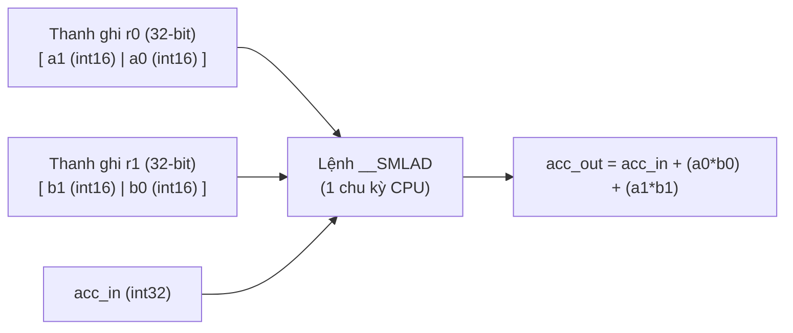
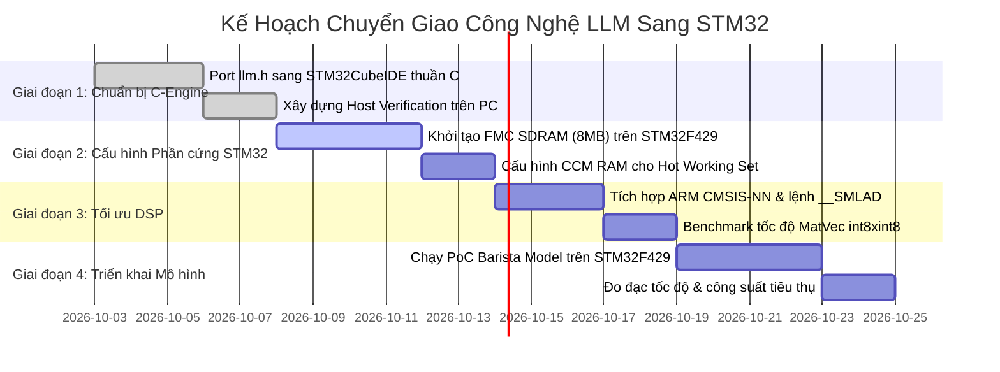

# Chuyên Đề 5: Đánh Giá Khả Năng Chuyển Giao Sang Hệ Vi Điều Khiển STM32

> **Mục tiêu**: Phân tích tính khả thi kỹ thuật và xây dựng lộ trình chuyển giao (Porting & Adaptation) kiến trúc LLM từ `esp32-ai` sang các dòng vi điều khiển **STM32** (trọng tâm là STM32F429 Discovery, STM32H7 và STM32MP1 trong dự án hiện tại).

---

## 1. Bảng So Sánh Phần Cứng: ESP32-S3 vs Hệ Sinh Thái STM32

Để đánh giá tính khả thi khi đưa giải pháp LLM của `esp32-ai` sang STM32, ta đối chiếu các thông số phần cứng then chốt:

| Tiêu chí kỹ thuật | ESP32-S3 (N16R8) | STM32F429ZI (Discovery) | STM32H743 / H747 | STM32MP157 |
|---|---|---|---|---|
| **Kiến trúc CPU** | 2x Xtensa LX7 @ 240MHz | 1x Cortex-M4 @ 180MHz (FPU) | 1x Cortex-M7 @ 480MHz (+ M4 @ 240MHz) | 2x Cortex-A7 @ 800MHz + 1x Cortex-M4 |
| **Tập lệnh DSP/SIMD** | Xtensa custom PIE/SIMD | ARMv7E-M DSP (`__SMLAD`, 2 MACs/cycle) | ARMv7E-M DSP + Dual-issue superscalar | ARM NEON SIMD 128-bit |
| **Internal SRAM** | 512 KB | 256 KB (192KB System + 64KB CCM) | 1,024 KB (1 MB đa phân vùng) | 384 KB (SRAM nội) + DDR3 |
| **Bộ nhớ ngoài RAM** | 8 MB Octal-SPI PSRAM (~60.7 MB/s) | 8 MB 16-bit SDRAM via FMC (~100-140 MB/s) | 32-bit SDRAM via FMC (>300 MB/s) | 512 MB - 1 GB DDR3 (>1000 MB/s) |
| **Bộ nhớ Flash ngoài** | 16 MB SPI/QIO (mmap MMU) | SPI Flash thông thường hoặc NOR Flash trên FMC | OctoSPI / QuadSPI (Memory-Mapped XIP) | eMMC / NAND Flash |
| **Mức tiêu thụ năng lượng** | Trung bình (~100-250 mA) | Thấp (~50-100 mA) | Trung bình (~150-250 mA) | Cao hơn (~300-600 mA) |

---

## 2. Phân Tích Tính Khả Thi Theo Từng Cấp Độ Bộ Nhớ

### 1. Tầng 1: Internal SRAM Cho "Hot Working Set"
- **Yêu cầu của mô hình**:
  * Managed hot-set của `llm.h` chỉ tốn **29,320 Bytes (~28.6 KB)** gồm RMSNorm weights và các vector kích hoạt (`x`, `qkv`, `att`, `g1`, `g2`, `ple`).
- **Trên STM32F429**:
  * STM32F429 sở hữu **64 KB Core Coupled Memory (CCM RAM)** tại địa chỉ `0x10000000`.
  * CCM RAM kết nối trực tiếp với D-bus của lõi Cortex-M4, chạy ở tốc độ 180 MHz không qua bus ma trận (Zero Wait States).
  * **Đánh giá**: **Vượt trội hơn ESP32-S3!** Ta có thể ánh xạ toàn bộ 29.3 KB hot-set vào CCM RAM. Tốc độ đọc ghi vector kích hoạt trên CCM RAM sẽ nhanh hơn đáng kể so với SRAM dùng chung của ESP32.

### 2. Tầng 2: External RAM Cho Dense Core & KV Cache
- **Yêu cầu của mô hình**:
  * Cần khoảng **4.19 MB** cho staged int8 weights và **1.1 MB** cho KV Cache $\rightarrow$ Tổng cộng cần tối thiểu **~5.5 MB RAM**.
- **Trên STM32F429 Discovery Board (`STM32F429I-DISC1`)**:
  * Bo mạch tích hợp sẵn chip SDRAM ngoài **IS42S16400J (64 Mbit = 8 MB)** kết nối qua bộ điều khiển FMC (Flexible Memory Controller) với bus dữ liệu 16-bit chạy ở tần số 90 MHz (HCLK/2).
  * Băng thông đọc tuần tự thực tế của SDRAM FMC 16-bit đạt khoảng **100 - 140 MB/s**, cao gấp đôi so với băng thông PSRAM Octal-SPI của ESP32-S3 (60.7 MB/s)!
  * **Hệ quả cực kỳ quan trọng**: Thời gian nghẽn của Output Head (vốn tốn 40 ms trên ESP32) sẽ giảm xuống còn **~17 - 24 ms trên SDRAM của STM32F429**!

### 3. Tầng 3: External Flash Cho Bảng Tra Cứu PLE (25M Tham Số)
- **Yêu cầu của mô hình**:
  * Cần khoảng **12 MB đến 15 MB** bộ nhớ Flash có khả năng ánh xạ địa chỉ tuyến tính (Memory-Mapped / XIP) để hàm `deq_row()` đọc ngẫu nhiên trực tiếp bằng con trỏ C (`const uint8_t*`).
- **Khả năng đáp ứng trên các dòng STM32**:
  * **Trên STM32F429**: Chip chỉ có 2MB Flash nội và không có phần cứng Quad-SPI Memory-Mapped Mode (chỉ có chuẩn SPI truyền thống). Để ánh xạ XIP trên F429, cần sử dụng chip NOR Flash song song kết nối vào bus FMC (hoặc mô phỏng cơ chế phần mềm nạp từng block SPI).
  * **Trên STM32H7 / STM32L4+ / STM32U5**: Các dòng này tích hợp sẵn ngoại vi **QuadSPI / OctoSPI với Memory-Mapped Mode phần cứng**. Toàn bộ chip Flash ngoài (16MB - 64MB) tự động xuất hiện tại dải địa chỉ `0x90000000`, hoạt động hoàn toàn tương đương với hàm `esp_partition_mmap()` của ESP-IDF!

---

## 3. Khai Thác Sức Mạnh DSP Của ARM Cortex-M: Nhân Lệnh `__SMLAD`

Trên ESP32-S3, runtime `llm.h` hiện tại vẫn sử dụng vòng lặp nhân vô hướng (scalar loop):
```c
static inline int32_t llm_dot_i8(const int8_t *a, const int8_t *b, int n) {
  int32_t acc = 0;
  for (int i = 0; i < n; i++) acc += (int32_t)a[i] * (int32_t)b[i];
  return acc;
}
```

Trên lõi **ARM Cortex-M4 (STM32F4) và Cortex-M7 (STM32H7)**, tập lệnh DSP ARMv7E-M cung cấp lệnh độc quyền:
`__SMLAD` (Signed Multiply with Accumulate Dual):
- Nạp 2 cặp số nguyên có dấu 16-bit từ thanh ghi 32-bit.
- Thực hiện **2 phép nhân và 1 phép cộng tích lũy 32-bit chỉ trong đúng 1 chu kỳ xung nhịp (Single-Cycle Dual MAC)**!



### Hàm Nhân Tối Ưu Hóa Bằng CMSIS DSP Cho STM32:
```c
// Hàm nhân tích vô hướng 8-bit siêu tốc tận dụng __SMLAD trên Cortex-M4/M7
static inline int32_t stm32_dot_i8_dsp(const int8_t *a, const int8_t *b, int n) {
    int32_t acc = 0;
    int i = 0;
    
    // Mở vòng lặp bước 4 (Unrolling by 4), xử lý 4 phép nhân mỗi bước
    for (; i <= n - 4; i += 4) {
        // Nạp 4 byte int8 và mở rộng dấu thành 2 thanh ghi int16x2
        int32_t a32 = *((const int32_t *)(a + i));
        int32_t b32 = *((const int32_t *)(b + i));
        
        int32_t a_lo = __SXTB16(a32);       // byte 0 & 2 sign-extended to 16-bit
        int32_t a_hi = __SXTB16(__ROR(a32, 8)); // byte 1 & 3 sign-extended
        int32_t b_lo = __SXTB16(b32);
        int32_t b_hi = __SXTB16(__ROR(b32, 8));
        
        acc = __SMLAD(a_lo, b_lo, acc);     // 2 MACs trong 1 chu kỳ
        acc = __SMLAD(a_hi, b_hi, acc);     // 2 MACs trong 1 chu kỳ
    }
    // Xử lý các phần tử lẻ còn lại
    for (; i < n; i++) {
        acc += (int32_t)a[i] * (int32_t)b[i];
    }
    return acc;
}
```
Nhờ cải tiến này, tốc độ tính toán thuần (Compute Time) trên mỗi nhân Cortex-M có thể đạt hiệu suất tính toán tương đương, thậm chí vượt trội hơn nhân Xtensa LX7 cùng xung nhịp.

---

## 4. Đề Xuất Chiến Lược Thiết Kế Cho Dự Án STM32 (Actionable Design Recommendations)

Đối với các dự án nhúng trên STM32 (đặc biệt là đề tài nghiên cứu `llm-tts` hiện tại):

### Đề xuất 1: Ưu tiên kiến trúc Từ vựng Bất đối xứng (Mô hình Barista)
- Đừng cố gắng chạy một mô hình 32k tokens sinh văn bản tự do nếu mục tiêu chỉ là giao tiếp người - máy (HMI), điều khiển thiết bị hoặc trả lời trạng thái.
- Mô hình dạng Barista (Input 2,000 - 8,000 tokens, Output 200 - 500 classes):
  * Dung lượng nhị phân chỉ **3 MB - 4 MB** (nằm gọn trong Flash ngoài).
  * Bộ nhớ RAM chỉ cần **1.5 MB - 2 MB**.
  * Tốc độ suy luận trên STM32F429 / STM32H7 ước tính có thể đạt **> 20 - 30 tokens/giây** (thời gian trễ < 40 ms/từ)!

### Đề xuất 2: Tận dụng DMA Prefetching Để Triệt Tiêu Độ Trễ Bộ Nhớ
- Trên vi điều khiển STM32, kênh **DMA2 (STM32F4) hoặc MDMA (STM32H7)** có thể chạy ngầm dưới phần cứng.
- Trong khi CPU Cortex-M đang bận tính tích vô hướng của hàng $r$, DMA có thể nạp trước hàng $r+1$ từ SDRAM FMC vào bộ đệm trong SRAM.
- Kỹ thuật **Double-Buffering (Ping-Pong Buffer)** này sẽ giấu hoàn toàn độ trễ đọc của SDRAM/PSRAM, nâng tốc độ suy luận lên tiệm cận trần lý thuyết!

---

## 5. Lộ Trình Thử Nghiệm Thực Tế (PoC Implementation Roadmap)



### Các Bước Thực Hiện Cụ Thể:
1. **Bước 1 (Xác thực C-Engine)**: Lấy nguyên bản `runtime/llm.h`, tạo một project C console trên máy tính hoặc chạy mô phỏng Keil MDK / STM32CubeIDE để nạp file `model.bin` của Barista/TinyStories và kiểm tra độ khớp kết quả logit.
2. **Bước 2 (Bring-up Bộ nhớ STM32F429)**:
   - Sử dụng CubeMX cấu hình FMC SDRAM (16-bit, Bank 5, địa chỉ `0xD0000000`).
   - Cấu hình file linker `.ld` để dành riêng section `.ccmram` cho scratch buffers và `.sdram` cho staged int8 weights.
3. **Bước 3 (Thử nghiệm với Barista Model)**:
   - Barista là mô hình lý tưởng nhất vì chỉ cần 4.6 MB, có thể lưu trên SDRAM hoặc Flash ngoài và mang lại kết quả thực tế tức thì qua cổng UART nối tiếp.
4. **Bước 4 (Tích hợp TTS)**: Kết hợp kết quả chữ sinh ra từ LLM với bộ tổng hợp giọng nói cực nhẹ (như SanoTTS / PicoTTS) để tạo ra một hệ thống Edge AI thoại hoàn chỉnh trên STM32.
