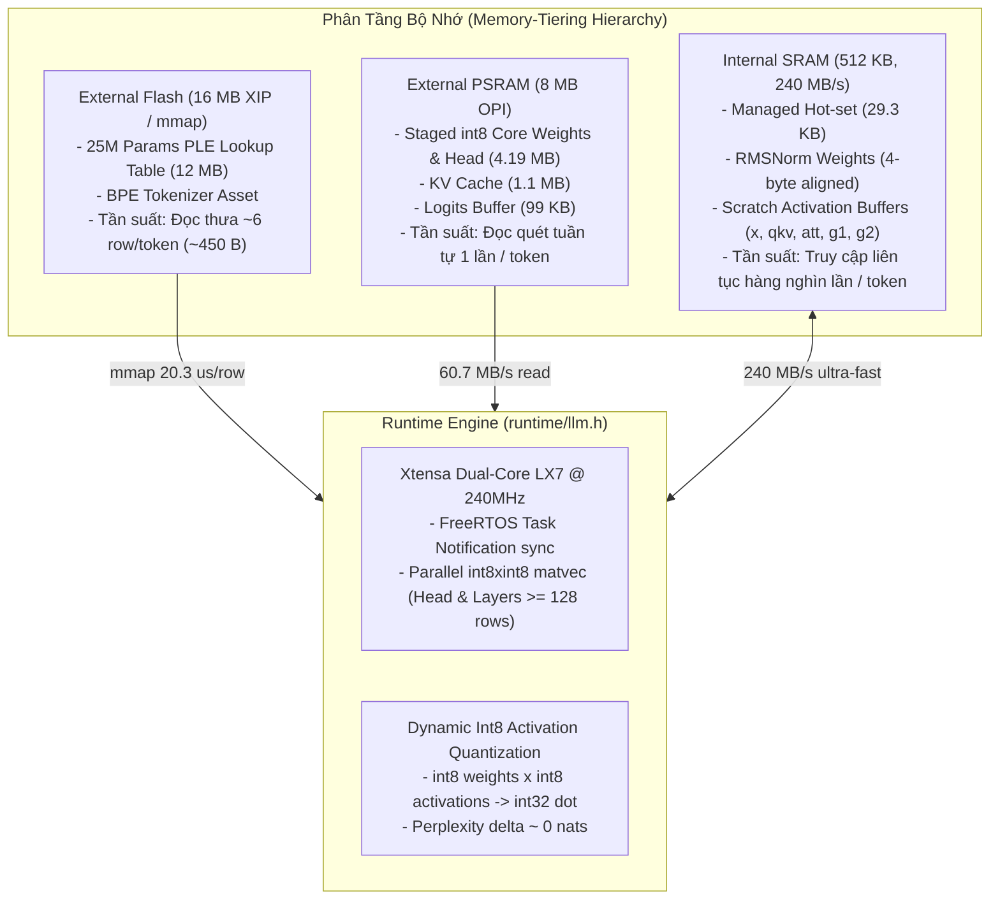

# Báo Cáo Phân Tích Toàn Diện: Giải Pháp Chạy LLM Trên Vi Điều Khiển (ESP32-AI)

> **Tài liệu tham chiếu dự án**: Phân tích giải pháp kỹ thuật từ repository [`esp32-ai`](file:///E:/UIT/stm32-develop/esp32-ai)  
> **Thư mục lưu trữ**: `docs/tasks/llm-tts/researcher/esp32/`  
> **Ngày lập báo cáo**: Tháng 10/2026  
> **Mục tiêu**: Nghiên cứu kiến trúc, thuật toán, cơ chế quản lý bộ nhớ, tối ưu hóa C-runtime và đánh giá khả năng ứng dụng cho hệ vi điều khiển nhúng (ESP32 / STM32).

---

## 1. Tóm Tắt Điều Hành (Executive Summary)

Repository [`esp32-ai`](file:///E:/UIT/stm32-develop/esp32-ai) hiện thực hóa một bước đột phá quan trọng trong lĩnh vực **Edge AI / TinyML**: chạy hoàn toàn độc lập (on-device, zero-cloud) một mô hình ngôn ngữ lớn (LLM) có dung lượng lên đến **28.9 triệu tham số (28.9M parameters)** trên vi điều khiển **ESP32-S3** với tốc độ đạt **9.88 tokens/giây** (thời gian tính toán thuần **94.9 ms/token**) và chất lượng văn bản mạch lạc.

Bên cạnh mô hình sinh ngôn ngữ, repository còn chứng minh tính tổng quát của hệ thống suy luận nhúng qua:
1. **TinyStories (TinyLM)**: Mô hình 28.9M tham số (4-bit PTQ, 14.9 MB), sinh truyện ngắn tiếng Anh mạch lạc từ câu mồi.
2. **Barista**: Mô hình 8.9M tham số cho tác vụ Question-Answering (Hỏi - Đáp) chuyên sâu về pha chế Espresso, sử dụng kỹ thuật **Asymmetric Vocabulary** (đọc 8,057 token BPE, phát sinh 854 class output đặc thù) với độ trễ chỉ **49.6 ms/forward step** (~16.6 từ/giây).
3. **Fruit Fly Connectome**: Mô phỏng mạng nơ-ron sinh học thực tế từ dự án MaleCNS v1.0 gồm **48,311 nơ-ron** và **9.46 triệu khớp thần kinh (synaptic connections)**, chạy nén lossless trong Flash và suy luận đa nhân Xtensa SIMD để điều khiển phản xạ tránh né vật cản thời gian thực.

---

## 2. Thông Số Kỹ Thuật Trọng Tâm (Key Metrics)

| Tiêu chí | Cấu hình triển khai TinyLM (TinyStories) | Cấu hình Barista (Espresso QA) | Cấu hình Connectome (Ruồi giấm) |
|---|---|---|---|
| **Số lượng tham số / Nơ-ron** | **28.9M parameters** (25M trong Flash table) | **8.9M parameters** | **48,311 neurons, 9.46M synapses** |
| **Phần cứng mục tiêu** | ESP32-S3 (512KB SRAM, 8MB PSRAM, 16MB Flash) | ESP32-S3 N16R8 | ESP32-S3 N16R8 |
| **Dung lượng nhị phân** | 14.91 MB (Flash partition `0x110000`) | 4.60 MB (Flash partition `0x110000`) | 13.52 MB FCL1 (`0x210000`) |
| **Dạng lượng tử hóa** | 4-bit Group-wise PTQ (group 128, fp16 scale) | 4-bit Group-wise PTQ | Lossless compression (varint + raw LZ4) |
| **Tốc độ suy luận (Throughput)** | **9.88 tok/s** (end-to-end có màn hình/serial) | **16.6 pieces/s** (60.2 ms/piece) | 1 chu kỳ quyết định / 1.7 giây |
| **Thời gian tính toán (Compute)** | **94.9 ms/token** | **49.6 ms/forward** | ~1.7 s / toàn bộ 9.46M kết nối |
| **Bộ nhớ SRAM sử dụng** | 29,320 bytes (294 KB free) | 31,596 bytes (288 KB free) | Buffers Q29 nội bộ |
| **Bộ nhớ PSRAM sử dụng** | 4.19 MB (3.74 MB free) | ~2.45 MB (5.55 MB free) | Block cache & states |
| **Độ suy hao Perplexity** | Giữ nguyên 121% - 126% ưu thế so với Baseline | Không suy hao hội thoại | Sai số số học Q29 trong ngưỡng cho phép |

---

## 3. Cốt Lõi Đột Phá: Vượt Qua Bức Tường Bộ Nhớ Vi Điều Khiển

Trước công trình này, các dự án chạy LLM trên vi điều khiển (tiêu biểu như `esp32-llm` của DaveBben) chỉ chạy được tối đa khoảng **260,000 tham số (260K params)** do cố gắng ép toàn bộ trọng số vào SRAM hoặc PSRAM.

`esp32-ai` đã mở rộng quy mô tham số lên **~110 lần (28.9M)** nhờ 3 nguyên lý kỹ thuật:

1. **Per-Layer Embeddings (PLE) mượn từ Google Gemma 3n**:
   - Thay vì dồn chiều rộng vào các lớp dày đặc (Dense Transformer Layers) vốn đòi hỏi CPU phải tính toán trên mọi tham số ở mỗi token, mô hình tách phần lớn tri thức thành một **Lookup Table khổng lồ (25M params)**.
   - Bảng này nằm trực tiếp trên Flash (qua cơ chế Flash mmap / XIP). Tại mỗi token, vi điều khiển **chỉ đọc ra khoảng 6 hàng (~450 bytes)** thay vì phải nạp toàn bộ ma trận.
   - Thời gian đọc ngẫu nhiên trên Flash của ESP32-S3 là **20.3 µs/hàng**, dẫn đến chi phí truy xuất bảng chỉ tốn **~0.12 ms/token** (chỉ chiếm **0.7%** tổng băng thông bộ nhớ mỗi token).

2. **Phân Tầng Bộ Nhớ Dựa Trên Tần Suất Truy Cập (Access-Frequency Tiering)**:
   - **Flash (16MB)**: Chứa dữ liệu đọc thưa (Sparse table, Token Embedding).
   - **PSRAM (8MB)**: Chứa Dense Core và Output Head (quét tuần tự 1 lần/token) cùng KV Cache. Trọng số được unpack sẵn thành `int8` để bỏ qua chi phí giải mã nibble trong vòng lặp sinh.
   - **Internal SRAM (512KB)**: Dành riêng cho tập dữ liệu nóng (Hot working set: 29.3 KB) gồm RMSNorm weights và các vector kích hoạt (`scratch buffers`).

3. **Int8 Activation Quantization & Dual-Core Parallelism**:
   - Vector kích hoạt được lượng tử hóa động sang `int8` ở mỗi bước, cho phép chuyển toàn bộ phép nhân ma trận trọng số - vector (MatVec) thành phép nhân số nguyên `int8 x int8 -> int32` cực nhanh, không làm suy giảm độ chính xác perplexity ($\Delta < 0.0003$ nats).
   - Tận dụng FreeRTOS Task Notifications để phân bổ các ma trận lớn ($\ge 128$ hàng, đặc biệt là Output Head vốn chiếm 60% thời gian) chia đôi song song trên cả 2 nhân Xtensa LX7 (240MHz).

---

## 4. Cấu Trúc Bộ Tài Liệu Nghiên Cứu

Bộ tài liệu phân tích chi tiết trong thư mục `docs/tasks/llm-tts/researcher/esp32/` được tổ chức thành 5 chuyên đề chuyên sâu:

| Tập tin | Tiêu đề chuyên đề | Nội dung tóm tắt |
|---|---|---|
| [`01-architecture-and-ple.md`](file:///E:/UIT/stm32-develop/docs/tasks/llm-tts/researcher/esp32/01-architecture-and-ple.md) | **Kiến Trúc Transformer & Cơ Chế Per-Layer Embeddings** | Khảo sát toán học của Gemma PLE, cấu trúc Decoder Block (RMSNorm, RoPE split-half, SwiGLU FFN, PLE gating), các nhánh kiểm chứng (Ablation Arms: baseline, ple, fatembed, bigcore). |
| [`02-memory-hierarchy-and-quantization.md`](file:///E:/UIT/stm32-develop/docs/tasks/llm-tts/researcher/esp32/02-memory-hierarchy-and-quantization.md) | **Phân Tầng Bộ Nhớ & Kỹ Thuật Lượng Tử Hóa** | Thiết kế phân bổ Flash-PSRAM-SRAM, đo đạc băng thông thực nghiệm trên phần cứng, lượng tử hóa 4-bit Group-wise PTQ, cơ chế Int8 Staging và Dynamic Int8 Activations. |
| [`03-c-runtime-engine.md`](file:///E:/UIT/stm32-develop/docs/tasks/llm-tts/researcher/esp32/03-c-runtime-engine.md) | **Kiến Trúc C-Runtime Engine Tối Giản** | Phân tích mã nguồn `runtime/llm.h`, bố cục binary `model.bin`, cơ chế Zero-Allocation lúc chạy, đa luồng đa nhân FreeRTOS, phân tích điểm nghẽn (Profiling & Bottleneck analysis). |
| [`04-models-and-applications.md`](file:///E:/UIT/stm32-develop/docs/tasks/llm-tts/researcher/esp32/04-models-and-applications.md) | **Các Mô Hình Cụ Thể: TinyStories, Barista & Connectome** | Đi sâu vào TinyLM (sinh văn bản), Barista (Asymmetric Vocab, BPE Tokenizer BTK1, chống ảo giác), và mô phỏng mạng nơ-ron sinh học MaleCNS v1.0 bằng SIMD Assembly. |
| [`05-stm32-transferability.md`](file:///E:/UIT/stm32-develop/docs/tasks/llm-tts/researcher/esp32/05-stm32-transferability.md) | **Khả Năng Chuyển Giao Sang STM32 (STM32 Implications)** | Đánh giá tính khả thi khi port giải pháp sang STM32F429 / STM32H7 / STM32MP1, phân tích bộ nhớ FMC/SDRAM/QSPI, tối ưu hóa qua Cortex-M4/M7 DSP SIMD (`__SMLAD`), và lộ trình xây dựng PoC. |

---

## 5. Kết Luận Nhanh

Giải pháp trong `esp32-ai` cung cấp một mẫu hình mẫu mực (blueprint) về cách thiết kế mô hình AI phù hợp với đặc thù vi điều khiển: **không cố gắng thu nhỏ mô hình đồng nhất một cách mù quáng, mà tái cấu trúc mô hình sao cho hình dạng toán học của nó khớp hoàn hảo với cấu trúc phân tầng vật lý của vi điều khiển (Memory-Hardware Co-design)**.
