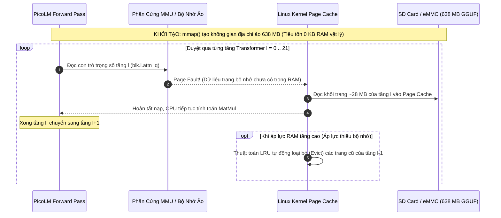

# Chuyên Đề 1: Kiến Trúc Mô Hình & Cơ Chế Streaming Bộ Nhớ Ảo (mmap)

> **Tập tin phân tích**: [`picolm/picolm/model.h`](file:///E:/UIT/stm32-develop/picolm/picolm/model.h), [`picolm/picolm/model.c`](file:///E:/UIT/stm32-develop/picolm/picolm/model.c)  
> **Chủ đề**: Giải mã kiến trúc Transformer LLaMA chuẩn trong PicoLM, bộ nạp tệp GGUF tự phát triển, và cơ chế ánh xạ bộ nhớ ảo `mmap` cho phép chạy mô hình 638 MB trên thiết bị chỉ có 256 MB RAM.

---

## 1. Kiến Trúc Mạng Nơ-ron LLaMA / TinyLlama 1.1B

PicoLM được tối ưu hóa đặc biệt cho dòng kiến trúc **LLaMA** (phiên bản tiêu biểu là **TinyLlama-1.1B-Chat-v1.0**), một trong những kiến trúc decoder-only transformer hiện đại nhất hiện nay.

```mermaid
flowchart TD
    INPUT[Input Token ID] --> EMB_LOOKUP[Token Embedding: token_embd.weight\n(Dequant row sang x[2048])]
    
    subgraph Transformer_Layer["Transformer Block l = 0 .. 21 (22 Lớp)"]
        X_IN[Trạng thái ẩn x[2048]] --> ATTN_NORM[RMSNorm: attn_norm.weight]
        ATTN_NORM --> MATMUL_QKV[MatMul: attn_q (dim->dim), attn_k, attn_v (dim->kv_dim)]
        MATMUL_QKV --> ROPE[Rotary Position Embedding: RoPE Q, K]
        ROPE --> STORE_KV[Ghi K, V vào FP16 KV Cache]
        
        STORE_KV --> FLASH_ATTN[Flash Attention với Online Softmax\n(GQA: 32 Q heads, 4 KV heads)]
        FLASH_ATTN --> ATTN_OUT[MatMul: attn_output (dim->dim)]
        ATTN_OUT --> RES_1[+ Residual x]
        
        RES_1 --> FFN_NORM[RMSNorm: ffn_norm.weight]
        FFN_NORM --> MATMUL_FFN[MatMul: ffn_gate, ffn_up (dim->5632)]
        MATMUL_FFN --> SWIGLU[SwiGLU: silu gate * up]
        SWIGLU --> FFN_DOWN[MatMul: ffn_down (5632->dim)]
        FFN_DOWN --> RES_2[+ Residual x -> Layer tiếp theo]
    end
    
    EMB_LOOKUP --> Transformer_Layer
    Transformer_Layer --> OUT_NORM[Final RMSNorm: output_norm.weight]
    OUT_NORM --> OUT_PROJ[MatMul: output.weight (dim->32000)]
    OUT_PROJ --> LOGITS[Logits Array 32,000 floats]
```

### Các Siêu Tham Số Chi Tiết (TinyLlama 1.1B Config):
- **Số lớp ($n_{\text{layers}}$)**: 22 layers.
- **Số chiều ẩn ($n_{\text{embd}}$)**: 2,048.
- **Số chiều FFN ẩn ($n_{\text{ffn}}$)**: 5,632 (Kiểu SwiGLU gồm 3 ma trận: `gate`, `up`, `down`).
- **Số đầu Query ($n_{\text{heads}}$)**: 32 heads $\rightarrow$ Kích thước mỗi đầu $\text{head\_dim} = 2048 / 32 = 64$.
- **Cơ chế Grouped-Query Attention (GQA)**: $n_{\text{kv\_heads}} = 4$ heads.
  * Tỉ lệ chia sẻ $32 : 4 = 8 : 1$. Cứ 8 đầu Query sẽ dùng chung 1 đầu Key và 1 đầu Value.
  * Điều này giúp kích thước KV Cache giảm đi **8 lần** so với Multi-Head Attention truyền thống!
  * Chiều rộng của vector KV tại mỗi vị trí chỉ là: $\text{kv\_dim} = 4 \times 64 = 256$ floats.
- **Kích thước từ vựng ($\text{vocab\_size}$)**: 32,000 tokens (chuẩn BPE của LLaMA).
- **Độ dài ngữ cảnh tối đa ($\text{max\_seq\_len}$)**: Mặc định 2,048 tokens (có thể ghi đè bằng cờ `-c 512` để tiết kiệm RAM).
- **Hệ số RoPE Base ($\text{rope\_freq\_base}$)**: 10,000.0.

---

## 2. Trình Phân Tích Định Dạng GGUF Tự Chế (Zero-Dependency GGUF Parser)

Định dạng **GGUF** (do nhóm phát triển `llama.cpp` khởi xướng) hiện là tiêu chuẩn vàng của thế giới mã nguồn mở cho các mô hình ngôn ngữ lượng tử hóa.

Thay vì dựa vào các thư viện phức tạp, [`model.c`](file:///E:/UIT/stm32-develop/picolm/picolm/model.c) hiện thực một parser GGUF v2/v3 nguyên khối bằng C:
1. **Kiểm tra Magic Header**: Xác thực 4 byte đầu tiên phải là `0x46554747` (`"GGUF"` theo thứ tự Little-Endian) và phiên bản version phải là 2 hoặc 3.
2. **Đọc Bảng Metadata Key-Value**:
   - Trích xuất tự động các tham số cấu hình mạng: `llama.embedding_length`, `llama.block_count`, `llama.feed_forward_length`, `llama.attention.head_count`, `llama.attention.head_count_kv`.
   - Trích xuất bảng từ vựng BPE (`tokenizer.ggml.tokens`), điểm số token (`tokenizer.ggml.scores`) cùng các ID điều khiển như BOS, EOS.
3. **Liên Kết Danh Sách Tensor**:
   - GGUF lưu trữ metadata của từng tensor gồm: tên chuỗi (ví dụ: `blk.0.attn_q.weight`), kích thước các chiều, kiểu lượng tử hóa (type enum) và offset byte tương đối.
   - Hàm `model_load()` tính toán offset tuyệt đối dựa trên giá trị căn chỉnh `alignment` (mặc định 32 bytes) và gán con trỏ `void*` tương ứng vào cấu trúc `layer_weights_t`.
   - **Hoàn toàn không có thao tác cấp phát hay sao chép mảng trọng số** $\rightarrow$ Thời gian load mô hình chỉ mất vài mili-giây!

---

## 3. Cơ Chế Streaming Bộ Nhớ Ảo: Trái Tim Của PicoLM (`mmap`)

### 1. Nghịch Lý 638 MB vs 256 MB RAM
Mô hình TinyLlama 1.1B nén 4-bit (Q4_K_M) có kích thước tệp là **638 MB**.
Trong khi đó, bo mạch **Sipeed LicheeRV Nano ($9.90)** chỉ có **256 MB RAM** tổng thể (trong đó hệ điều hành Linux và driver đã chiếm khoảng 100 MB).
- Nếu dùng phương pháp nạp truyền thống (`fread()` toàn bộ mô hình vào RAM), hệ thống sẽ bị lỗi **OOM (Out Of Memory)** và kernel sẽ kích hoạt OOM-Killer để tắt ngay tiến trình.
- Làm sao có thể chạy một tệp 638 MB trong khoảng RAM trống chưa đầy 150 MB?

### 2. Giải Pháp: `mmap()` & Cơ Chế Phân Trang Của Nhân Linux (OS Page Paging)
PicoLM không bao giờ đọc toàn bộ tệp vào RAM. Nó chỉ gọi hàm hệ thống:
```c
#ifdef _WIN32
    m->file_handle = CreateFileA(path, GENERIC_READ, FILE_SHARE_READ, NULL, OPEN_EXISTING, ...);
    m->map_handle = CreateFileMappingA(m->file_handle, NULL, PAGE_READONLY, 0, 0, NULL);
    m->mmap_addr = MapViewOfFile(m->map_handle, FILE_MAP_READ, 0, 0, 0);
#else
    m->fd = open(path, O_RDONLY);
    m->mmap_addr = mmap(NULL, m->mmap_size, PROT_READ, MAP_SHARED, m->fd, 0);
#endif
```



### Tại Sao Cơ Chế Này Hoạt Động Hoàn Hảo Với LLM?
1. **Truy Cập Tuyến Tính Theo Tầng (Strict Layer-by-Layer Locality)**:
   - Trong quá trình sinh một token, mô hình Transformer duyệt qua các tầng theo thứ tự tuần tự tuyệt đối: Tầng 0 $\rightarrow$ Tầng 1 $\rightarrow$ ... $\rightarrow$ Tầng 21.
   - Tại bất kỳ một thời điểm nào, CPU **chỉ cần tương tác với trọng số của đúng một tầng duy nhất** (~28 MB trọng số).
2. **Kernel Quản Lý Bộ Nhớ Đệm Tự Động**:
   - Khi CPU chạm tới tầng tiếp theo, phần cứng quản lý bộ nhớ (MMU) gây ra ngắt lỗi trang (**Page Fault**). Nhân Linux lập tức nạp trang dữ liệu 4KB từ thẻ nhớ SD/eMMC vào RAM.
   - Khi RAM vật lý gần đầy, thuật toán **LRU (Least Recently Used)** của Linux tự động thu hồi và giải phóng các trang của các tầng trước đó (vì các trang này chỉ mở ở chế độ `PROT_READ`, kernel chỉ việc hủy bỏ mà không cần ghi ngược lại đĩa).
3. **Mức Tiêu Thụ RAM Vật Lý Thực Tế**:
   - Trọng số mô hình không nằm trong heap của ứng dụng mà nằm trong **Page Cache** của hệ điều hành.
   - Bộ nhớ RAM cấp phát riêng thực tế của PicoLM chỉ cần giữ các vector kích hoạt và KV Cache!

---

## 4. Kế Toán Bộ Nhớ RAM Thực Thi (Runtime Memory Budget)

Toàn bộ bộ nhớ động của PicoLM được cấp phát thành **đúng 2 khối liên tục duy nhất** lúc khởi động:
1. `mem_block`: Chứa toàn bộ các vector kích hoạt nóng, bảng RoPE, trọng số norm giải mã sẵn và bộ nhớ đệm tạm thời.
2. `kv_block`: Chứa bộ nhớ đệm KV Cache kiểu số thực nửa chính xác FP16.

### Bảng Phân Bổ Chi Tiết Cho TinyLlama 1.1B:

| Thành phần dữ liệu trong RAM | Kích thước với ngữ cảnh 512 tokens | Kích thước với ngữ cảnh 2048 tokens | Cơ chế lưu trữ |
|---|---|---|---|
| **FP16 KV Cache** | **11.0 MB** | **44.0 MB** | Cấp phát trong `kv_block` (`uint16_t*`) |
| **BPE Tokenizer Data** | ~4.5 MB | ~4.5 MB | Danh sách chuỗi từ vựng, điểm số, bảng chỉ mục sắp xếp |
| **Activation Buffers** (`x`, `xb`, `xb2`, `q`, `hb`, `hb2`) | 0.14 MB | 0.14 MB | Các vector kích hoạt trung gian |
| **Logits Buffer** (32,000 floats) | 0.12 MB | 0.12 MB | Chứa kết quả xác suất token đầu ra |
| **Pre-computed RoPE Tables** | 0.13 MB | 0.52 MB | Bảng sin/cos tính sẵn cho từng vị trí |
| **Pre-dequantized Norm Weights** | 0.35 MB | 0.35 MB | 45 vector RMSNorm giải mã sẵn sang fp32 |
| **Dequant Scratch Buffer** | 0.50 MB | 0.50 MB | Vùng đệm tạm thời kích thước $\max(n_{\text{embd}}, n_{\text{ffn}})$ |
| **TỔNG BỘ NHỚ RAM TIÊU TỐN** | **~16.7 MB** | **~50.1 MB** | **Phù hợp hoàn hảo cho hệ thống 256MB RAM** |

> [!TIP]
> **Quy tắc vàng cho thiết bị cực kỳ hạn chế RAM (như LicheeRV Nano 256MB)**:
> Chạy lệnh với tùy chọn `-c 512` (giới hạn ngữ cảnh 512 tokens). PicoLM sẽ chỉ tiêu tốn chưa đầy **17 MB RAM**, để lại hơn 130 MB RAM trống cho kernel Linux hoạt động ổn định và duy trì Page Cache cho tệp GGUF mà không bao giờ bị tràn bộ nhớ!
