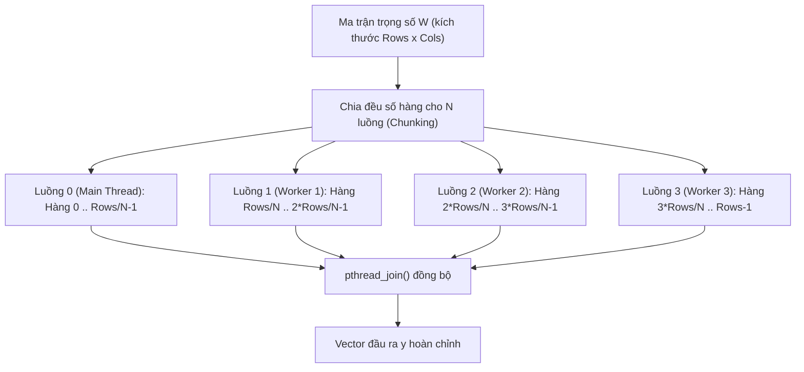
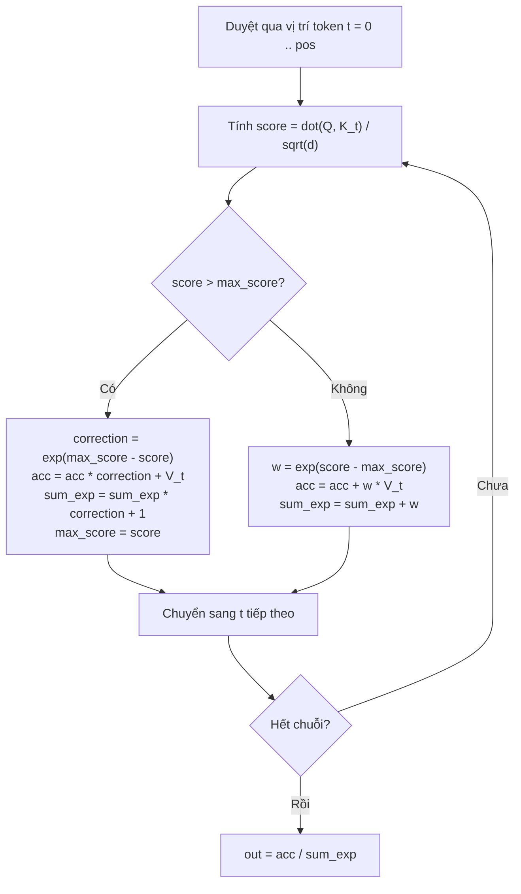

# Chuyên Đề 2: Các Kỹ Thuật Tối Ưu Hóa Tính Toán & Tăng Tốc SIMD

> **Tập tin phân tích**: [`picolm/picolm/quant.c`](file:///E:/UIT/stm32-develop/picolm/picolm/quant.c), [`picolm/picolm/tensor.c`](file:///E:/UIT/stm32-develop/picolm/picolm/tensor.c), [`picolm/picolm/quant.h`](file:///E:/UIT/stm32-develop/picolm/picolm/quant.h), [`picolm/BLOG.md`](file:///E:/UIT/stm32-develop/picolm/BLOG.md)  
> **Chủ đề**: Phân tích chi tiết hành trình tối ưu hóa nâng tốc độ suy luận từ 1.6 tok/s lên 13.5 - 30+ tok/s: Phép nhân hợp nhất Fused Dequant-Dot, đa luồng đa nhân, tập lệnh SIMD ARM NEON/SSE2, Flash Attention (Online Softmax) và nén KV Cache FP16.

---

## 1. Hành Trình Tăng Tốc: Từ 1.6 Đến Hơn 30 Tokens/Giây

Trong bài toán suy luận LLM trên CPU, trở ngại lớn nhất không chỉ là sức mạnh tính toán số học (FLOPs) mà chính là **băng thông bộ nhớ (Memory Bandwidth Bottleneck)**. PicoLM đã trải qua một chuỗi tái cấu trúc thuật toán để loại bỏ triệt để các bước luân chuyển dữ liệu thừa:

```mermaid
graph LR
    O0["1. C-Scalar Thô\n(1.6 tok/s)"] -->|Loại bỏ vùng đệm tạm| O1["2. Fused Dequant-Dot\n(3.0 tok/s - x2)"]
    O1 -->|Chia output rows| O2["3. Multi-Threaded MatMul\n(9.4 tok/s - x3)"]
    O2 -->|Vector hóa 4-wide| O3["4. ARM NEON / SSE2\n(13.5 - 30+ tok/s)"]
    O3 -->|Giảm 50% RAM KV| O4["5. Nén FP16 KV Cache\n(Tăng gấp đôi băng thông Attn)"]
    O4 -->|Triệt tiêu 25k lệnh powf| O5["6. Pre-computed RoPE\n(+5-10% tốc độ)"]
    O5 -->|Online Softmax 1 pass| O6["7. Flash Attention\n(Bỏ mảng điểm Attn O(N))"]
```



---

## 2. Tối Ưu Hóa 1: Phép Nhân Hợp Nhất (Fused Dequantize + Dot Product)

### Vấn Đề Của Cách Làm Truyền Thống (2-Pass Naive MatMul)
Trong các bộ khung thông thường, phép nhân ma trận trọng số lượng tử hóa $W$ với vector kích hoạt $x$ được tách làm 2 lượt:
- **Lượt 1**: Giải nén cả hàng trọng số $W[i]$ từ chuẩn Q4_K ra mảng `float scratch[256]` (tốn 1 KB RAM cho mỗi block).
- **Lượt 2**: Tính tích vô hướng giữa `scratch` và `x`.
- **Hậu quả**: Vi điều khiển phải ghi 1 KB vào RAM rồi lập tức đọc ngược lại. Với hàng chục triệu tham số ở mỗi bước forward, việc này làm nghẽn bus bộ nhớ CPU.

### Giải Pháp Của PicoLM: Tính Tích Vô Hướng Ngay Khi Giải Nén ([`quant.c`](file:///E:/UIT/stm32-develop/picolm/picolm/quant.c))
Hàm `vec_dot_q4_K_f32()` tích lũy trực tiếp giá trị vào các thanh ghi của CPU:
```c
float vec_dot_q4_K_f32(const void *src, const float *x, int n) {
    const block_q4_K *b = (const block_q4_K *)src;
    int nb = n / QK_K; // QK_K = 256 weights per super-block
    float sumf = 0.0f;

    for (int i = 0; i < nb; i++) {
        const uint8_t *q = b[i].qs;
        float d = fp16_to_fp32(b[i].d);
        float dmin = fp16_to_fp32(b[i].dmin);
        // ... Đọc scales và mins của 8 sub-blocks ...
        
        for (int sb = 0; sb < 8; sb++) {
            float sum_qx = 0.0f;
            float sum_x = 0.0f;
            // Tích lũy 32 phần tử trong sub-block trực tiếp vào thanh ghi
            for (int l = 0; l < 32; l++) {
                uint8_t q_val = (l < 16) ? (q[l] & 0x0F) : (q[l - 16] >> 4);
                sum_qx += (float)q_val * x[l]; // Nhân giá trị nguyên với x
                sum_x  += x[l];                // Tính tổng x để bù trừ min
            }
            // Nhân tỉ lệ đúng 1 lần cho cả 32 phần tử:
            sumf += (d * scale) * sum_qx - (dmin * min_val) * sum_x;
            x += 32;
        }
    }
    return sumf;
}
```
> **Kết quả**: Cắt giảm **50% lưu lượng truy xuất bộ nhớ**. Tốc độ tăng ngay lập tức gấp đôi: từ **1.6 lên 3.0 tokens/s**!

---

## 3. Tối Ưu Hóa 2: Đa Luồng Đa Nhân Cho Phép Nhân Ma Trận (Multi-Threaded MatMul)

Phép nhân ma trận - vector ($y = W \cdot x$) có tính chất song song độc lập hoàn hảo theo từng hàng đầu ra $y[i]$:



- **Tối ưu Cache**: Mỗi luồng được giao một dải hàng liên tục trong bộ nhớ (`[start, end)`). Điều này giúp bộ điều khiển bộ nhớ (Memory Controller) và phần cứng Prefetcher của CPU nạp trước dữ liệu liên tục vào L1/L2 Cache cực kỳ hiệu quả.
- **Không lãng phí luồng chính**: Luồng chính (`main thread`) trực tiếp đảm nhận phần việc của Worker 0 trong khi các worker khác chạy, triệt tiêu thời gian nhàn rỗi.
- **Hiệu năng**: Tăng tốc gần như tuyến tính theo số nhân thực (3.0 tok/s $\rightarrow$ **9.4 tok/s trên Raspberry Pi 4** 4 nhân; **13.5 tok/s trên x86** 8 nhân).

---

## 4. Tối Ưu Hóa 3: Tăng Tốc Vector Bằng Tập Lệnh SIMD (ARM NEON & x86 SSE2)

PicoLM tự động phát hiện kiến trúc phần cứng tại thời điểm biên dịch để kích hoạt các hàm nội tại SIMD (Intrinsics):

### 1. Vector Hóa ARM NEON (Cho Raspberry Pi 3/4/5, Cortex-A)
Mỗi thanh ghi NEON 128-bit xử lý đồng thời 4 số thực `float32`.
Trong phép giải mã Q4_K:
```c
// Nạp 8 byte chứa 16 nibble 4-bit
uint8x8_t qbytes = vld1_u8(q + l);
uint8x8_t q_lo = vand_u8(qbytes, vdup_n_u8(0x0F)); // Tách 8 nibble thấp
uint8x8_t q_hi = vshr_n_u8(qbytes, 4);            // Tách 8 nibble cao

// Mở rộng kiểu dữ liệu từ uint8 -> uint16 -> uint32 -> float32
uint16x8_t q_lo16 = vmovl_u8(q_lo);
float32x4_t qf0 = vcvtq_f32_u32(vmovl_u16(vget_low_u16(q_lo16)));
float32x4_t xv0 = vld1q_f32(xp + l); // Nạp 4 số thực đầu vào

// Nhân và tích lũy trong 1 lệnh duy nhất (Fused Multiply-Accumulate):
sum_qx_v = vmlaq_f32(sum_qx_v, qf0, xv0);
sum_x_v  = vaddq_f32(sum_x_v, xv0);
```

### 2. Tương Thích Ngược Với ARM 32-bit (AArch32 trên Pi Zero / Pi 1)
Lệnh cộng ngang toàn bộ thanh ghi `vaddvq_f32` chỉ có trên kiến trúc ARM 64-bit (AArch64). Để đảm bảo chạy được trên bo mạch rẻ nhất như Pi Zero (ARMv7 32-bit), PicoLM cung cấp hàm tương thích:
```c
static inline float vaddvq_f32_compat(float32x4_t v) {
#if defined(__aarch64__)
    return vaddvq_f32(v);
#else
    float32x2_t r = vadd_f32(vget_low_f32(v), vget_high_f32(v));
    return vget_lane_f32(vpadd_f32(r, r), 0);
#endif
}
```

---

## 5. Tối Ưu Hóa 4: Nén KV Cache Sang Chuẩn Số Thực Nửa Chính Xác (FP16 KV Cache)

### Vấn Đề
Trong kiến trúc Transformer, KV Cache lưu trữ toàn bộ các vector Key và Value của các token trước đó để phục vụ cơ chế tự chú ý (Self-Attention).
Với TinyLlama 1.1B (22 layers, ngữ cảnh 512 tokens, 4 KV heads, head_dim 64):
$$\text{Dung lượng float32} = 22 \times 2 \times 512 \times 256 \times 4 \text{ Bytes} \approx \mathbf{22 \text{ MB}}$$
Với ngữ cảnh 2048 tokens, con số này vọt lên **88 MB** (chiếm tới gần 40% RAM của một bo mạch 256MB).

### Giải Pháp
Chuyển đổi toàn bộ KV Cache sang chuẩn số thực nửa chính xác **IEEE 754 FP16 (16-bit uint16_t)**:
- Cắt giảm đúng **50% dung lượng RAM** (22 MB $\rightarrow$ **11 MB** cho 512 tokens; 88 MB $\rightarrow$ **44 MB** cho 2048 tokens).
- Tăng gấp đôi băng thông đọc Attention: CPU chỉ phải nạp một nửa số byte qua bus bộ nhớ cho mỗi vị trí cache.
- **Không cần phần cứng hỗ trợ FP16**: Sử dụng hai hàm chuyển đổi thuần bằng thao tác bit (`fp32_to_fp16` và `fp16_to_fp32`):
```c
uint16_t fp32_to_fp16(float f) {
    uint32_t bits;
    memcpy(&bits, &f, sizeof(float));
    uint32_t sign = (bits >> 16) & 0x8000;
    int exp = (int)((bits >> 23) & 0xFF) - 127 + 15;
    uint32_t mant = bits & 0x7FFFFF;
    if (exp <= 0) return (uint16_t)sign; // Underflow
    if (exp >= 31) return (uint16_t)(sign | 0x7C00); // Overflow / Inf
    mant += 0x00001000; // Round to nearest even
    return (uint16_t)(sign | ((uint32_t)exp << 10) | (mant >> 13));
}
```
> **Độ chính xác**: Các giá trị $K, V$ là các vector trung gian của mạng nơ-ron vốn đã xấp xỉ do lượng tử hóa trọng số. Thử nghiệm thực tế cho thấy kết quả sinh tham lam (Greedy Search) khi dùng FP16 KV Cache **khớp 100% không suy suyển so với float32**!

---

## 6. Tối Ưu Hóa 5: Flash Attention Với Cơ Chế Online Softmax

Phép Self-Attention tiêu chuẩn đòi hỏi 3 lượt quét:
1. Tính ma trận điểm $S = Q \cdot K^T / \sqrt{d}$ (cần cấp phát mảng tạm `scores[seq_len]`).
2. Tìm $\max(S)$ và tính $\text{softmax}(S)$ (cần đọc lại mảng `scores`).
3. Nhân ma trận trọng số Attention với $V$ để tạo vector đầu ra (lượt thứ 3).

### Thuật Toán Online Softmax Của Flash Attention Trong `model.c`:
Thay vì lưu lại toàn bộ mảng điểm, PicoLM tính toán Attention và tích lũy vector $V$ **trong đúng một lượt quét duy nhất (Single-Pass)**:

```c
float max_score = -1e30f;
float sum_exp = 0.0f;
float acc[head_dim]; // Vùng đệm tích lũy vector V
memset(acc, 0, head_dim * sizeof(float));

for (int t = 0; t <= pos; t++) {
    float score = dot_product(qh, kt) / sqrtf(head_dim);

    if (score > max_score) {
        // Tìm thấy giá trị lớn hơn: Tái tỉ lệ hóa các giá trị đã tích lũy trước đó
        float correction = expf(max_score - score);
        sum_exp = sum_exp * correction + 1.0f;
        for (int d = 0; d < head_dim; d++) {
            acc[d] = acc[d] * correction + vt[d];
        }
        max_score = score;
    } else {
        // Điểm số nhỏ hơn: Tích lũy bình thường theo trọng số exp
        float w = expf(score - max_score);
        sum_exp += w;
        for (int d = 0; d < head_dim; d++) {
            acc[d] += w * vt[d];
        }
    }
}
// Chuẩn hóa một lần cuối cùng
for (int d = 0; d < head_dim; d++) {
    out[d] = acc[d] / sum_exp;
}
```



> **Lợi ích**:
> 1. Triệt tiêu hoàn toàn mảng đệm điểm `att[]` (tiết kiệm 64 KB bộ nhớ).
> 2. Chỉ duyệt qua bộ nhớ KV Cache một lần duy nhất thay vì 3 lần, tăng tối đa hiệu suất bộ nhớ đệm CPU L1/L2.

---

## 7. Bài Học Kỹ Thuật Thực Chiến: Sự Cố Căn Chỉnh Scale Q6_K (The Q6_K Debugging War Story)

Trong quá trình phát triển, tác giả gặp một lỗi nghiêm trọng: Mô hình sau khi nạp chạy ra kết quả vô nghĩa (Garbage output), token sinh ra có mã `13288` thay vì `2760` theo chuẩn.

### Quá Trình Điều Tra Lỗi:
Tác giả viết một script Python so sánh từng tensor giải mã của PicoLM với thư viện chuẩn `gguf`:
- Các tensor dạng **Q4_K** (`attn_q`, `ffn_gate`): Khớp tuyệt đối 100% $\checkmark$.
- Các tensor dạng **Q6_K** (`attn_v`, `ffn_down`): Bắt đầu bị lệch dữ liệu kể từ phần tử thứ 16 trở đi $\boldsymbol{\times}$.
- Tỉ lệ lệch giữa giá trị C và giá trị chuẩn đúng bằng tỉ lệ `scale[0] / scale[1]`.

### Nguyên Nhân & Bản Vá 1 Dòng Code:
Trong chuẩn nén Q6_K của GGUF, một super-block 256 phần tử chứa **16 giá trị scale (mỗi scale áp dụng cho một nhóm 16 phần tử)** chứ không phải 8 giá trị scale như Q4_K.
- **Code sai ban đầu**: Dùng chung một scale cho cả khối 32 phần tử:
  ```c
  y[l] = d * (float)sc[is] * (float)q1;
  ```
- **Bản vá chính xác**: Tăng chỉ số scale sau mỗi 16 phần tử:
  ```c
  int is_l = is + (l / 16);  // Điểm mấu chốt sửa toàn bộ lỗi!
  y[l] = d * (float)sc[is_l] * (float)q1;
  ```
> **Bài học kinh nghiệm**: Khi hiện thực các thuật toán lượng tử hóa tùy biến cấp thấp (Low-level Quantization Kernels), luôn cần xây dựng các bộ kiểm thử tự động (Unit Tests) đối chiếu từng tensor với mã nguồn tham chiếu trên máy trạm trước khi triển khai lên phần cứng nhúng.
