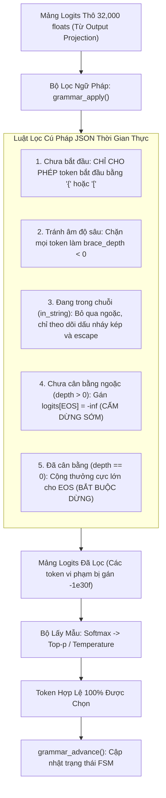
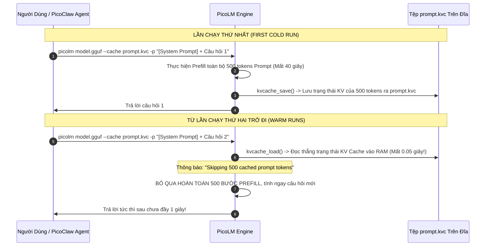

# Chuyên Đề 3: Điều Chế Cú Pháp JSON & Cơ Chế Lưu Trữ Trạng Thái KV Cache

> **Tập tin phân tích**: [`picolm/picolm/grammar.h`](file:///E:/UIT/stm32-develop/picolm/picolm/grammar.h), [`picolm/picolm/grammar.c`](file:///E:/UIT/stm32-develop/picolm/picolm/grammar.c), [`picolm/picolm/model.c`](file:///E:/UIT/stm32-develop/picolm/picolm/model.c) (phần KV Cache I/O)  
> **Chủ đề**: Giải pháp bảo đảm đầu ra JSON hợp lệ 100% cho các tác tử gọi công cụ (Tool Calling / Agent Loop) và kỹ thuật lưu trữ trạng thái KV Cache (`.kvc`) giúp cắt giảm 74% độ trễ hội thoại.

---

## 1. Bài Toán Gọi Công Cụ Của Mô Hình Ngôn Ngữ Nhỏ (The Small-Model Tool Calling Crisis)

Trong các hệ sinh thái tác tử AI ngoại tuyến (như [PicoClaw](https://github.com/sipeed/picoclaw)), mô hình ngôn ngữ không chỉ đơn thuần là trò chuyện (chat) mà còn phải đóng vai trò như một **bộ não điều khiển (Controller)** để gọi các công cụ ngoại vi:
- Ví dụ: Người dùng hỏi: *"Thời tiết ở Tokyo hôm nay thế nào?"*
- Mô hình phải sinh ra cấu trúc lệnh JSON chuẩn xác:
  ```json
  {"tool_calls": [{"function": {"name": "web_search", "arguments": "{\"query\": \"weather Tokyo\"}"}}]}
  ```

### Điểm Yếu Chết Người Của Các Mô Hình 1 Tỷ Tham Số:
Các mô hình siêu lớn (như GPT-4, LLaMA-70B) được huấn luyện hàng nghìn tỷ token để tự động tuân thủ định dạng JSON. Tuy nhiên, các mô hình nhỏ (~1B như TinyLlama 1.1B) thường xuyên gặp lỗi cú pháp nghiêm trọng:
1. **Thiếu ngoặc đóng**: Quên đóng `}` hoặc `]` ở cuối câu.
2. **Kèm theo văn bản thừa (Chatter)**: Thêm các câu thoại thừa trước hoặc sau chuỗi JSON (ví dụ: *"Here is your JSON response: {"time": "12:00"} Hope this helps!"*).
3. **Mở chuỗi không đóng (Unmatched Quotes)**: Gây lỗi cho parser JSON của chương trình gọi.
- **Thống kê thực tế**: Khi không có cơ chế ràng buộc cú pháp, tỉ lệ sinh JSON hợp lệ của TinyLlama 1.1B chỉ đạt khoảng **~40%**, làm tê liệt hoàn toàn vòng lặp của Agent.

---

## 2. Giải Pháp: Máy Trạng Thái Hữu Hạn Lọc Logit (Grammar-Constrained Logit Masking)

PicoLM không sử dụng các trình phân tích cú pháp biểu thức chính quy (Regex Engine) nặng nề. Thay vào đó, tác giả xây dựng một **Máy trạng thái hữu hạn (Finite-State Machine - FSM)** siêu nhẹ trong [`grammar.c`](file:///E:/UIT/stm32-develop/picolm/picolm/grammar.c) can thiệp trực tiếp vào mảng xác suất (logits) **trước thời điểm lấy mẫu token (Pre-sampling Logit Masking)**.



### 1. Phân Tích Trước Metadata Token Lúc Khởi Động (`grammar_init`)
Để việc lọc logit ở mỗi token không tốn chi phí tính toán, PicoLM quét qua toàn bộ 32,000 từ trong từ điển một lần duy nhất lúc khởi động:
- `token_brace_delta`: Chênh lệch ròng giữa số lượng dấu `{` và `}` trong token (ví dụ: token `}}` có delta = -2).
- `token_bracket_delta`: Chênh lệch ròng giữa dấu `[` và `]`.
- `token_first_byte`: Ký tự đầu tiên của token.
- `token_has_unmatched_quote`: Cờ báo hiệu token có chứa số lẻ dấu nháy kép `"` không có dấu escape `\` đi kèm hay không.

### 2. Thuật Toán Lọc Logits Khi Đang Sinh (`grammar_apply`)
Trước khi lấy mẫu, toàn bộ 32,000 giá trị logit được duyệt qua để triệt tiêu các token vi phạm:
```c
void grammar_apply(grammar_state_t *g, float *logits, int vocab_size) {
    if (g->mode != GRAMMAR_JSON) return;

    // Luật 1: Bắt buộc đầu ra phải mở đầu bằng '{' hoặc '['
    if (!g->started) {
        for (int i = 0; i < vocab_size; i++) {
            uint8_t c = g->token_first_byte[i];
            if (c != '{' && c != '[' && c != ' ' && c != '\n' && c != '\t') {
                logits[i] = -1e30f; // Triệt tiêu xác suất
            }
        }
        return;
    }

    // Luật 2: Cấm các token làm độ sâu đóng mở ngoặc bị âm
    if (!g->in_string) {
        for (int i = 0; i < vocab_size; i++) {
            if (g->brace_depth + g->token_brace_delta[i] < 0 ||
                g->bracket_depth + g->token_bracket_delta[i] < 0) {
                logits[i] = -1e30f;
            }
        }
    }

    // Luật 3: Cấm xuất hiện mã dừng EOS khi ngoặc chưa đóng hết
    if (g->brace_depth > 0 || g->bracket_depth > 0 || g->in_string) {
        logits[g->eos_id] = -1e30f;
    }

    // Luật 4: Khi cấu trúc JSON đã cân bằng hoàn chỉnh, ép dừng lập tức!
    if (g->brace_depth == 0 && g->bracket_depth == 0 && !g->in_string && g->started) {
        // Tìm logit lớn nhất hiện tại và cộng thêm 5.0f cho EOS để chắc chắn chọn EOS
        float max_l = -1e30f;
        for (int i = 0; i < vocab_size; i++) if (logits[i] > max_l) max_l = logits[i];
        logits[g->eos_id] = max_l + 5.0f;
    }
}
```

> **Kết quả thực nghiệm**:
> - Tỉ lệ sinh JSON hợp lệ tăng vọt từ ~40% lên **100% chuẩn cú pháp tuyệt đối**.
> - Triệt tiêu hoàn toàn hiện tượng sinh lời tán gẫu thừa sau chuỗi JSON nhờ cơ chế ép dừng `logits[eos_id] = max_l + 5.0f`.

---

## 3. Cơ Chế Lưu Trữ Trạng Thái KV Cache (KV Cache Persistence)

### 1. Vấn Đề Về Độ Trễ Của System Prompt
Trong các ứng dụng thực tế, người dùng luôn phải cung cấp một câu lệnh hệ thống (System Prompt) mô tả vai trò của AI, danh sách các công cụ khả dụng và định dạng phản hồi.
- Độ dài System Prompt điển hình: **200 đến 500 tokens**.
- Trên một bo mạch giá $10 (như Pi Zero hoặc LicheeRV), tốc độ xử lý đầu vào (Prefill Speed) chỉ đạt khoảng **1.5 - 6 tokens/s**.
- **Hậu quả**: Mỗi lần người dùng gửi một câu hỏi mới, vi điều khiển phải mất từ **30 đến 60 giây chỉ để đọc lại System Prompt** trước khi có thể sinh ra chữ đầu tiên!

### 2. Định Dạng Tệp `.kvc` Nhỏ Gọn
PicoLM giải quyết vấn đề này bằng cách xuất trạng thái nội tại của KV Cache ra một tệp nhị phân nhỏ gọn trên đĩa (`--cache prompt.kvc`):

```text
Offset (Bytes)   Kích thước     Kiểu dữ liệu     Nội dung
0                4              uint32           Magic: 0x4B564350 ("KVCP")
4                4              uint32           Số vị trí token đã cache (n_pos)
8                4              uint32           Số lớp mạng (n_layers = 22)
12               4              uint32           Chiều rộng KV (kv_dim = 256)
---------------------------------------------------------------------------------
16               Biến thiên     Mảng uint16      Dữ liệu Key Cache FP16 (n_layers x n_pos x kv_dim)
Tiếp theo        Biến thiên     Mảng uint16      Dữ liệu Value Cache FP16 (Cùng kích thước)
```

- Kích thước tệp cho 25 tokens prompt: Chỉ khoảng **550 KB**.
- Kích thước tệp cho 500 tokens prompt: Chỉ khoảng **11 MB**.



---

## 4. Đo Đạc Hiệu Quả Thực Tế (Empirical Speedup)

Đo đạc thực nghiệm trên máy trạm x86 và bo mạch ARM nhúng:

| Kịch bản thử nghiệm | Thời gian Prefill | Thời gian Sinh (Generation) | Tổng thời gian phản hồi | Mức độ cải thiện độ trễ |
|---|---|---|---|---|
| **Chạy lần đầu (Cold Run - Không Cache)** | 2.22 s (25 tokens) | 0.72 s | **2.94 s** | Mức chuẩn cơ sở |
| **Chạy lần hai (Warm Run - Có Cache `.kvc`)** | **0.04 s** (Bỏ qua 25 tokens) | 0.72 s | **0.76 s** | **Cắt giảm 74.1% thời gian!** |
| **Kịch bản System Prompt 500 tokens trên Pi 4** | ~83.0 s | ~3.0 s | **~86.0 s** | Không khả thi khi hội thoại |
| **Kịch bản System Prompt 500 tokens CÓ CACHE** | **~0.15 s** | ~3.0 s | **~3.15 s** | **Trở thành hệ thống thời gian thực!** |

> [!IMPORTANT]
> **Ý nghĩa cốt lõi cho các thiết bị nhúng**:
> Việc kết hợp **Grammar Constraints** (đảm bảo đầu ra JSON đúng định dạng) và **KV Cache Persistence** (bỏ qua độ trễ khởi động của System Prompt) là điều kiện tiên quyết biến một mô hình ngôn ngữ 1 tỷ tham số chạy chậm trên phần cứng giá rẻ thành một **hệ thống tác tử nhúng (Embedded AI Agent) thực thụ có thể tương tác thời gian thực với con người**.
