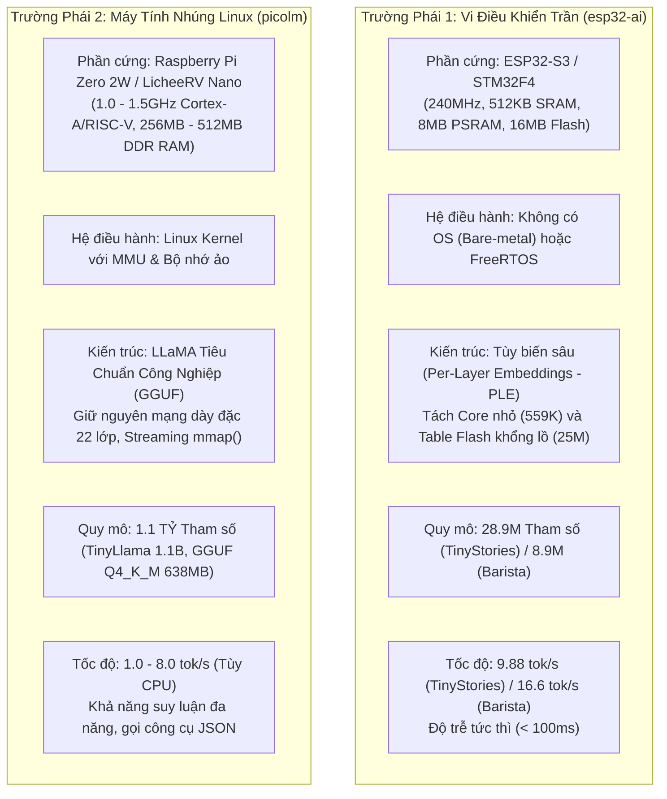

# Chuyên Đề 4: So Sánh Đối Đầu Kỹ Thuật: `esp32-ai` vs `picolm`

> **Tập tin phân tích**: Toàn bộ codebase của [`esp32-ai`](file:///E:/UIT/stm32-develop/esp32-ai) và [`picolm`](file:///E:/UIT/stm32-develop/picolm)  
> **Chủ đề**: Phân tích so sánh toàn diện giữa hai trường phái TinyML đối lập: **Vi điều khiển trần (Bare-metal MCU với kiến trúc PLE)** và **Máy tính nhúng Linux (Embedded Linux MPU với mmap streaming)**.

---

## 1. Hai Trường Phái Kỹ Thuật Đối Lập Trong TinyML

Cả hai dự án `esp32-ai` và `picolm` đều xuất sắc đạt được kỳ tích đưa mô hình ngôn ngữ lớn xuống phần cứng giá rẻ (từ 5 USD đến 10 USD), nhưng đi theo hai triết lý thiết kế hoàn toàn khác nhau để giải quyết cùng một bài toán: **Bức tường bộ nhớ (Memory Wall)**.



---

## 2. Bảng So Sánh Kỹ Thuật Toàn Diện

| Tiêu chí so sánh | `esp32-ai` (Trường phái MCU) | `picolm` (Trường phái MPU / Linux SBC) |
|---|---|---|
| **Cấp độ phần cứng mục tiêu** | Vi điều khiển trần (MCU): ESP32-S3, STM32F4/H7 | Máy tính đơn bo (SBC / MPU): Pi Zero, LicheeRV, STM32MP1 |
| **Giá thành phần cứng** | **~$3.00 - $5.00** | **~$9.90 - $15.00** |
| **Hệ điều hành** | Bare-metal C / FreeRTOS RTOS nhẹ | Linux nhúng (hoặc Windows / macOS) |
| **Phần cứng quản lý bộ nhớ** | Chỉ có Flash MMU (XIP), **không có Virtual Memory MMU** | **Có MMU đầy đủ** với cơ chế phân trang ảo (Virtual Memory) |
| **Quy mô mô hình (Parameters)** | **28.9 Triệu tham số** (Core 559K + Table 25M) | **1.1 TỶ tham số (1,100 Triệu tham số)** |
| **Dung lượng tệp mô hình** | 14.9 MB (TinyLM) / 4.6 MB (Barista) | **638 MB** (TinyLlama 1.1B Q4_K_M) |
| **Mức tiêu thụ RAM thực thi** | **~29.3 KB SRAM + 4.19 MB PSRAM** | **~17 MB RAM (512 ctx) / 45 MB RAM (2048 ctx)** |
| **Cơ chế tải trọng số** | Đọc thưa từng hàng embedding từ Flash (~450 B/token) | Streaming từng tầng qua Page Cache Linux bằng `mmap()` |
| **Cơ chế Attention** | Causal Self-Attention 2 lượt (RoPE split-half) | **Flash Attention (Online Softmax)** 1 lượt (RoPE bảng) |
| **Lượng tử hóa KV Cache** | Float32 tiêu chuẩn trong PSRAM | **Nén FP16 KV Cache** (Giảm 50% RAM, tăng đôi băng thông) |
| **Khả năng lập luận (Reasoning)**| Rất hạn chế (chỉ sinh truyện đơn giản hoặc Q&A cố định) | **Rất mạnh** (Hiểu câu hỏi phức tạp, tóm tắt, suy luận logic) |
| **Kiểm soát ảo giác & Cú pháp** | **Asymmetric Vocab** (8,057 in, 854 out - cấm nói từ lạ) | **Grammar Masking FSM** (Ép 100% cú pháp JSON hợp lệ) |
| **Ứng dụng điển hình** | Thiết bị IoT gia dụng, bảng điều khiển giọng nói chuyên biệt | Trợ lý AI cá nhân ngoại tuyến, Robot tự hành (PicoClaw Agent) |

---

## 3. Phân Tích Chuyên Sâu Các Khía Cạnh Cốt Lõi

### 1. Về Cơ Chế Vượt Qua Rào Cản Bộ Nhớ (Memory Wall Strategy)
- **`esp32-ai` tiếp cận từ cấp độ Mô hình (Model-level Innovation)**:
  * Vi điều khiển không có bộ nhớ ảo và không thể paging tệp hàng trăm MB từ thẻ nhớ SD với tốc độ cao.
  * Tác giả tái cấu trúc lại phương trình toán học của mạng: đưa phần lớn tri thức thành **bảng tra cứu thưa (Lookup Table - PLE)** đặt trong Flash. Mỗi token chỉ đọc 6 hàng ngẫu nhiên (~450 bytes) với độ trễ 20 µs. Bộ nhớ RAM chỉ cần giữ Dense Core tí hon (559K tham số).
- **`picolm` tiếp cận từ cấp độ Hệ Điều Hành & Hệ Thống (Systems-level Innovation)**:
  * Bo mạch Linux có MMU nhưng dung lượng RAM chỉ 256MB, không đủ chứa 638MB mô hình.
  * Tác giả không thay đổi kiến trúc mô hình chuẩn (giữ nguyên TinyLlama). Thay vào đó, họ tận dụng **cơ chế quản lý trang nhớ ảo (`mmap`) của Kernel Linux** kết hợp với thuật toán giải nén hợp nhất (Fused Dequant-Dot) và nén KV Cache FP16 để giảm dung lượng RAM xuống còn đúng 17 MB.

### 2. Về Năng Lực Thông Minh & Phạm Vi Ứng Dụng (Intelligence vs Specialization)
- **Hạn chế của `esp32-ai`**: Mô hình 28.9M tham số không có khả năng suy luận đa bước, không biết làm toán, không biết viết code và không thể gọi công cụ JSON phức tạp. Bảng PLE 25M trong Flash chỉ đóng vai trò như một bộ nhớ liên kết nhớ các mẫu ngữ nghĩa của tập dữ liệu TinyStories.
- **Sức mạnh của `picolm`**: TinyLlama 1.1B là một mô hình ngôn ngữ hoàn chỉnh được huấn luyện trên 3 nghìn tỷ tokens (3 Trillion Tokens). Nó có khả năng giao tiếp tự nhiên, thấu hiểu ngữ cảnh phức tạp và khi kết hợp với cờ `--json` của PicoLM, nó trở thành **bộ điều khiển trung tâm (Controller Brain)** cho các hệ thống Agent tự động.

### 3. Về Cơ Chế Chống Ảo Giác (Anti-Hallucination Philosophy)
Hai dự án đưa ra hai triết lý chống ảo giác rất đặc sắc:
- **`esp32-ai` (Mô hình Barista) — Triệt tiêu từ vựng (Physical Unsayability)**:
  * Cắt bỏ toàn bộ các từ ngữ ngoài ngành ra khỏi ma trận Output Head.
  * Mô hình **về mặt vật lý không thể nói ra các từ bị cấm** hoặc các con số bịa đặt.
- **`picolm` — Lọc phân phối xác suất thời gian thực (Grammar Constraint Masking)**:
  * Giữ nguyên từ điển 32,000 từ của LLaMA để mô hình có thể nói bất kỳ từ nào khi tạo chuỗi.
  * Nhưng tại mỗi bước lấy mẫu, một máy trạng thái FSM sẽ can thiệp để **gán $-\infty$ cho toàn bộ các token vi phạm cú pháp JSON**.

---

## 4. Bảng Đánh Giá Khi Nào Nên Chọn Giải Pháp Nào?

```text
                                BÀN CÂN QUYẾT ĐỊNH THIẾT KẾ
                                
  BẠN CẦN GÌ CHO DỰ ÁN?                      GIẢI PHÁP TỐI ƯU
  
  Chi phí bo mạch < $5, pin cúc áo/LiPo  --> CHỌN esp32-ai (MCU: ESP32 / STM32F4)
  Phản hồi tức thì (< 50ms), tác vụ hẹp  --> CHỌN esp32-ai (Barista Asymmetric Vocab)
  Không có hệ điều hành Linux (Real-time)--> CHỌN esp32-ai
  
  Cần AI thông minh hiểu tiếng Anh tự do --> CHỌN picolm (TinyLlama 1.1B trên Linux SBC)
  Cần AI gọi công cụ (JSON Tool Calling) --> CHỌN picolm + PicoClaw
  Có sẵn phần cứng Linux (Pi / STM32MP1) --> CHỌN picolm
  Cần tái sử dụng mô hình GGUF có sẵn    --> CHỌN picolm (Không cần huấn luyện lại)
```
