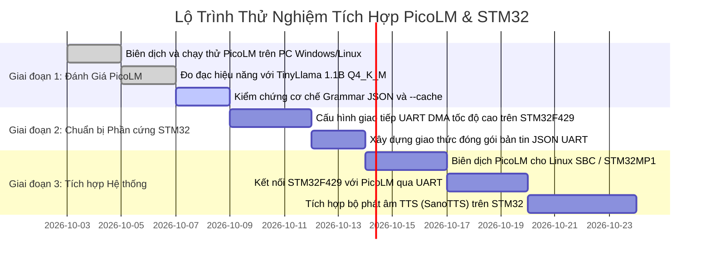

# Chuyên Đề 5: Định Hướng Ứng Dụng Trên Hệ Sinh Thái STM32 & Kiến Trúc Nhúng Lai

> **Mục tiêu**: Đánh giá tính khả thi khi triển khai PicoLM trên hệ sinh thái phần cứng **STM32** (phân biệt rạch ròi giữa dòng vi điều khiển MCU Cortex-M và vi xử lý MPU Cortex-A), đồng thời đề xuất mô hình **Kiến trúc nhúng lai (Hybrid Edge-AI Architecture)** kết hợp giữa STM32 và PicoLM.

---

## 1. Phân Biệt Sống Còn: STM32 MCU (Cortex-M) vs STM32 MPU (Cortex-A)

Khi nghiên cứu việc đưa mô hình 1 tỷ tham số (1B LLM) sang STM32, các kỹ sư thường mắc một hiểu lầm phổ biến: cố gắng đưa code `picolm` lên các dòng vi điều khiển như STM32F4 hoặc STM32H7.

Cần phải phân định ranh giới phần cứng rõ ràng:

```text
+-----------------------------------------------------------------------------------+
| DÒNG 1: STM32 MICROCONTROLLER (MCU: STM32F4, STM32F7, STM32H7)                    |
| - Lõi: ARM Cortex-M4 / Cortex-M7 (180 MHz - 480 MHz)                              |
| - Bộ nhớ: SRAM nội 256 KB - 1 MB; SDRAM ngoài tối đa 8 MB - 32 MB                 |
| - Phần cứng: CHỈ CÓ MPU (Memory Protection Unit), KHÔNG CÓ MMU (Memory Management) |
| - Hệ điều hành: Bare-metal C / FreeRTOS (Không có bộ nhớ ảo / Virtual Memory)     |
| => KẾT LUẬN: KHÔNG THỂ CHẠY PICOLM (Vì không có mmap và RAM < 17MB).              |
|              -> Dòng này PHẢI DÙNG GIẢI PHÁP CỦA ESP32-AI (Mô hình < 30M, PLE)!   |
+-----------------------------------------------------------------------------------+
                                         vs
+-----------------------------------------------------------------------------------+
| DÒNG 2: STM32 MICROPROCESSOR (MPU: STM32MP157, STM32MP257)                       |
| - Lõi: Dual ARM Cortex-A7 @ 650-800 MHz (hoặc Cortex-A35 @ 1.5 GHz trên MP2)     |
| - Bộ nhớ: 512 MB - 1 GB DDR3/DDR4 RAM; Bộ nhớ lưu trữ eMMC / SD Card 4GB - 32GB   |
| - Phần cứng: CÓ MMU HOÀN CHỈNH (Hỗ trợ phân trang bộ nhớ ảo Virtual Paging)       |
| - Hệ điều hành: OpenSTLinux (Nhân Linux chuẩn POSIX)                              |
| => KẾT LUẬN: CHẠY PICOLM HOÀN HẢO 100%! RAM 512MB chứa thoải mái 45MB của PicoLM! |
+-----------------------------------------------------------------------------------+
```

---

## 2. Triển Khai PicoLM Trên Dòng MPU STM32MP1

Dòng chip **STM32MP157** (tích hợp 2 nhân ARM Cortex-A7 32-bit có hỗ trợ tập lệnh **NEON SIMD** và 1 nhân ARM Cortex-M4 chạy thời gian thực) là nền tảng hoàn hảo của STMicroelectronics để chạy PicoLM:

### 1. Khả Năng Tương Thích Tuyệt Đối
- PicoLM là C11 thuần, chỉ dùng thư viện chuẩn `libc`, `libm`, `libpthread`.
- Cơ chế `mmap()` của PicoLM là cuộc gọi hệ thống POSIX chuẩn của Linux kernel.
- Tệp mô hình `tinyllama-1.1b-chat-v1.0.Q4_K_M.gguf` (638 MB) được đặt trên thẻ nhớ micro-SD hoặc phân vùng eMMC.
- Khi chạy với cờ `-c 512`, PicoLM chỉ chiếm **~17 MB RAM**, hoàn toàn vừa vặn trong dung lượng 512 MB DDR3 của STM32MP1 (để lại hơn 400 MB cho hệ thống Linux).

### 2. Biên Dịch Cho STM32MP1 Bằng Toolchain Của ST
Trong môi trường SDK của ST (OpenSTLinux Yocto SDK hoặc ARM GNU Toolchain):
```bash
# Biên dịch chéo (Cross-compile) nhắm đến Cortex-A7 có NEON
arm-ostl-linux-gnueabi-gcc -O3 \
    -march=armv7-a -mfpu=neon-vfpv4 -mfloat-abi=hard \
    -DPICOLM_NEON=1 \
    picolm.c model.c tensor.c quant.c tokenizer.c sampler.c grammar.c \
    -o picolm_stm32mp1 -lm -lpthread

# Sao chép sang bo mạch STM32MP1 qua SCP:
scp picolm_stm32mp1 root@stm32mp1:/usr/bin/
```
> **Tốc độ ước tính trên STM32MP1 (Dual Cortex-A7 @ 800MHz, NEON)**: Đạt khoảng **~2.5 đến 4.0 tokens/giây** (hoàn toàn đủ nhanh để hiển thị từng từ phản hồi cho người dùng qua màn hình LCD hoặc giao diện nối tiếp).

---

## 3. Kiến Trúc Nhúng Lai Đề Xuất (Hybrid Edge-AI Architecture)

Để giải quyết trọn vẹn bài toán lớn của thư mục `docs/tasks/llm-tts/` (kết hợp cả Mô hình Ngôn ngữ **LLM** và Tổng hợp Tiếng nói **TTS**), chúng tôi đề xuất mô hình **Kiến trúc nhúng lai 2 tầng (Two-Tier Hybrid Architecture)**:

```mermaid
flowchart TD
    subgraph Tier1["TẦNG 1: TẦNG ĐIỀU KHIỂN THỜI GIAN THỰC & ÂM THANH (STM32F429 / H7)"]
        MIC["Microphone I2S / Cảm biến"] --> ADC_IN["Thu âm giọng nói / Cảm biến môi trường"]
        AUDIO_OUT["DAC / I2S Audio Amp"] <-- SANO_TTS["Bộ Tổng Hợp Tiếng Nói Cực Nhẹ (SanoTTS / PicoTTS)"]
        LCD["Màn hình LCD SPI / LTDC"] <-- GUI["Giao diện người dùng thời gian thực"]
        CORE_M["Lõi Cortex-M4 / Cortex-M7 (Bare-metal / FreeRTOS)\n- Độ trễ phản hồi mức micro-giây\n- Tiêu thụ năng lượng cực thấp"]
    end

    subgraph Comm["Giao Thức Giao Tiếp Nối Tiếp Tốc Độ Cao"]
        UART_DMA["Giao tiếp UART DMA (3 Mbps) / SPI DMA (20 Mbps)\nTruyền nhận chuỗi văn bản ASCII / Lệnh JSON"]
    end

    subgraph Tier2["TẦNG 2: BỘ NÃO LẬP LUẬN AI NGOẠI TUYẾN (STM32MP1 / SBC Giá $10)"]
        PICOLM["PicoLM Engine (C11, ~80 KB Binary, ~45MB RAM)"]
        AGENT["PicoClaw Agent Loop (Điều phối công cụ / bộ nhớ hội thoại)"]
        KVC["KV Cache Persistence (.kvc - Bỏ qua 74% độ trễ Prefill)"]
        JSON_FSM["Grammar JSON Masking (Bảo đảm cú pháp điều khiển 100%)"]
    end

    Tier1 <==> Comm <==> Tier2
```

### Phân Công Nhiệm Vụ Trong Kiến Trúc Lai:
1. **STM32F429 / STM32H7 (Front-End Processor)**:
   - Đảm nhận toàn bộ các tác vụ có tính thời gian thực cứng (Hard Real-time): Thu tín hiệu cảm biến, điều khiển động cơ, quét nút bấm, lái màn hình LCD và xuất âm thanh qua giao tiếp I2S.
   - Nhận văn bản trả lời từ tầng 2 và chạy bộ tổng hợp giọng nói siêu nhẹ (**SanoTTS** hoặc **PicoTTS**) để phát trực tiếp ra loa mà không làm nghẽn CPU.
2. **STM32MP1 hoặc Bo Mạch SBC Giá $10 (Cognitive Coprocessor)**:
   - Đóng vai trò như một "Co-processor thông minh". Khi STM32F4 gửi yêu cầu qua cổng UART nối tiếp, vi xử lý MPU sẽ kích hoạt **PicoLM**.
   - Nhờ cờ `--json` và cơ chế lưu trữ KV Cache (`--cache prompt.kvc`), MPU phản hồi lại chuỗi JSON chỉ trong chưa đầy 1 giây.
   - Khi không có tác vụ tính toán, MPU có thể tự động chuyển sang chế độ tiết kiệm năng lượng (Sleep mode) để bảo tồn năng lượng pin.

---

## 4. Lộ Trình Thử Nghiệm Kỹ Thuật (Actionable PoC Roadmap)



### Các Bước Thực Hiện Cụ Thể:
1. **Bước 1 (Thử nghiệm cục bộ)**: Chạy thử file thực thi `picolm` trên máy tính với câu lệnh:
   ```bash
   ./picolm tinyllama-1.1b-chat-v1.0.Q4_K_M.gguf -p "Hello world" -n 50
   ```
2. **Bước 2 (Kiểm tra cơ chế JSON Tool Calling)**: Kiểm tra khả năng ép khuôn JSON phục vụ điều khiển ngoại vi của STM32:
   ```bash
   ./picolm model.gguf --json -p "<|user|>Turn on LED 1</s><|assistant|>" -n 50
   ```
3. **Bước 3 (Triển khai giao thức UART trên STM32F429)**: Xây dựng driver UART nhận diện gói tin dạng Stream qua ngắt rảnh dòng (UART IDLE Line Interrupt) kết hợp DMA tròn (Circular DMA).
4. **Bước 4 (Ghép nối toàn diện LLM + TTS)**: Kết hợp chuỗi văn bản do PicoLM sinh ra truyền về STM32F429 để chuyển thành giọng nói qua mô-đun SanoTTS (sẽ được phân tích tiếp theo trong thư mục `researcher/sanoTTS/`).
