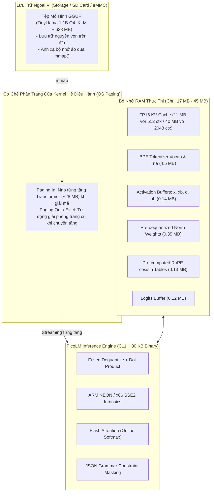

# Báo Cáo Phân Tích Toàn Diện: Giải Pháp Chạy Mô Hình LLM 1B Với 256MB RAM (PicoLM)

> **Tài liệu tham chiếu dự án**: Phân tích giải pháp kỹ thuật từ repository [`picolm`](file:///E:/UIT/stm32-develop/picolm)  
> **Thư mục lưu trữ**: `docs/tasks/llm-tts/researcher/picolm/`  
> **Ngày lập báo cáo**: Tháng 10/2026  
> **Mục tiêu**: Nghiên cứu kiến trúc động cơ suy luận C11 thuần, cơ chế streaming trọng số qua bộ nhớ ảo (`mmap`), kỹ thuật nén KV Cache FP16, tối ưu hóa SIMD NEON/SSE2, điều chế cú pháp JSON (Grammar Constraints) và rút ra bài học cho các hệ thống nhúng (STM32MP1 / STM32 MPU).

---

## 1. Tóm Tắt Điều Hành (Executive Summary)

Repository [`picolm`](file:///E:/UIT/stm32-develop/picolm) (viết tắt của **PicoLLM**) giải quyết bài toán: **Làm thế nào để chạy một mô hình ngôn ngữ lớn 1 tỷ tham số (1.1 Billion Parameters - điển hình là TinyLlama 1.1B) trên các bo mạch máy tính nhúng (Single Board Computer - SBC) giá rẻ chỉ $10 với bộ nhớ RAM cực kỳ eo hẹp (256MB RAM)?**

PicoLM được viết hoàn toàn bằng **C11 nguyên bản (~2,500 dòng code)**, không phụ thuộc vào bất kỳ thư viện bên ngoài nào ngoại trừ thư viện chuẩn C (`libc`, `libm`, `libpthread`). Nó không cần Python, PyTorch, CUDA hay các bộ thư viện BLAS cồng kềnh. Toàn bộ engine được biên dịch thành **một file thực thi duy nhất chỉ nặng ~80 KB**.

Mô hình hoạt động như một "bộ não AI ngoại tuyến (offline brain)" hoàn hảo cho framework tác tử [PicoClaw](https://github.com/sipeed/picoclaw), cho phép xây dựng các AI Assistant chạy cục bộ hoàn toàn, không cần kết nối Internet, không gửi dữ liệu lên đám mây và không tốn chi phí API hàng tháng.



---

## 2. Bảng Thông Số Hiệu Năng Thực Tế (Performance Benchmarks)

Đo đạc thực tế trên mô hình **TinyLlama 1.1B Q4_K_M (kích thước tệp 638 MB)** qua các nền tảng phần cứng:

| Thiết bị phần cứng | Chip xử lý & Kiến trúc | Mức RAM thiết bị | Tốc độ Prefill (tokens/s) | Tốc độ Generation (tokens/s) | RAM Runtime thực tế | Giá thành tham khảo |
|---|---|---|---|---|---|---|
| **Máy trạm x86-64** | Intel / AMD (8 threads, SSE2) | 16 GB - 64 GB | ~11 tok/s | **~13 - 13.5 tok/s** | **45 MB** | $500+ |
| **Raspberry Pi 5** | Broadcom BCM2712 (4x Cortex-A76) | 4 GB - 8 GB | ~12 tok/s | **~10 - 30+ tok/s** | **45 MB** | $60 |
| **Raspberry Pi 4** | Broadcom BCM2711 (4x Cortex-A72) | 2 GB - 8 GB | ~6 tok/s | **~8 - 9.4 tok/s** | **45 MB** | $35 |
| **Raspberry Pi 3B+**| Broadcom BCM2837 (4x Cortex-A53) | 1 GB | ~3.5 tok/s | **~4 tok/s** | **45 MB** | $25 |
| **Pi Zero 2W** | Broadcom BCM2710A1 (4x Cortex-A53) | 512 MB | ~1.5 tok/s | **~2 tok/s** | **45 MB** | $15 |
| **LicheeRV Nano** | SG2002 (1x RISC-V C906 @ 1GHz) | **256 MB** | ~0.8 tok/s | **~1.0 tok/s** | **~17 - 45 MB** | **$9.90** |

> [!NOTE]
> - Với ngữ cảnh (context) 512 tokens: Bộ nhớ RAM thực thi chỉ tốn **~16.7 MB**.
> - Với ngữ cảnh tối đa 2048 tokens: Bộ nhớ RAM thực thi chỉ tốn **~45 MB**.
> - Dung lượng file thực thi: **~65 KB - 80 KB** (tùy kiến trúc CPU).

---

## 3. Bản Đồ 9 Tối Ưu Hóa Cốt Lõi (The 9 Optimization Pillars)

Tốc độ sinh văn bản của PicoLM được nâng từ **1.6 tokens/s lên tới hơn 13.5 tokens/s** trên CPU x86 (và lên tới hơn 30 tokens/s với đa nhân ARM NEON) nhờ 9 kỹ thuật phối hợp:

```text
1. C-Engine Thô (Naive Scalar MatMul)      ██░░░░░░░░░░░░░░░░░░░░  1.6 tok/s
2. + Fused Dequant + Dot Product            ████░░░░░░░░░░░░░░░░░░  3.0 tok/s (Giảm 50% băng thông bộ nhớ)
3. + Multi-Threaded MatMul (pthreads)       ████████████░░░░░░░░░░  9.4 - 13.5 tok/s (Chia đều output rows)
4. + ARM NEON / x86 SSE2 Intrinsics        ████████████████░░░░░░  Tăng 4-8x trên vòng lặp nhân vector
5. + Nén FP16 KV Cache                      █████████████████░░░░░  Giảm 50% RAM KV (22MB -> 11MB)
6. + Pre-computed RoPE Tables               ██████████████████░░░░  Bỏ 25,344 lệnh powf() mỗi bước
7. + Flash Attention (Online Softmax)       ███████████████████░░░  Triệt tiêu mảng điểm Attention O(N)
8. + Grammar-Constrained JSON Masking       ████████████████████░░  100% cú pháp JSON hợp lệ cho Tool Calling
9. + KV Cache Persistence (--cache .kvc)    ██████████████████████  Bỏ qua Prefill hệ thống, giảm 74% độ trễ
```

---

## 4. Cấu Trúc Bộ Tài Liệu Nghiên Cứu

Bộ tài liệu phân tích chi tiết trong thư mục `docs/tasks/llm-tts/researcher/picolm/` bao gồm 5 chuyên đề chuyên sâu:

| Tập tin | Tiêu đề chuyên đề | Nội dung tóm tắt |
|---|---|---|
| [`01-architecture-and-mmap.md`](file:///E:/UIT/stm32-develop/docs/tasks/llm-tts/researcher/picolm/01-architecture-and-mmap.md) | **Kiến Trúc Mô Hình & Cơ Chế Streaming Bộ Nhớ Ảo (mmap)** | Khảo sát kiến trúc LLaMA / TinyLlama (22 layers, GQA 32$\rightarrow$4, SwiGLU FFN), bộ giải mã GGUF v2/v3 tự chế, cơ chế ánh xạ `mmap()` kết hợp phân trang Kernel để chạy file 638MB chỉ với 17MB RAM. |
| [`02-computational-optimizations.md`](file:///E:/UIT/stm32-develop/docs/tasks/llm-tts/researcher/picolm/02-computational-optimizations.md) | **Các Kỹ Thuật Tối Ưu Hóa Tính Toán & SIMD** | Chi tiết phép nhân hợp nhất (Fused Dequant-Dot), tăng tốc vector ARM NEON / x86 SSE2, thuật toán Flash Attention (Online Softmax) và bài học sửa lỗi căn chỉnh scale Q6_K. |
| [`03-grammar-and-kv-cache-persistence.md`](file:///E:/UIT/stm32-develop/docs/tasks/llm-tts/researcher/picolm/03-grammar-and-kv-cache-persistence.md) | **Điều Chế Cú Pháp JSON & Lưu Trữ Trạng Thái KV Cache** | Cơ chế Finite State Machine lọc logit thời gian thực đảm bảo 100% cú pháp JSON phục vụ gọi công cụ (Tool Calling), và kỹ thuật lưu/nạp bộ nhớ đệm KV (`.kvc`) giúp cắt giảm 74% thời gian phản hồi. |
| [`04-comparative-analysis-esp32-vs-picolm.md`](file:///E:/UIT/stm32-develop/docs/tasks/llm-tts/researcher/picolm/04-comparative-analysis-esp32-vs-picolm.md) | **So Sánh Đối Đầu: `esp32-ai` vs `picolm`** | Phân tích toàn diện 2 trường phái TinyML: Vi điều khiển trần (MCU Bare-metal / PLE) vs Máy tính nhúng Linux (MPU / mmap streaming). Đánh giá sự bù trừ giữa năng lực mô hình, độ trễ và phần cứng. |
| [`05-stm32-and-edge-implications.md`](file:///E:/UIT/stm32-develop/docs/tasks/llm-tts/researcher/picolm/05-stm32-and-edge-implications.md) | **Khả Năng Ứng Dụng Trên STM32 MPU & Đề Xuất Kiến Trúc** | Đánh giá tính khả thi khi chạy PicoLM trên các dòng MPU của STMicroelectronics (**STM32MP157 / STM32MP257**), thiết kế mô hình nhúng lai (Hybrid: MCU STM32F4 + MPU STM32MP1) và lộ trình thử nghiệm PoC. |

---

## 5. Kết Luận Nhanh

Nếu dự án `esp32-ai` cho thấy cách tối ưu hóa cực đoan cho **Vi điều khiển không có hệ điều hành (Bare-metal MCU)** bằng cách tái cấu trúc mô hình (Per-Layer Embeddings), thì `picolm` chứng minh sức mạnh của **C thuần kết hợp với cơ chế bộ nhớ ảo của Linux (mmap)** trên **Vi xử lý nhúng (MPU)**. Đây là hai mảnh ghép bổ trợ hoàn hảo cho bức tranh toàn cảnh về Edge AI trong các dự án nhúng hiện đại.
