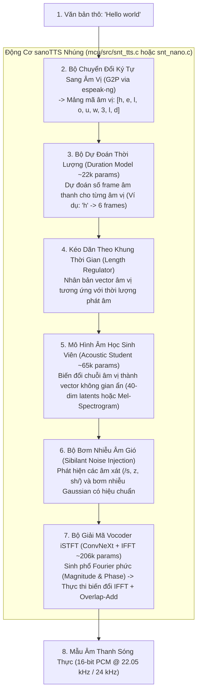
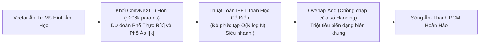

# Chuyên Đề 1: Kiến Trúc Mạng Nơ-ron & Bộ Giải Mã Sóng Âm iSTFT

> **Tập tin phân tích**: [`sanoTTS/mcu/src/snt_tts.c`](file:///E:/UIT/stm32-develop/sanoTTS/mcu/src/snt_tts.c), [`sanoTTS/mcu/src/snt_nano.c`](file:///E:/UIT/stm32-develop/sanoTTS/mcu/src/snt_nano.c), [`sanoTTS/docs/distillation-recipe.md`](file:///E:/UIT/stm32-develop/sanoTTS/docs/distillation-recipe.md)  
> **Chủ đề**: Giải mã đường ống tổng hợp giọng nói từ văn bản đến sóng âm, cơ chế chưng cất tri thức (Knowledge Distillation), cuộc cách mạng vocoder iSTFT và kỹ thuật bơm nhiễu âm gió (Sibilant Noise Injection).

---

## 1. Đường Ống Tín Hiệu Toàn Diện (End-to-End Signal Pipeline)

Trong các hệ thống Text-to-Speech truyền thống, quy trình tạo tiếng nói từ văn bản thường bị chia cắt thành các mô hình nơ-ron khổng lồ tiêu tốn hàng trăm megabyte RAM. `sanoTTS` đã tinh gọn toàn bộ chuỗi mắt xích thành một luồng tính toán liên tục, nhỏ gọn và hoàn toàn có thể chạy trên thanh ghi của vi điều khiển:



---

## 2. Cuộc Cách Mạng Vocoder: Tại Sao iSTFT Thay Thế Được HiFi-GAN?

Trong công nghệ TTS, thành phần ngốn nhiều tài nguyên nhất không phải là bộ dự đoán âm học mà chính là **Bộ tạo sóng âm (Neural Vocoder)**:

### 1. Sự Bế Tắc Của Các Vocoder Nơ-ron Truyền Thống
- Các mô hình Vocoder phổ biến hiện nay như **HiFi-GAN**, **WaveGlow**, **BigVGAN** hay **Diffusion Vocoders** có quy mô từ **15 triệu đến hơn 80 triệu tham số**.
- Chúng sử dụng hàng chục tầng tích chập chuyển vị (Transposed Convolutions) và khối tàn dư đa chu kỳ (Multi-Period ResBlocks) để "vẽ" từng mẫu âm thanh (22,050 mẫu mỗi giây).
- Khối lượng tính toán này đòi hỏi hàng tỷ phép tính mỗi giây (Giga-FLOPs), biến việc chạy Neural Vocoder trên vi điều khiển không có GPU thành điều không tưởng.

### 2. Giải Pháp Đột Phá Của sanoTTS: Biến Đổi Ngược Fourier Thời Gian Ngắn (iSTFT)
Thay vì dùng mạng nơ-ron để sinh trực tiếp từng mẫu sóng trong miền thời gian (Time-domain waveform), `sanoTTS` chia bài toán làm 2 phần:
1. **Mạng nơ-ron tí hon**: Chỉ dự đoán phổ tần số phức của tín hiệu âm thanh trong miền tần số (Short-Time Fourier Transform Domain), gồm biên độ (Magnitude $|X|$) và pha (Phase $\angle X$ hoặc phần thực/ảo: $R, I$).
2. **Thuật toán xử lý tín hiệu số cổ điển (DSP Math)**: Dùng thuật toán **Biến đổi ngược Fourier nhanh (Inverse Fast Fourier Transform - IFFT)** kết hợp với kỹ thuật **Chồng lấp - Cộng dồn (Overlap-Add - OLA)** để khôi phục sóng âm:

$$x[n] = \sum_{m} \text{IFFT}\{ X_m[k] \} \cdot w[n - mH]$$

Trong đó $w$ là cửa sổ phân tích (Hanning window) và $H$ là bước nhảy hop size (ví dụ: $H = 256$ mẫu).



### Tại Sao Cơ Chế Này Hoạt Động Cực Kỳ Nhanh Trên Vi Điều Khiển?
- **Tiết kiệm hàng chục triệu tham số**: Phần lớn công việc chuyển đổi sang sóng âm được thực hiện bởi công thức toán học IFFT thuần túy, không cần học bằng trọng số nơ-ron!
- **Tận dụng bộ thư viện DSP của vi điều khiển**: Mọi vi điều khiển ARM Cortex-M hay Xtensa đều có sẵn các hàm IFFT số nguyên cực nhanh trong thư viện CMSIS-DSP (`arm_cfft_q15` hoặc `arm_rfft_fast_f32`) chỉ tốn vài trăm chu kỳ CPU.

---

## 3. Kỹ Thuật Bơm Nhiễu Âm Gió (Sibilant Noise Injection)

Khi chưng cất (Knowledge Distillation) từ mô hình giáo viên (Teacher) sang mô hình sinh viên tí hon (Student):

### 1. Hiện Tượng Sụp Đổ Âm Gió (Sibilant Collapse)
- Mô hình âm học sinh viên được tối ưu bằng hàm mất mát hồi quy trung bình ($L_1$ hoặc $L_2$ Loss).
- Các âm xát vô thanh (Sibilant Fricatives như **/s/** trong *"sun"*, **/z/** trong *"zoo"*, **/ʃ/** trong *"shoe"*, **/ʒ/** trong *"measure"*) về bản chất vật lý là **nhiễu loạn dải rộng (Broadband Turbulent Noise)** do luồng khí ma sát qua kẽ răng tạo ra.
- Vì mạng nơ-ron cố gắng hồi quy giá trị kỳ vọng (Mean), toàn bộ các biến thiên ngẫu nhiên tần số cao bị "san phẳng". Hậu quả: các âm **/s, z/** biến thành **tiếng huýt sáo chói tai (whistly tone)**, làm giọng đọc nghe như bị ngọng hoặc nhân tạo rất khó chịu.

### 2. Thuật Toán Bơm Nhiễu Trong `mcu/src/snt_tts.c`
Tác giả đã phát hiện và bổ sung một kỹ thuật tinh tế: Đo đạc độ lệch chuẩn $\sigma_{\text{tea}}$ của từng kênh từ mô hình giáo viên, sau đó bơm trực tiếp nhiễu ngẫu nhiên Gaussian vào các frame âm xát trước khi lượng tử hóa:

```c
// Bơm nhiễu có kiểm soát vào frame âm xát
if (is_sibilant_frame(current_phoneme_id)) {
    for (int ch = 0; ch < 40; ch++) {
        float noise = gaussian_random() * tea_std[ch];
        latent[ch] += beta * noise;  // beta ≈ 0.9
    }
}
```

```text
Hiệu quả đo đạc phổ âm thanh (Spectral Flatness 2–8 kHz):
- Âm gốc của mô hình giáo viên (Teacher Reference): 0.689 (Nhiễu tự nhiên)
- Mô hình sinh viên chưa bơm nhiễu: 0.597 (Bị san phẳng, gây tiếng huýt sáo)
- Mô hình sinh viên SAU KHI BƠM NHIỄU: 0.686 (Khôi phục 99.5% độ sắc nét âm gió!)
```

---

## 4. Các Dòng Mô Hình Trong Họ sanoTTS (Model Lineage)

Dự án phát triển 4 dòng mô hình với các mức đánh đổi khác nhau giữa dung lượng bộ nhớ và độ tự nhiên của giọng nói:

```text
+-----------------------------------------------------------------------------------+
| 1. DÒNG SIÊU NHỎ: heart-nano (Dành riêng cho vi điều khiển nhỏ nhất)               |
| - Tổng số tham số: 294,279 tham số (Duration: 22k, Acoustic: 65k, Decoder: 206k)  |
| - Dung lượng Flash int8: 337 KB                                                   |
| - Tần số lấy mẫu: 24.0 kHz (Chất lượng rất rõ ràng, RTF ~ 0.18 trên ESP32-S3)     |
+-----------------------------------------------------------------------------------+
                                         |
                                         v
+-----------------------------------------------------------------------------------+
| 2. DÒNG NHÚNG TIÊU CHUẨN: en_us_r7 / Kristin (Bản đóng gói cho Arduino)           |
| - Tổng số tham số: 567,008 tham số                                                |
| - Dung lượng Flash int8: 680 KB (front_q8.bin 280KB + model_q8.bin 400KB)         |
| - Tần số lấy mẫu: 22.05 kHz (Chất lượng tự nhiên UTMOS 3.85)                      |
+-----------------------------------------------------------------------------------+
                                         |
                                         v
+-----------------------------------------------------------------------------------+
| 3. DÒNG ĐA NGÔN NGỮ: amy / vietnamese / german (Cho Web WASM & MPU)               |
| - Tổng số tham số: ~1.46M - 1.57M tham số                                         |
| - Dung lượng tệp: ~2.8 - 3.0 MB (fp16) hoặc 5.5 - 6.0 MB (fp32)                   |
| - Chất lượng vượt trội: SCOREQ đạt 4.13, đánh bại cả các mô hình 15M tham số     |
+-----------------------------------------------------------------------------------+
                                         |
                                         v
+-----------------------------------------------------------------------------------+
| 4. DÒNG CHẤT LƯỢNG CAO PHÒNG THU: heart (24 kHz Studio Quality)                   |
| - Tổng số tham số: 2,270,000 tham số (2.27M params)                               |
| - Dung lượng tệp: 8.7 MB (fp32) - Giao diện 100-band mel + ConvNeXt iSTFT         |
+-----------------------------------------------------------------------------------+
```

> [!TIP]
> **Lựa chọn tối ưu cho hệ thống STM32 nhúng**:
> Dòng **`heart-nano` (294k params, 337 KB)** và **`en_us_r7` (567k params, 680 KB)** là hai ứng viên sáng giá nhất. Cả hai đều có thể nằm trọn trong bộ nhớ Flash nội 1MB - 2MB của các vi điều khiển STM32F4/STM32H7 mà không cần lắp thêm chip Flash ngoài!
