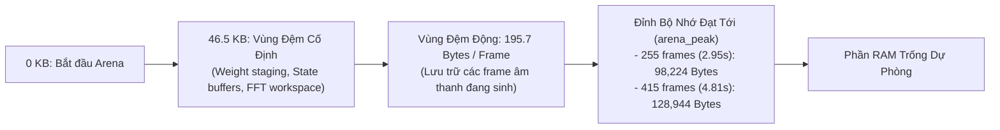
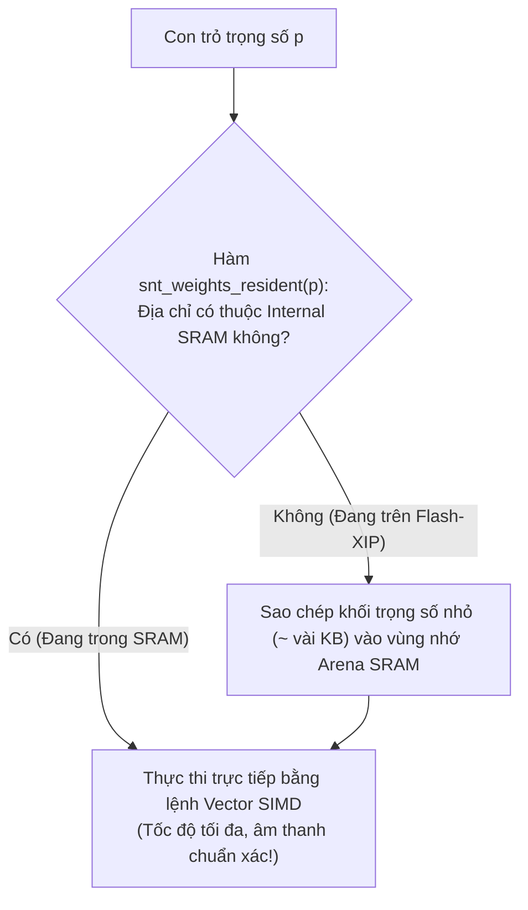

# Chuyên Đề 2: C-Runtime Nhúng & Cơ Chế Quản Lý Bộ Nhớ Không Malloc

> **Tập tin phân tích**: [`sanoTTS/mcu/src/snt_tts.c`](file:///E:/UIT/stm32-develop/sanoTTS/mcu/src/snt_tts.c), [`sanoTTS/mcu/src/snt_nano.c`](file:///E:/UIT/stm32-develop/sanoTTS/mcu/src/snt_nano.c), [`sanoTTS/mcu/include/snt_port.h`](file:///E:/UIT/stm32-develop/sanoTTS/mcu/include/snt_port.h), [`sanoTTS/mcu/include/snt_tts.h`](file:///E:/UIT/stm32-develop/sanoTTS/mcu/include/snt_tts.h)  
> **Chủ đề**: Thiết kế kiến trúc động cơ suy luận thuần C99, cơ chế cấp phát bộ nhớ đệm Bump Arena tuyệt đối không phân mảnh, hợp đồng chuyển giao cổng phần cứng 8 hàm và bài học xử lý bẫy truy cập Flash-XIP.

---

## 1. Triết Lý Thiết Kế Của Động Cơ `mcu/`

Động cơ suy luận nhúng trong thư mục `mcu/` của `sanoTTS` được thiết kế theo các tiêu chuẩn khắt khe nhất của hệ thống nhúng an toàn (Mission-Critical Embedded Systems):

```text
+-----------------------------------------------------------------------------------+
| 1. NGUYÊN TẮC C99 ĐỘC LẬP HOÀN TOÀN (Zero-Dependency Platform-Agnostic Core)      |
|    Tập tin src/snt_tts.c chứa toàn bộ logic mạng nơ-ron mà KHÔNG HỀ CÓ bất kỳ     |
|    lệnh #ifdef ESP32 hay chỉ thị riêng của nhà sản xuất nào. Cùng một file C99     |
|    biên dịch nguyên vẹn trên Host Linux, WebAssembly, ESP32 và STM32!             |
+-----------------------------------------------------------------------------------+
                                         |
                                         v
+-----------------------------------------------------------------------------------+
| 2. QUẢN LÝ BỘ NHỚ THEO MÔ HÌNH VÙNG ĐỆM CHỦ ĐỘNG (Caller-Owned Bump Arena)        |
|    Tuyệt đối không gọi malloc() / free() trong toàn bộ quá trình tổng hợp âm thanh. |
|    Chương trình gọi cấp sẵn 1 mảng byte; engine tự dịch con trỏ nội bộ (Bump ptr). |
|    Triệt tiêu 100% rủi ro phân mảnh heap (Heap Fragmentation Roulette).            |
+-----------------------------------------------------------------------------------+
                                         |
                                         v
+-----------------------------------------------------------------------------------+
| 3. HỢP ĐỒNG CHUYỂN GIAO TỐI GIẢN (Minimal Porting Surface Contract)               |
|    Toàn bộ ranh giới phần cứng chỉ gồm ĐÚNG 8 HÀM trong include/snt_port.h:       |
|    - 4 hàm tính toán đại số tuyến tính int8/int16 (Dot product, MatVec).           |
|    - 4 hàm hỗ trợ hệ thống (Kiểm tra vị trí bộ nhớ, đa nhân, đo thời gian).      |
+-----------------------------------------------------------------------------------+
```

---

## 2. Cơ Chế Quản Lý Bộ Nhớ Đệm Bump Arena (Không Phân Mảnh)

### Vấn Đề Của Hàm `malloc()` Trên Vi Điều Khiển
Trên các vi điều khiển có bộ nhớ hạn chế (như 256 KB hoặc 512 KB SRAM):
- Khi hệ thống chạy các tác vụ mạng (WiFi/BLE), hệ điều hành FreeRTOS và giao diện người dùng, bộ nhớ heap bị chia cắt thành hàng trăm mẩu nhỏ vụn.
- Tổng bộ nhớ trống có thể vẫn còn 250 KB, nhưng khối nhớ liên tục lớn nhất có thể chỉ còn 110 KB.
- Việc gọi `malloc(120 KB)` sẽ lập tức trả về `NULL` và gây crash hệ thống, dù dung lượng tổng vẫn thừa!

### Giải Pháp Của sanoTTS: Phân Bổ Kiểu Vùng Đệm (Bump Arena)
Hàm `snt_synthesize()` nhận vào con trỏ một khối bộ nhớ được người dùng cấp phát tĩnh hoặc cấp phát trước:
```c
int snt_synthesize(const snt_config_t *cfg,
                   const int32_t *phoneme_ids, int n_phonemes,
                   snt_pcm_callback pcm_cb, void *user_data,
                   snt_stats_t *stats);
```
Trong đó `cfg->arena` trỏ tới khối RAM làm việc. Engine sử dụng bộ cấp phát tuyến tính (Bump Allocator):
- Mỗi khi cần tạo một tensor kích hoạt tạm thời, con trỏ `arena_ptr` chỉ việc tăng tịnh tiến lên phía trước.
- Khi kết thúc câu nói, toàn bộ con trỏ được reset về 0 trong 1 chu kỳ máy!



### Công Thức Toán Học Dự Đoán Bộ Nhớ RAM Tiêu Tốn
Đo đạc thực nghiệm trên phần cứng thật cho thấy kích thước bộ nhớ RAM tuân theo phương trình tuyến tính hoàn hảo ($R^2 = 0.9998$):

$$\text{RAM Working Set (Bytes)} = 46,500 + 195.7 \times (\text{Số frames âm thanh})$$

- Với một câu ngắn (khoảng 3 giây $\approx 255$ frames): Đỉnh tiêu thụ RAM (`arena_peak`) là **chính xác 98,224 Bytes (~96 KB)**.
- Với một câu dài (khoảng 5 giây $\approx 415$ frames): Đỉnh tiêu thụ RAM là **chính xác 128,944 Bytes (~126 KB)**.
- Con số **98,224 Bytes** này là đồng nhất bit-exact trên máy trạm Linux, trên chip ESP32 và trên vi điều khiển STM32!

---

## 3. Hợp Đồng Chuyển Giao Cổng Phần Cứng 8 Hàm (`snt_port.h`)

Để đưa sanoTTS sang một kiến trúc chip mới (như STM32 Cortex-M4/M7), lập trình viên **không cần sửa một dòng code nào trong thuật toán mạng nơ-ron**. Toàn bộ công việc chỉ là hiện thực đúng **8 hàm** trong [`include/snt_port.h`](file:///E:/UIT/stm32-develop/sanoTTS/mcu/include/snt_port.h):

```c
/* =========================================================================
 * 4 HÀM TÍNH TOÁN ĐẠI SỐ TUYẾN TÍNH CỐT LÕI
 * Yêu cầu: Tích lũy số nguyên 32-bit chính xác (int32 accumulation),
 * độ dài len là bội số của 16, địa chỉ con trỏ căn chỉnh 16 bytes.
 * ========================================================================= */

// 1. Tích vô hướng giữa 2 vector int8
int32_t snt_dot_s8(const int8_t *a, const int8_t *b, int len);

// 2. Nhân ma trận int8 với vector int8 -> vector đầu ra int32
void snt_matvec_s8(const int8_t *act, const int8_t *w, int32_t *out, int rows, int len);

// 3. Tích vô hướng vector kích hoạt int16 với trọng số int8 (cho chuỗi residual)
int32_t snt_dot_s16s8(const int16_t *a, const int8_t *b, int len);

// 4. Nhân ma trận int8 với vector kích hoạt int16 -> vector đầu ra int32
void snt_matvec_s16s8(const int16_t *act, const int8_t *w, int32_t *out, int rows, int len);


/* =========================================================================
 * 4 HÀM SHIM GIAO TIẾP HỆ THỐNG
 * ========================================================================= */

// 5. Kiểm tra con trỏ có nằm trong RAM nội bộ hay không (phục vụ SIMD)
int snt_weights_resident(const void *p);

// 6. Thực thi hàm f trên nhân phụ (nếu có 2 nhân; mặc định chạy tuần tự)
void snt_par_run(snt_par_fn f, int n, void *ctx);

// 7. Đồng hồ đo micro-giây phục vụ đo đạc hiệu năng (Profiling)
int64_t snt_now_us(void);

// 8. Định danh ngân hàng bộ nhớ tạm thời cho nhân hiện tại (0: Main, 1: Worker)
int snt_scratch_id(void);
```

### Cơ Chế Ủy Quyền Thư Viện (Kernel-Library Delegation)
Nhờ hợp đồng 8 hàm này, việc porting trở nên cực kỳ linh hoạt:
- **Trên ESP32-S3**: Ủy quyền cho thư viện `esp-nn` của Espressif hoặc dùng các hàm hợp ngữ PIE ASM.
- **Trên STM32 (Cortex-M4 / Cortex-M7)**: Ủy quyền trực tiếp cho thư viện chuẩn **ARM CMSIS-NN** (`arm_nn_mat_mult_nt_t_s8`) hoặc tận dụng tập lệnh DSP `__SMLAD`.
- **Trên vi điều khiển thông thường**: Dùng bộ kernel tham chiếu C vô hướng chuẩn (`snt_kernels_ref.c`) mà không cần thư viện bên ngoài.

---

## 4. Cảnh Báo Sống Còn: Bẫy Đọc Flash-XIP & Nhận Thức Vùng Nhớ (Residency Awareness)

Trong quá trình tối ưu hóa trên vi điều khiển, nhóm tác giả đã phát hiện một hiện tượng lỗi phần cứng vô cùng nguy hiểm nhưng ít người biết:

### Hiện Tượng "Âm Thanh Rác" Khi Chạy SIMD Trực Tiếp Trên Flash
- Trọng số mô hình nén được lưu trong bộ nhớ Flash ngoài và ánh xạ vào bộ nhớ qua cơ chế Flash-XIP.
- Khi CPU dùng các lệnh đọc dữ liệu vô hướng thông thường (`L8UI` / con trỏ chuẩn), dữ liệu được nạp chính xác qua bộ nhớ đệm cache của vi điều khiển.
- Tuy nhiên, khi kích hoạt tập lệnh **Vector SIMD (như PIE trên Xtensa LX7)** để nạp 16 byte cùng lúc (`EE.VLD.128`) trực tiếp từ dải địa chỉ Flash-XIP:
  * Bus phần cứng không đáp ứng kịp chu kỳ truy xuất vector, trả về **dữ liệu rác hoàn toàn ngẫu nhiên** mà không gây ngắt ngoại lệ (Crash)!
  * Hệ quả: Tốc độ tính toán vẫn báo cực nhanh, nhưng độ tương quan âm thanh sụp đổ từ 0.995 xuống **0.011 (toàn tiếng rè trắng)**!



### Giải Pháp: Hàm `snt_weights_resident`
Hàm số 5 trong hợp đồng cổng (`snt_weights_resident`) được đưa vào để kiểm tra địa chỉ vùng nhớ:
- Nếu trọng số đang nằm trên Flash ngoài: Engine sẽ sao chép từng khối trọng số nhỏ của tầng hiện tại vào vùng nhớ đệm trong SRAM trước khi gọi lệnh SIMD.
- Nếu trọng số đã nằm trong RAM: Thực thi lệnh SIMD trực tiếp.
- Cơ chế này bảo đảm âm thanh sinh ra luôn đạt độ tương quan chuẩn xác **corr > 0.98** ở tốc độ cao nhất.

---

## 5. Cổng Kiểm Chứng Sai Số Số Học Bit-Exact (The Correctness Oracle)

Một nguyên tắc kỷ luật sắt đá được áp dụng xuyên suốt dự án sanoTTS: **Một chỉ số tốc độ mà không đi kèm với kết quả kiểm tra tính đúng đắn thì hoàn toàn vô giá trị.**

Trong tập tin `mcu/test/golden_main.c`:
1. **Kiểm tra độ tương quan (Correlation Gate)**:
   $$\text{corr}(x_{\text{device}}, x_{\text{golden}}) \ge 0.980$$
2. **Kiểm tra tỉ lệ công suất âm thanh (RMS Energy Ratio)**:
   $$0.80 \le \frac{\text{RMS}(x_{\text{device}})}{\text{RMS}(x_{\text{golden}})} \le 1.25$$

> **Bài học thực nghiệm**: Từng có bản build thuật toán IFFT số nguyên bị lỗi tràn số, đạt độ tương quan $\text{corr} = 0.989$ nhưng biên độ âm thanh bị phóng đại gấp **500 lần** (cháy loa). Nhờ cổng kiểm chứng kép (cả Correlation lẫn RMS Ratio), mọi bản build trên STM32 và ESP32 đều được bảo đảm an toàn âm học tuyệt đối trước khi nạp vào phần cứng.
