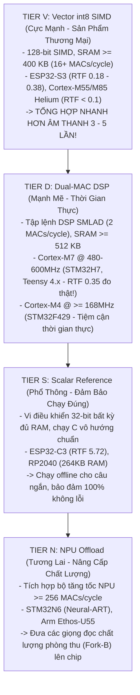

# Chuyên Đề 3: Phân Hạng Vi Điều Khiển & Phép Đo Hiệu Năng Thực Tế

> **Tập tin phân tích**: [`sanoTTS/BOARDS.md`](file:///E:/UIT/stm32-develop/sanoTTS/BOARDS.md), [`sanoTTS/docs/mcu-classes-and-porting.md`](file:///E:/UIT/stm32-develop/sanoTTS/docs/mcu-classes-and-porting.md)  
> **Chủ đề**: Khung phân hạng phần cứng 4 tầng (Tier V, Tier D, Tier S, Tier N), giải mã nghịch lý đa nhân, phân tích tại sao Cortex-M7 đánh bại Xtensa SIMD và giải pháp khắc phục lỗi thiếu RAM trên STM32H7.

---

## 1. Khung Phân Loại Phần Cứng (The Feasibility Gate)

Trong tài liệu [`docs/mcu-classes-and-porting.md`](file:///E:/UIT/stm32-develop/sanoTTS/docs/mcu-classes-and-porting.md), nhóm tác giả đã thiết lập một công thức toán học chặt chẽ để đánh giá xem một con chip bất kỳ có thể chạy được sanoTTS hay không:

$$\text{Khả năng thực thi} = f(\text{Năng lực int8 MAC/s thực tế}, \text{Dung lượng SRAM khả dụng})$$

### 1. Định Mức Tải Cố Định Của Mô Hình (Workload Envelope)
Để tạo ra **1 giây âm thanh**, mô hình sanoTTS (dòng nhúng ~294k đến 567k tham số) đòi hỏi:
- **Khối lượng tính toán**: Duy trì ổn định khoảng **~45 MMAC/s (Triệu phép nhân tích lũy số nguyên 8-bit mỗi giây)**.
- **Dung lượng Flash chứa trọng số**: ~399 KB (cho `heart-nano`) đến ~680 KB (cho `r7`).
- **Mức sàn SRAM tối thiểu**:
  * Chế độ Streaming (tổng hợp đến đâu phát đến đó): **~130 – 160 KB RAM**.
  * Chế độ Whole-utterance (tổng hợp cả câu rồi phát): **~98 – 128 KB RAM**.

```text
BẢNG TIÊU CHUẨN XẾP HẠNG THỜI GIAN THỰC (REAL-TIME VERDICT):

  Năng lực int8 MAC/s thực tế            Đánh giá thời gian thực (RTF)
  ----------------------------------------------------------------------
  ≥ 180 MMAC/s                            Thời gian thực, dư dả (RTF < 0.25)
  90 – 180 MMAC/s                         Thời gian thực (RTF 0.25 - 0.50)
  25 – 90 MMAC/s                          Tiệm cận thời gian thực (RTF 0.50 - 1.0)
  < 25 MMAC/s                             Chạy ngoại tuyến (Offline only, RTF > 1.0)
```

---

## 2. Bốn Tầng Vi Điều Khiển Được Định Nghĩa (The 4 MCU Classes)



---

## 3. Phân Tích Phép Đo Phần Cứng Thực Tế

Bảng tổng hợp từ các bài đo đạc thực nghiệm trên phần cứng thật ([`BOARDS.md`](file:///E:/UIT/stm32-develop/sanoTTS/BOARDS.md)):

| Bo mạch & Chip | Lõi CPU & Xung nhịp | Kernel thực thi | Chỉ số RTF đo được | Tốc độ / Thời gian thực | Hiệu suất int8 (eff MMAC/s) | Độ khớp âm thanh (Corr) |
|---|---|---|---|---|---|---|
| **STM32 Nucleo-H755ZI-Q** | **Cortex-M7 @ 480 MHz** | **C vô hướng (Scalar C)** | **0.3498** | **2.9x nhanh hơn** | **55.1** | **1.000000** |
| **ESP32-S3** | Xtensa LX7 @ 240 MHz | **PIE SIMD (Mặc định)** | **0.3828** | **2.6x nhanh hơn** | 49.6 | 0.994664 |
| **ESP32-S3 (Đa nhân)** | Xtensa LX7 @ 240 MHz | PIE SIMD + Dual-Core | 0.3863 | 2.6x nhanh hơn | 49.2 | 0.994664 |
| **ESP32-S3 (C thô)** | Xtensa LX7 @ 240 MHz | C vô hướng (Không SIMD) | 1.5825 | 0.63x (Chậm hơn) | 12.0 | 0.994664 |
| **ESP32 Classic (LX6)** | Xtensa LX6 @ 240 MHz | C vô hướng (Không SIMD) | 2.1720 | 0.46x (Chậm hơn) | 8.9 | 1.000000 |
| **ESP32-C3** | RV32IMC @ 160 MHz | C vô hướng (Không FPU) | 5.7200 | 0.17x (Chậm hơn) | n/a | Đạt chuẩn |

---

## 4. Ba Phát Hiện Kỹ Thuật Đầy Bất Ngờ

### Phát hiện 1: ARM Cortex-M7 Chạy C Vô Hướng Vẫn Đánh Bại ESP32-S3 Chạy SIMD!
Một phát hiện gây ngạc nhiên lớn trong cộng đồng nhúng:
- Chip **STM32 Nucleo-H755ZI-Q (Cortex-M7 @ 480 MHz)** chỉ chạy code **C vô hướng thuần túy (Scalar C)** nhưng đạt **RTF = 0.3498 (nhanh hơn thời gian thực 2.9 lần)**, vượt qua cả ESP32-S3 chạy hợp ngữ SIMD tối ưu bằng tay (RTF = 0.3828)!
- **Lý do kỹ thuật**:
  1. *Xung nhịp*: Cortex-M7 chạy ở 480 MHz (gấp đôi 240 MHz của ESP32-S3).
  2. *Kiến trúc siêu vô hướng (Superscalar Dual-Issue)*: Lõi Cortex-M7 có thể thực thi 2 lệnh đồng thời trong cùng một chu kỳ xung nhịp.
  3. *Đường truyền AXI 64-bit*: Đường truyền từ CPU tới bộ nhớ SRAM là bus AXI 64-bit tốc độ cao, trong khi đường nạp dữ liệu Load/Store của Xtensa LX7 bị hạn chế hơn.
- **Ý nghĩa**: Con số 0.35 RTF của STM32H7 mới chỉ là mức sàn (floor). Nếu tối ưu tiếp bằng tập lệnh DSP `__SMLAD` hoặc thư viện CMSIS-NN, tốc độ có thể đạt **RTF < 0.15 (nhanh hơn thời gian thực 7 lần)**!

### Phát hiện 2: Chạy Đa Nhân Không Mang Lại Lợi Ích Cho SanoTTS
Thực nghiệm bật cờ `SANOTTS_ESP32_DUALCORE` trên ESP32-S3 cho kết quả:
- Chạy 1 nhân: $\text{RTF} = 0.3828$.
- Bật cả 2 nhân: $\text{RTF} = 0.3863$ (chậm hơn một chút!).
- **Nguyên nhân**:
  * Kích thước các ma trận trong mô hình 294k tham số khá nhỏ (khoảng 64 đến 128 chiều).
  * Chi phí đánh thức nhân phụ qua FreeRTOS Task Notification, chi phí chuyển đổi ngữ cảnh và sự tranh chấp bus bộ nhớ chung (Memory Bus Contention) lớn hơn thời gian tiết kiệm được khi chia đôi phép nhân.
  * **Kết luận**: Đối với sanoTTS, **chạy đơn nhân là tối ưu nhất**. Nhân còn lại nên để dành cho việc đọc cảm biến, quản lý WiFi/Bluetooth hoặc chạy mô hình LLM.

### Phát hiện 3: Tại Sao ESP32-C3 Bị Nghẽn Nặng (RTF 5.72)?
Chip ESP32-C3 chạy ở 160 MHz nhưng mất tới 5.72 giây để sinh 1 giây âm thanh.
- Điểm nghẽn không nằm ở các phép nhân ma trận int8 (vốn chạy khá nhanh).
- Điểm nghẽn nằm ở **các phép tính dấu phẩy động (Float Glue)**: Tính toán tỉ lệ scale, GroupNorm và biến đổi IFFT. Vì ESP32-C3 không có đơn vị phần cứng dấu phẩy động (Hardware FPU), mọi phép tính số thực đều phải mô phỏng bằng phần mềm (Software Emulation), làm tiêu tốn hàng trăm chu kỳ CPU cho mỗi phép tính.

---

## 5. Sự Cố Bộ Nhớ STM32H7 & Giải Pháp Khai Thác AXI SRAM (`0x24000000`)

Khi cộng đồng thử nghiệm sanoTTS trên STM32H7 qua nền tảng Arduino/stm32duino, họ gặp phải một lỗi ngưng trệ (Fatal crash): Bo mạch có tới 1MB RAM nhưng luôn báo **"FATAL: could not allocate arena"**!

### Nguyên Nhân Sự Cố
Trong file kịch bản liên kết (Linker Script) mặc định của stm32duino cho STM32H7:
```text
RAM (xrw) : ORIGIN = 0x20000000, LENGTH = LD_MAX_DATA_SIZE
_estack   = 0x20020000;  /* Chỉ cấp phát 128 KB vùng nhớ DTCM */
```
Toàn bộ biến toàn cục `.data`, `.bss`, ngăn xếp `stack` và vùng nhớ `heap` đều bị nhét chung vào dải DTCM 128 KB này. Với ~83 KB biến tĩnh của chương trình, hàm `malloc()` chỉ có thể cung cấp tối đa ~45 KB RAM, không đủ cho mức sàn 98 KB của sanoTTS!

```mermaid
flowchart TD
    SUBGRAPH_ERR["Cách Cấp Phát Mặc Định Bị Lỗi (DTCM 128 KB)"]
        DTCM["DTCM @0x20000000 (128 KB)\n- Globals + Stack: 83 KB\n- Heap khả dụng: ~45 KB\n=> malloc(98 KB) THẤT BẠI!"]
    end

    SUBGRAPH_FIX["Giải Pháp Của sanoTTS: Đưa Sang AXI SRAM (512 KB)"]
        AXI["AXI SRAM @0x24000000 (512 KB)\n- Nằm trong miền D1, được bật sẵn sau Reset\n- Hoàn toàn độc lập với DTCM, trống 100%\n=> Cấp phát Arena 128 KB DỄ DÀNG!"]
    end

    SUBGRAPH_ERR -.->|Sửa đổi vùng trỏ| SUBGRAPH_FIX
```

### Giải Pháp Đột Phá Của sanoTTS
Thay vì phụ thuộc vào `malloc()`, thư viện can thiệp gán con trỏ vùng nhớ Arena trực tiếp vào dải địa chỉ của **AXI SRAM tại `0x24000000` (dung lượng 512 KB)**:
```c
#if defined(STM32H7) && !defined(SANOTTS_NO_H7_AXI_SRAM)
    // Trỏ thẳng vùng nhớ Arena vào AXI SRAM miền D1
    void *arena_buf = (void *)0x24000000;
#endif
```
- Vùng nhớ AXI SRAM nằm ở miền D1, được phần cứng kích hoạt sẵn ngay sau khi Reset, có bus 64-bit kết nối trực tiếp với Cortex-M7 và hoàn toàn không bị tranh chấp bởi các biến toàn cục.
- **Kết quả trên phần cứng thật**: Bo mạch Nucleo-H755ZI-Q in ra thông số:
  `arena_src: AXI SRAM @0x24000000`, `corr: 1.000000`, `RTF: 0.3498` $\rightarrow$ Chạy mượt mà hoàn hảo!
