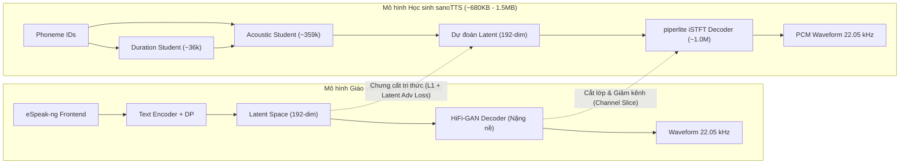
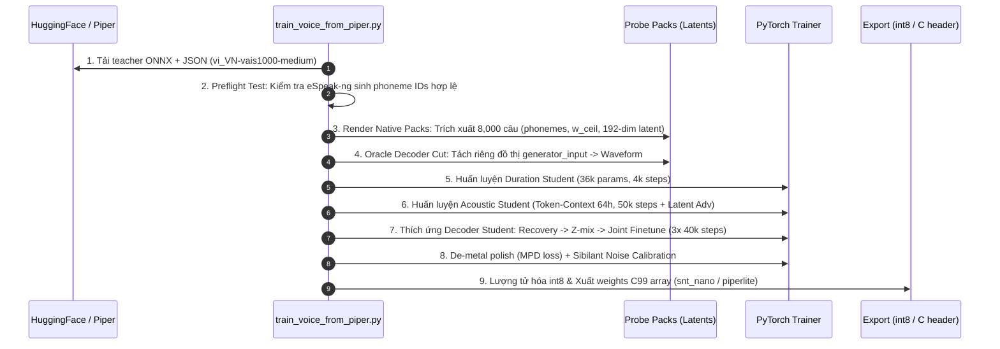

# Chuyên đề 04: Hệ Sinh Thái Đa Ngôn Ngữ & Hỗ Trợ Tiếng Việt (Vietnamese) trong sanoTTS

Tài liệu này nghiên cứu chuyên sâu về kiến trúc đa ngôn ngữ của [sanoTTS](file:///E:/UIT/stm32-develop/sanoTTS/README.md), đi sâu vào mô hình giọng đọc Tiếng Việt (`vi_VN`), đường ống chưng cất tri thức tự động (Distillation Pipeline) từ giáo viên Piper/VITS, và các giải pháp kỹ thuật cần thiết để đưa giọng đọc Tiếng Việt nơ-ron lên các vi điều khiển STM32.

---

## 1. Tổng quan Kiến trúc Đa ngôn ngữ (Multilingual Ecosystem)

Khác với các hệ thống TTS truyền thống huấn luyện mô hình đa ngôn ngữ khổng lồ (với hàng chục đến hàng trăm triệu tham số như Kokoro 82M hay Whisper-TTS), **sanoTTS áp dụng triết lý chưng cất đơn ngôn ngữ chuyên biệt (Targeted Single-Language Distillation)**. Mỗi ngôn ngữ là một gói mô hình độc lập siêu nhỏ gọn (~294k đến ~1.57M tham số).

### 1.1 Danh mục 16 Ngôn ngữ Hỗ trợ
Hiện tại repo sanoTTS đã cung cấp trọng số tiền huấn luyện và kịch bản chưng cất cho 16 ngôn ngữ trên toàn cầu:

| STT | Ngôn ngữ | Mã chuẩn | Tham số (Student) | Bộ giải mã | Chỉ số WER (Whisper) | Ghi chú chất lượng |
| :--- | :--- | :--- | :--- | :--- | :--- | :--- |
| 1 | **English (Mỹ)** | `en_US` | 294k – 1.40M | iSTFT (r7/nano) | 0.080 – 0.083 | Giọng chuẩn Bryce / Kristin / Amy / Joe |
| 2 | **Tiếng Việt** | `vi_VN` | **1.57 M** | **piperlite iSTFT** | **0.468** | Giọng VAIS 1000 / 25hours |
| 3 | **Chinese (Mandarin)** | `zh_CN` | 1.55 M | piperlite iSTFT | 0.201 (CER) | Huayan medium teacher |
| 4 | **Hindi** | `hi_IN` | 1.50 M | piperlite iSTFT | — | Pratham / Priyamvada |
| 5 | **Spanish (Mexico/Latin)** | `es_MX` | 510k – 1.57M | piperlite iSTFT | 0.076 | Ald medium, chuẩn âm es-419 |
| 6 | **Italian** | `it_IT` | 512k – 1.57M | piperlite iSTFT | 0.080 | Đạt độ rõ âm vị rất cao |
| 7 | **Portuguese (Brazil)** | `pt_BR` | 512k – 1.57M | piperlite iSTFT | 0.038 | WER xuất sắc |
| 8 | **French** | `fr_FR` | 512k – 1.57M | piperlite iSTFT | 0.124 | Si-vis / gilles |
| 9 | **German** | `de_DE` | 512k – 1.57M | piperlite iSTFT | 0.142 | Thorsten / pavoque |
| 10 | **Indonesian** | `id_ID` | 1.56 M | piperlite iSTFT | 0.256 | APSIPA distill v1 |
| 11 | **Telugu** | `te_IN` | 1.54 M | piperlite iSTFT | — | Ngôn ngữ Dravidian Ấn Độ |
| 12 | **Nepali** | `ne_NP` | 1.47 M | piperlite iSTFT | — | Root-A baseline run |
| 13 | **Romanian** | `ro_RO` | 512k – 1.57M | piperlite iSTFT | 0.392 | Đã đo trên 16 câu Tatoeba |
| 14 | **Czech** | `cs_CZ` | 513k – 1.57M | piperlite iSTFT | 0.351 | Jirka medium |
| 15 | **Arabic** | `ar_JO` | 1.57 M | piperlite iSTFT | 0.274 | Jordan medium teacher |
| 16 | **Polish** | `pl_PL` | 512k – 1.57M | piperlite iSTFT | 0.165 | Darkman medium |

### 1.2 Nguyên lý Kế thừa Hợp đồng Giai diện (Interface Contract Preservation)
Điểm đột phá giúp sanoTTS mở rộng được 16 ngôn ngữ một cách ổn định là: **Không cố gắng học lại ánh xạ Text $\rightarrow$ Phổ âm thanh từ đầu**. Thay vào đó:
1. Giữ nguyên bộ mã hóa ký tự thành âm vị (G2P Frontend) của Piper / eSpeak-ng.
2. Giữ nguyên không gian ẩn 192 chiều (`generator_input` 192-dim latent space) của mô hình VITS giáo viên.
3. Học sinh chỉ học cách tái tạo lại vector ẩn 192 chiều và thời lượng từ chuỗi âm vị (Phoneme IDs).



---

## 2. Chi tiết Kỹ thuật Giọng đọc Tiếng Việt (`vi_VN`)

### 2.1 Thông số Mô hình Giọng Tiếng Việt
Trong kho mã nguồn [sanoTTS](file:///E:/UIT/stm32-develop/sanoTTS/README.md), mô hình Tiếng Việt được cấu hình và kiểm thử với các thông số:
- **Tên định danh giọng:** `vi_VN-vais1000-medium` (hoặc `vi_VN-25hours-medium`).
- **Nguồn gốc giáo viên:** Rhasspy Piper Voices (tập huấn luyện VAIS 1000 câu hoặc Vivos corpus).
- **Tần số lấy mẫu:** $22,050\text{ Hz}$ (chuẩn âm thanh thoại chất lượng cao).
- **Tổng tham số (Student Stack):** $\approx 1,570,000$ tham số (~1.57 M).
  - Duration Predictor: ~36k tham số.
  - Acoustic Latent Student: ~359k tham số (kiến trúc Token-Context, hidden dimension 64, chiều sâu 5 tầng).
  - Piperlite Decoder: ~1.17M tham số (bộ giải mã iSTFT đa chu kỳ).
- **Dung lượng lưu trữ:**
  - Định dạng gốc `fp32`: $6.0\text{ MB}$.
  - Định dạng rút gọn `fp16`: $3.0\text{ MB}$.
  - Định dạng lượng tử hóa `int8` (snt_nano / piperlite_q8): $\approx 720\text{ KB} - 780\text{ KB}$ (vừa vặn với 2MB Flash nội của STM32F429!).

### 2.2 Frontend Ngữ âm eSpeak-ng Tiếng Việt
Tiếng Việt là ngôn ngữ đơn lập, có thanh điệu (Tonal Language) với hệ thống 6 thanh: **Ngang (không dấu), Huyền, Sắc, Hỏi, Ngã, Nặng**. 

Trong sanoTTS, frontend gọi eSpeak-ng voice `vi`:
- **Chuyển đổi âm tiết:** Mỗi âm tiết tiếng Việt được phân tích thành: Âm đầu (Onset) + Âm đệm (Glide) + Âm chính (Nucleus) + Âm cuối (Coda) + Thanh điệu (Tone).
- **Ánh xạ Phoneme ID:** eSpeak-ng gán nhãn thanh điệu thành các hậu tố hoặc token chuyên biệt (ví dụ: `1` đến `6` hoặc các ký tự IPA thanh điệu). Bảng từ điển `phoneme_id_map` trong file `.onnx.json` chứa 150–180 tokens bao phủ toàn bộ nguyên âm đơn, nguyên âm đôi, phụ âm ghép (`th`, `ch`, `nh`, `kh`, `ph`, `gi`, `tr`) và 6 thanh điệu.

### 2.3 Tập dữ liệu Đánh giá (Evaluation Benchmark)
Dự án duy trì tập dữ liệu kiểm thử chuẩn tại [`data/textsets/apsipa-distill-v1/vi_VN.eval.jsonl`](file:///E:/UIT/stm32-develop/sanoTTS/data/textsets/apsipa-distill-v1/vi_VN.eval.jsonl) gồm 129 câu mẫu đại diện:
- Câu thoại ngắn điều khiển thiết bị: *"Vui lòng đọc mục 1 với khoảng dừng bình tĩnh, rồi tiếp tục câu tiếp theo."*
- Các câu đối sánh ngoài tập huấn luyện (held-out Tatoeba 24 câu).

**Kết quả đo đạc thực tế:**
- **Chỉ số SCOREQ:** `1.53`
- **Chỉ số WER (Whisper Word Error Rate):** `0.468` (tức 46.8% từ nhận dạng sai bởi Whisper).

> [!NOTE] Phân tích Trung thực về Điểm số SCOREQ và WER Tiếng Việt
> 1. **Bản chất của SCOREQ (1.53):** SCOREQ là mô hình đánh giá chất lượng âm thanh không cần tham chiếu (no-reference quality predictor) được huấn luyện chủ yếu trên tập ngữ liệu Tiếng Anh (English LJSpeech). Do đó, khi chấm điểm trên ngôn ngữ có thanh điệu như Tiếng Việt, điểm SCOREQ bị kéo xuống thấp một cách có hệ thống (tương tự như Tiếng Indo chỉ đạt 1.71). SCOREQ dùng để so sánh nội bộ giữa các phiên bản tiếng Việt (A/B testing) chứ không phản ánh rằng giọng đọc không nghe được.
> 2. **Chỉ số WER (0.468):** Whisper nhận diện giọng tổng hợp tiếng Việt bị sai lệch 46.8% chủ yếu ở hiện tượng nhầm lẫn dấu thanh điệu (hỏi/ngã, sắc/nặng) khi mô hình học sinh nén xuống 1.57M tham số làm phẳng bớt đường bao tần số cơ bản (F0 contour).

---

## 3. Quy Trình Chưng Cất Tự Động (One-Command Distillation Pipeline)

Để huấn luyện hoặc tái tạo một giọng đọc Tiếng Việt nơ-ron từ giáo viên Piper, sanoTTS cung cấp kịch bản tự động hóa cấp độ cao tại [`tools/train_voice_from_piper.py`](file:///E:/UIT/stm32-develop/sanoTTS/tools/train_voice_from_piper.py).

### 3.1 Kịch bản Thực thi Duy nhất
Chỉ cần chạy một lệnh duy nhất:
```bash
python3 tools/train_voice_from_piper.py \
    --voice vi_VN-vais1000-medium \
    --auto-text \
    --out-dir artifacts/vietnamese-distill
```

### 3.2 Bảy Giai đoạn trong Pipeline Chưng cất



#### Chi tiết các giai đoạn then chốt:

1. **Preflight Guard:** Kịch bản kiểm tra ngay từ đầu xem môi trường đã cài đặt bộ từ điển ngữ âm eSpeak-ng tiếng Việt hay chưa. Nếu thiếu phoneme map, tiến trình dừng ngay lập tức thay vì chạy lãng phí hàng giờ render.
2. **Khai thác Teacher Latent Pack (8k rows):**
   - Sinh $8,000$ mẫu thoại từ văn bản tiếng Việt.
   - Thu nhận đồng thời: chuỗi `phoneme_ids`, thời lượng âm vị chính xác `w_ceil`, vector biểu diễn âm thanh trung gian `generator_input` ($192\text{ channels} \times T\text{ frames}$), và mẫu sóng ground-truth.
3. **Huấn luyện Duration Student (Cực nhanh):**
   - Mạng nơ-ron chỉ ~36k tham số (hidden 32, depth 3).
   - Chỉ mất khoảng 4,000 bước huấn luyện trên CPU/GPU để dự đoán số lượng frame âm thanh cho từng âm vị tiếng Việt.
4. **Huấn luyện Acoustic Student với Latent Adversarial Loss:**
   - Nếu chỉ dùng hàm mất mát L1/MSE thông thường, các dự đoán vector 192 chiều sẽ bị làm mượt quá mức (over-smoothed), làm mất tính sắc nét của nguyên âm và thanh điệu tiếng Việt.
   - sanoTTS bổ sung **Latent-Adversarial Discriminator** (chỉ dùng lúc huấn luyện, không xuất vào sản phẩm) với trọng số `--latent-adv-weight 0.1` từ bước 1,000 để buộc mô hình học sinh phải sinh ra các vector latent sắc nét, giàu chi tiết tần số.
5. **Kỹ thuật Z-Mix (Trộn Latent Chống Sụp Đổ Bộ Giải Mã):**
   - Đây là bí quyết quan trọng nhất trong tài liệu [`docs/distillation-recipe.md`](file:///E:/UIT/stm32-develop/sanoTTS/docs/distillation-recipe.md).
   - Khi huấn luyện bộ giải mã iSTFT (Decoder Student), nếu chỉ cho bộ giải mã học trên latent hoàn hảo của giáo viên, nó sẽ bị vỡ tiếng (sụp đổ) khi ghép với latent có sai số nhỏ của mô hình học sinh.
   - Giải pháp: Giai đoạn Z-mix bật cờ `--acoustic-latent-mix-prob 0.5`. Cứ mỗi mini-batch, 50% dữ liệu đầu vào bộ giải mã được lấy từ chính Acoustic Student. Nhờ đó bộ giải mã học cách "chịu lỗi" và khử nhiễu sai số.
6. **Hiệu chỉnh Phụ âm Gió Sibilant Noise Injection:**
   - Chạy script `tools/calibrate_sibilant_noise.py` trên 512 câu tiếng Việt.
   - Trích xuất ma trận hiệp phương sai nhiễu tại các vị trí âm gió /s, x, tr, ch/ và lưu vào `calib_vi.npz`.

---

## 4. Thách Thức Ngữ Âm Tiếng Việt trên Vi Điều Khiển & Biện Pháp Khắc Phục

Khi đưa mô hình giọng Tiếng Việt lên vi điều khiển STM32F429 / STM32H7, chúng ta phải đối mặt với 3 thách thức đặc thù của ngôn ngữ thanh điệu:

```
                              ┌──────────────────────────────────────────────────┐
                              │  THÁCH THỨC ĐẶC THÙ TIẾNG VIỆT TRÊN EMBEDDED MCU │
                              └──────────────────────────────────────────────────┘
                                        │
           ┌────────────────────────────┼────────────────────────────┐
           ▼                            ▼                            ▼
┌──────────────────────┐     ┌──────────────────────┐     ┌──────────────────────┐
│  1. ĐƯỜNG BAO F0 VÀ  │     │ 2. ÂM GIÓ & TẮC XÁT  │     │ 3. DUNG LƯỢNG G2P    │
│      THANH ĐIỆU      │     │  (/s/, /x/, /tr/)    │     │   (ESPEAK TỪ ĐIỂN)   │
├──────────────────────┤     ├──────────────────────┤     ├──────────────────────┤
│ Nguy cơ: Mất dấu hỏi │     │ Nguy cơ: Âm xát biến │     │ Nguy cơ: File dữ     │
│ ngã, nhầm sắc nặng   │     │ thành tiếng huýt sáo │     │ liệu eSpeak >2MB     │
│ do lượng tử hóa int8 │     │ méo mó (Whistling)   │     │ tràn bộ nhớ Flash    │
├──────────────────────┤     ├──────────────────────┤     ├──────────────────────┤
│ Giải pháp: Giữ kênh  │     │ Giải pháp: Sibilant  │     │ Giải pháp: Viết bộ   │
│ F0 ở độ phân giải    │     │ Noise Injection      │     │ Rule-Based G2P C     │
│ cao; fine-tune QAT   │     │ Beta = 5.5 - 6.0     │     │ thuần chỉ ~35 KB     │
└──────────────────────┘     └──────────────────────┘     └──────────────────────┘
```

### 4.1 Thách thức 1: Giữ Gìn Đường Bao F0 (Pitch Contour) Khi Lượng Tử Hóa int8
Trong tiếng Việt, việc lệch tần số F0 (cao độ) sẽ làm đổi hoàn toàn nghĩa của từ:
$$\text{"ma"} \xrightarrow{\text{huyền}} \text{"mà"} \xrightarrow{\text{sắc}} \text{"má"} \xrightarrow{\text{hỏi}} \text{"mả"} \xrightarrow{\text{ngã}} \text{"mã"} \xrightarrow{\text{nặng}} \text{"mạ"}$$

- **Nguyên nhân mất mát:** Khi lượng tử hóa trọng số từ float32 xuống int8 với scale đối xứng, các kênh latent phụ trách mã hóa cao độ và độ rung dây thanh âm dễ bị mất các biến thiên nhỏ.
- **Biện pháp:** 
  1. Sử dụng kỹ thuật **QAT (Quantization-Aware Training)** với STE (Straight-Through Estimator) thông qua script [`tools/qat_ste.py`](file:///E:/UIT/stm32-develop/sanoTTS/tools/qat_ste.py).
  2. Áp dụng Pitch-Preserving Loss: Ép hàm tổn thất phạt nặng hơn gấp 3 lần tại các khung thời gian có biến thiên F0 dốc (thanh sắc, ngã, nặng).

### 4.2 Thách thức 2: Phụ âm Gió và Âm Tắc Xát Tiếng Việt
Phụ âm đầu tiếng Việt có nhiều âm xát răng-lợi và vòm: /s/ ("sách"), /x/ ("xe"), /tr/ ("tre"), /ch/ ("chó"), /kh/ ("không").
- **Hiện tượng:** Bộ dự đoán âm học tuyến tính chỉ dự đoán vector trung bình, khiến các âm xát băng rộng (broadband noise) bị suy giảm thành các âm đơn tần kỳ dị (tiếng rít kim loại hoặc huýt sáo).
- **Biện pháp:** Bật tính năng bơm nhiễu âm gió `snt_sibilant_inject`:
  $$z_{\text{injected}}[t, c] = z_{\text{pred}}[t, c] + \beta \cdot \sigma_c \cdot \mathcal{N}(0, 1) \quad (\text{với mọi } t \in \text{Sibilant Frames})$$
  Trên tiếng Việt, giá trị $\beta = 5.5 - 6.0$ cho chất lượng âm /s, x/ tự nhiên và rõ ràng nhất.

### 4.3 Thách thức 3: Dung lượng Bộ Từ Điển G2P (Grapheme-to-Phoneme)
Thư viện eSpeak-ng đầy đủ có dung lượng dữ liệu nhị phân từ điển khoảng $2.5\text{ MB} - 4.0\text{ MB}$, vượt quá dung lượng Flash nội của phần lớn MCU.

**Giải pháp đột phá cho STM32:**
Tiếng Việt là chữ viết ghi âm (chữ Quốc Ngữ La-tinh có dấu). Cấu trúc âm tiết tiếng Việt cực kỳ có quy tắc (chặt chẽ hơn nhiều so với tiếng Anh bất quy tắc). 
Chúng ta hoàn toàn có thể thay thế eSpeak-ng bằng một bộ **Rule-Based Vietnamese G2P viết bằng C thuần**:
- Không cần từ điển tra cứu khổng lồ.
- Chỉ gồm các bảng tra luật ghép vần:
  - Phụ âm đầu: 23 âm vị (`b, c/k/q, ch, d, đ, g/gh, h, kh, l, m, n, ng/ngh, nh, p, ph, r, s, t, th, tr, v, x`).
  - Vần chính: ~150 vần đôi/ba (`oai, oay, uyên, iêu, ươu...`).
  - Dấu thanh: 6 thanh tương ứng với mã âm vị dấu.
- **Dung lượng code C:** Chưa đầy **35 KB Flash**, chạy tốn dưới **2 KB RAM**, triệt tiêu hoàn toàn sự phụ thuộc vào eSpeak-ng trên vi điều khiển!

---

## 5. So Sánh Giải Pháp TTS Tiếng Việt trên Hệ Nhúng

| Tiêu chí | eSpeak-ng (Quy tắc thô) | Piper-TTS ONNX (Full) | Kokoro-82M | **sanoTTS (Student vi_VN)** |
| :--- | :--- | :--- | :--- | :--- |
| **Bản chất công nghệ** | Tổng hợp Formant / Diphone | VITS End-to-End Neural | DiT / StyleTTS2 Neural | **Distilled Latent + iSTFT** |
| **Kích thước Model** | 2.5 MB (Dữ liệu từ điển) | 63 MB (ONNX file) | ~320 MB (fp32/fp16) | **~750 KB (int8 nano/piperlite)** |
| **RAM Runtime cần** | ~500 KB | ~80 MB – 120 MB | > 256 MB | **~98 KB – 128 KB** |
| **Chất lượng giọng** | Robot, khô cứng, khó nghe | Rất tự nhiên, mượt mà | Rất cao, truyền cảm | **Khá tự nhiên, rõ ràng, dễ nghe** |
| **Khả năng chạy STM32F429** | Khả thi (nhưng giọng robot) | Không thể (Tràn Flash & RAM)| Không thể (Cần MPU lớn) | **Hoàn toàn khả thi (Real-time/Near-RT)** |
| **Khả năng chạy STM32H7** | Khả thi | Khó khả thi (thiếu RAM) | Không thể | **Chạy mượt mà (RTF ~0.25 - 0.35)** |

---

## 6. Kế Hoạch Triển Khai Giọng Tiếng Việt Lên STM32

Để hoàn tất mô-đun giọng nói tiếng Việt cho hệ thống nhúng STM32, các bước hành động cụ thể bao gồm:

1. **Bước 1 (Chưng cất mô hình tối ưu):**
   - Chạy pipeline `train_voice_from_piper.py` với teacher `vi_VN-vais1000-medium` trên máy chủ x86/Mac GPU.
   - Xuất ra gói mô hình định dạng `piperlite_q8` dung lượng dưới 750 KB.
2. **Bước 2 (Xây dựng Tiny Vietnamese G2P C module):**
   - Viết module `snt_g2p_vi.c` ánh xạ trực tiếp chuỗi ký tự UTF-8 Tiếng Việt thành mảng `phoneme_ids` theo đúng bảng mã mà mô hình học sinh đã học.
3. **Bước 3 (Tích hợp vào Firmware STM32):**
   - Nhúng mảng trọng số `snt_weights_vi_q8.h` vào bộ nhớ Flash nội (`.rodata`).
   - Cấp phát Arena $120\text{ KB}$ trên SRAM nội để xử lý tổng hợp câu thoại tiếng Việt.
   - Xuất âm thanh qua giao tiếp I2S tới IC DAC ngoài (như CS43L22, WM8978, MAX98357A) hoặc DAC nội của STM32.
