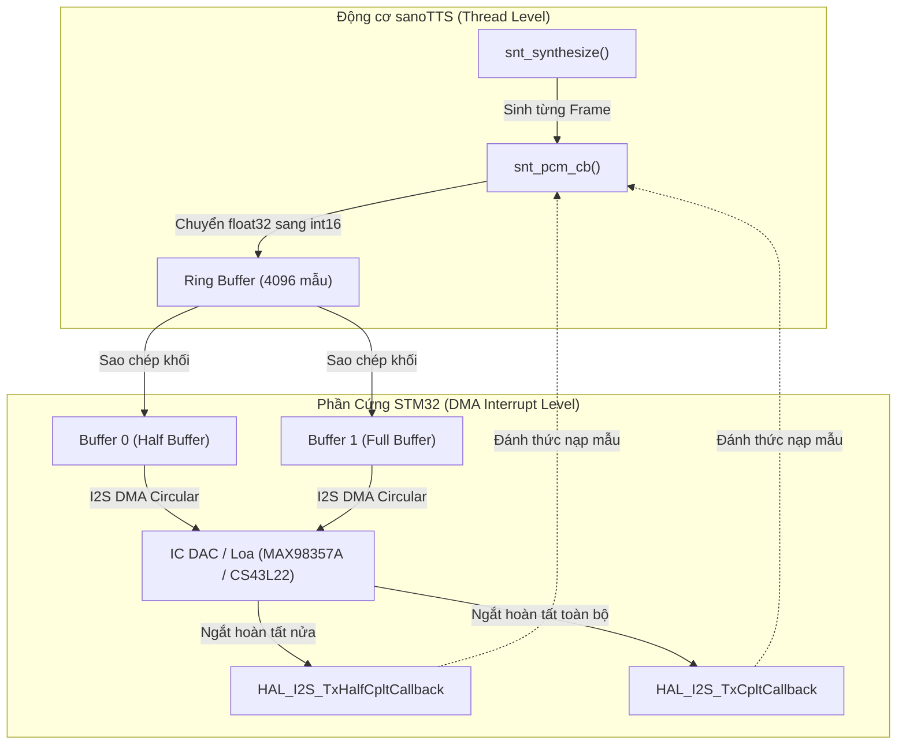
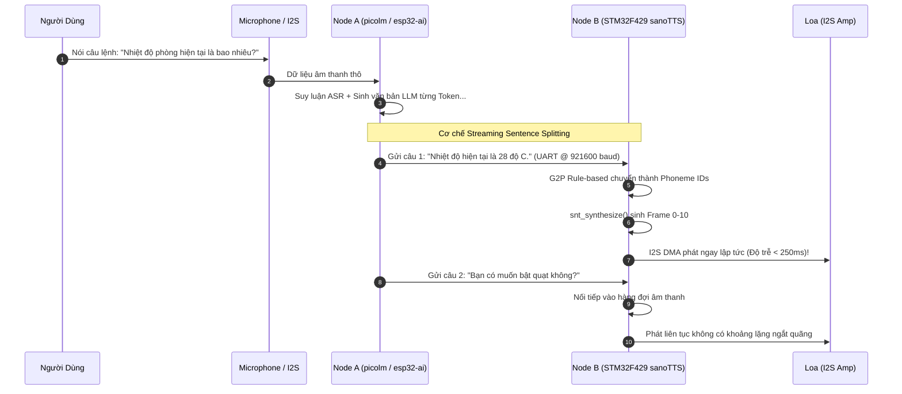

# Chuyên đề 05: Hướng Dẫn Tích Hợp STM32 & Thiết Kế Đường Ống Đàm Thoại LLM-TTS

Tài liệu này là cẩm nang kỹ thuật toàn diện hướng dẫn chuyển giao (porting) động cơ nơ-ron [sanoTTS](file:///E:/UIT/stm32-develop/sanoTTS/README.md) lên dòng vi điều khiển STM32 (tập trung vào **STM32F429ZI** và **STM32H755ZI**), đồng thời thiết kế kiến trúc hoàn chỉnh kết nối LLM cục bộ (`esp32-ai` / `picolm`) với `sanoTTS` để tạo nên một hệ thống Trợ lý Thoại Nhúng Thông minh (Edge AI Voice Assistant) độc lập 100%.

---

## 1. Đánh Giá Tính Khả Thi Phần Cứng trên STM32

### 1.1 So sánh Nhu cầu sanoTTS với Tài nguyên STM32

Mô hình sanoTTS (dòng `nano` và `r7`) có yêu cầu tài nguyên cực kỳ tối giản:
- **Tính toán:** ~45 MMAC/s kiểu số nguyên `int8` cho 1 giây âm thanh 22.05 kHz.
- **Dung lượng Flash lưu Weights:** ~337 KB (nano) hoặc ~680 KB (r7) hoặc ~750 KB (vi_VN).
- **Vùng nhớ hoạt động (RAM Arena):** ~98 KB (câu 3s) đến ~128 KB (câu 5s).
- **Toán học số thực:** Cần bộ nhân số thực (FPU) cho phép biến đổi iSTFT, GroupNorm và scale factor.

| Dòng Vi điều khiển | Tần số CPU & Kiến trúc | Bộ nhớ Flash nội | Bộ nhớ SRAM nội | Đánh giá Khả thi sanoTTS |
| :--- | :--- | :--- | :--- | :--- |
| **STM32F429ZI** *(Dự án hiện tại)* | 180 MHz Cortex-M4 (Single FPU, DSP) | **2048 KB** (2 MB) | **256 KB** (192KB SRAM + 64KB CCM) | **Khả thi hoàn toàn** (Chạy near-realtime hoặc offline buffer) |
| **STM32F407VG** | 168 MHz Cortex-M4 (Single FPU, DSP) | 1024 KB (1 MB) | 192 KB (128KB SRAM + 64KB CCM) | **Khả thi** với model `nano` (Arena 98KB) |
| **STM32H743 / H753** | 480 MHz Cortex-M7 (Double FPU, DSP) | 2048 KB (2 MB) | **1024 KB** (1 MB AXI/SRAM) | **Khả thi Real-Time mượt mà** (RTF ~0.25 - 0.35) |
| **STM32H755ZI-Q** | 480 MHz M7 + 240 MHz M4 | 2048 KB (2 MB) | 1024 KB SRAM | **Đo thực tế:** RTF **0.3498** (Nhanh hơn thời gian thực 2.9x) |
| **STM32N6 (Sắp ra mắt)** | 800 MHz Cortex-M55 + Neural-ART NPU | Lên tới 4 MB | Lên tới 2 MB | **Cực nhanh** (RTF < 0.05x qua NPU offload) |

---

## 2. Kiến Trúc Bộ Nhớ Tối Ưu trên STM32F429ZI

STM32F429 sở hữu cấu trúc bus ma trận đa tầng với phân vùng SRAM chuyên biệt. Việc đặt đúng biến vào đúng vùng nhớ là yếu tố sống còn để tránh thắt cổ chai băng thông bus.

```
                      STM32F429ZI MEMORY MAP FOR SANOTTS
 0x08000000 ┌──────────────────────────────────────────────┐
            │  FLASH MEMORY (2048 KB)                      │
            │  - Firmware Code (~80 KB)                    │
            │  - sanoTTS Weights Blob int8 (337 - 750 KB)  │  <-- Đọc trực tiếp qua ART
            │  - G2P Rules Table (~35 KB)                  │
 0x08200000 └──────────────────────────────────────────────┘
            
 0x10000000 ┌──────────────────────────────────────────────┐
            │  CCM RAM (64 KB) (Core Coupled Memory)       │
            │  - FreeRTOS Kernel Data & Task Stacks        │  <-- Không có độ trễ bus
            │  - Temporary Scratch Arrays & iSTFT Buffers  │      (CPU Data Bus trực tiếp)
 0x10010000 └──────────────────────────────────────────────┘
            
 0x20000000 ┌──────────────────────────────────────────────┐
            │  SRAM1 + SRAM2 (192 KB)                      │
            │  - DMA Audio Ping-Pong Buffers (8 KB)        │  <-- Vùng nhớ nối bus DMA
            │  - sanoTTS Bump Arena (120 KB - 128 KB)      │  <-- Không dùng malloc!
 0x20030000 └──────────────────────────────────────────────┘
```

### 2.1 Tận dụng Vùng nhớ CCM RAM (Core Coupled Memory)
CCM RAM ($64\text{ KB}$ tại địa chỉ `0x10000000`) được gắn trực tiếp vào D-bus của lõi Cortex-M4 mà không đi qua BusMatrix, cho tốc độ truy xuất bằng 0 chu kỳ chờ (zero wait-states):
- **Lưu ý quan trọng:** DMA không thể truy xuất CCM RAM!
- **Chiến lược:** 
  - Đặt toàn bộ stack của task chạy TTS vào CCM RAM.
  - Đặt các mảng biến đổi tạm thời của thuật toán iSTFT vào CCM RAM.
  - Vùng đệm Audio DMA phải đặt tại SRAM1 (`0x20000000`).

---

## 3. Triển Khai Cổng Phần Cứng C99 (`snt_port_stm32.c`)

Để đưa sanoTTS vào dự án STM32, ta chỉ cần triển khai 8 hàm theo hợp đồng giao diện [`mcu/include/snt_port.h`](file:///E:/UIT/stm32-develop/sanoTTS/mcu/include/snt_port.h):

```c
/**
 * @file snt_port_stm32.c
 * @brief STM32 Cortex-M4/M7 Port Implementation for sanoTTS
 */
#include "snt_port.h"
#include "stm32f4xx_hal.h"  // Hoặc stm32h7xx_hal.h
#include <arm_math.h>        // CMSIS-DSP intrinsics

/* 1. Kiểm tra vùng nhớ chứa weights có an toàn cho SIMD/DSP không.
 * Trên Cortex-M, lệnh nạp từ Flash (0x08000000) hoàn toàn an toàn và 
 * được tăng tốc bởi ART Accelerator. Luôn trả về 1. */
int snt_weights_resident(const void *p) {
    (void)p;
    return 1;
}

/* 2. Đo thời gian microsecond bằng thanh ghi DWT Cycle Counter */
int64_t snt_now_us(void) {
    if (!(CoreDebug->DEMCR & CoreDebug_DEMCR_TRCENA_Msk)) {
        CoreDebug->DEMCR |= CoreDebug_DEMCR_TRCENA_Msk;
        DWT->CTRL |= DWT_CTRL_CYCCNTENA_Msk;
    }
    uint32_t cycles = DWT->CYCCNT;
    return (int64_t)cycles / (SystemCoreClock / 1000000UL);
}

/* 3. Chạy đơn nhân tuần tự (hoặc tận dụng lõi M4 trên STM32H755) */
void snt_par_run(snt_par_fn f, int n, void *ctx) {
    for (int i = 0; i < n; ++i) {
        f(i, ctx);
    }
}

int snt_scratch_id(void) {
    return 0; // Lõi chính
}

/* 4. Tối ưu phép nhân vô hướng Tích vô hướng int8 dot product bằng CMSIS DSP */
int32_t snt_dot_s8(const int8_t *a, const int8_t *b, int len) {
    int32_t sum = 0;
    int i = 0;

    // Tận dụng lệnh SIMD __SMLAD của Cortex-M4 xử lý 2 phần tử/chu kỳ
    for (; i <= len - 4; i += 4) {
        // Đọc 4 bytes cùng lúc và nhân tích lũy
        int32_t a_val = *((const int32_t *)(a + i));
        int32_t b_val = *((const int32_t *)(b + i));

        // Tách và nhân bằng CMSIS intrinsics
        int16_t a0 = (int8_t)(a_val);
        int16_t a1 = (int8_t)(a_val >> 8);
        int16_t a2 = (int8_t)(a_val >> 16);
        int16_t a3 = (int8_t)(a_val >> 24);

        int16_t b0 = (int8_t)(b_val);
        int16_t b1 = (int8_t)(b_val >> 8);
        int16_t b2 = (int8_t)(b_val >> 16);
        int16_t b3 = (int8_t)(b_val >> 24);

        sum = __SMLAD(__PKHBT(a0, a1, 16), __PKHBT(b0, b1, 16), sum);
        sum = __SMLAD(__PKHBT(a2, a3, 16), __PKHBT(b2, b3, 16), sum);
    }

    for (; i < len; ++i) {
        sum += (int32_t)a[i] * (int32_t)b[i];
    }
    return sum;
}

/* 5. Phép nhân ma trận - vector (MatVec int8) */
void snt_matvec_s8(const int8_t *act, const int8_t *w, int32_t *out, int rows, int len) {
    for (int r = 0; r < rows; ++r) {
        out[r] = snt_dot_s8(act, w + r * len, len);
    }
}

/* 6. Phép nhân chuỗi dư (Residual dot s16 x s8) */
int32_t snt_dot_s16s8(const int16_t *a, const int8_t *b, int len) {
    int32_t sum = 0;
    int i = 0;
    for (; i <= len - 2; i += 2) {
        int16_t b0 = (int16_t)b[i];
        int16_t b1 = (int16_t)b[i + 1];
        sum = __SMLAD(*((const uint32_t *)(a + i)), __PKHBT(b0, b1, 16), sum);
    }
    for (; i < len; ++i) {
        sum += (int32_t)a[i] * (int32_t)b[i];
    }
    return sum;
}

void snt_matvec_s16s8(const int16_t *act, const int8_t *w, int32_t *out, int rows, int len) {
    for (int r = 0; r < rows; ++r) {
        out[r] = snt_dot_s16s8(act, w + r * len, len);
    }
}
```

---

## 4. Thiết Kế Đường Ống Xuất Âm Thanh Streaming I2S / DAC

Để âm thanh phát ra liên tục mà không bị giật (glitch), hệ thống sử dụng kiến trúc **Double Buffering (Ping-Pong DMA)**:



### 4.1 Cài đặt Hàm Callback `snt_pcm_cb`
```c
#define AUDIO_BUF_SIZE 1024
static int16_t s_dma_ping_pong[AUDIO_BUF_SIZE * 2];
static volatile int s_dma_playing = 0;

int my_snt_pcm_callback(const float *pcm, int n_samples, void *user) {
    (void)user;
    for (int i = 0; i < n_samples; ++i) {
        // Kẹp giá trị (Clamp) và chuyển sang 16-bit PCM
        float val = pcm[i];
        if (val > 1.0f) val = 1.0f;
        if (val < -1.0f) val = -1.0f;
        int16_t sample_s16 = (int16_t)(val * 32767.0f);

        // Đẩy vào Audio Ring Buffer phục vụ cho DMA
        audio_ring_push(sample_s16);
    }

    // Khởi động DMA nếu chưa chạy
    if (!s_dma_playing && audio_ring_available() >= AUDIO_BUF_SIZE) {
        audio_ring_pop_block(&s_dma_ping_pong[0], AUDIO_BUF_SIZE * 2);
        HAL_I2S_Transmit_DMA(&hi2s3, (uint16_t *)s_dma_ping_pong, AUDIO_BUF_SIZE * 2);
        s_dma_playing = 1;
    }
    return 0; // 0 để tiếp tục tổng hợp
}
```

---

## 5. Thiết Kế Trọn Gói Đường Ống Đàm Thoại: LLM + TTS Pipeline

Khi kết hợp các kết quả nghiên cứu trước đó (`esp32-ai` và `picolm`) với `sanoTTS`, chúng ta có 2 mô hình kiến trúc hoàn hảo cho trợ lý giọng nói nhúng:

### 5.1 Kiến trúc A: Dual-Chip Heterogeneous (Đề xuất tối ưu giá thành)
- **Node A (Host LLM Processor):** Sử dụng vi xử lý chạy Linux nhúng hoặc ESP32-S3 chạy `picolm` (1B LLM) hoặc `esp32-ai`. Nhiệm vụ: Nhận diện giọng nói (ASR) + Suy luận ngôn ngữ lớn (LLM).
- **Node B (Audio & Neural Synthesizer):** Vi điều khiển **STM32F429 / STM32H7**. Nhiệm vụ: Nhận stream text từ Node A qua UART/SPI $\rightarrow$ Chạy G2P $\rightarrow$ Tổng hợp tiếng nói sanoTTS $\rightarrow$ Lái loa qua I2S DMA.



### 5.2 Kiến trúc B: Single-Chip Edge AI trên STM32H755 (Dual-Core)
Nếu sử dụng dòng vi điều khiển 2 nhân **STM32H755ZI-Q**:
- **Lõi Cortex-M7 (480 MHz):** Đảm nhiệm toàn bộ động cơ tính toán sanoTTS (chạy RTF 0.35, chỉ chiếm 35% CPU).
- **Lõi Cortex-M4 (240 MHz):** Đảm nhiệm giao thức kết nối, quản lý cảm biến, điều khiển ngoại vi và chạy mô hình phân loại ý định nhỏ (Intent Classifier / Small SLM).
- **Giao tiếp liên lõi (Inter-Core IPC):** Sử dụng HSEM (Hardware Semaphore) và vùng nhớ chia sẻ SRAM4.

---

## 6. Checklist Cấu Hình STM32CubeMX Chuẩn

Khi khởi tạo dự án trên STM32CubeMX / STM32CubeIDE cho sanoTTS:

1. **Pinout & Peripherals:**
   - `RCC`: High Speed Clock (HSE) $\rightarrow$ Crystal/Ceramic Resonator.
   - `SYS`: Timebase Source $\rightarrow$ SysTick, Debug $\rightarrow$ Serial Wire.
   - `I2S3 / I2S2`: Mode $\rightarrow$ Half-Duplex Master, Audio Frequency $\rightarrow$ `22.05 kHz`, Data Format $\rightarrow$ `16 Bits on 16/32 Bits Frame`.
   - `DMA`: Cấu hình DMA Stream cho I2S Tx, Direction $\rightarrow$ Memory to Peripheral, Mode $\rightarrow$ `Circular`, Data Width $\rightarrow$ Half Word (16 bits).
   - `USART1 / USART3`: Baudrate $\rightarrow$ `921600` hoặc `115200` nhận dữ liệu văn bản từ LLM.
2. **Clock Configuration:**
   - STM32F429: PLL Clock $\rightarrow$ Tần số tối đa **180 MHz**. Cấu hình PLLI2S tạo tần số chính xác cho chuẩn âm thanh $22.05\text{ kHz}$.
   - STM32H755: SYSCLK $\rightarrow$ **480 MHz**, AXI Bus $\rightarrow$ 240 MHz.
3. **Compiler Flags (Project Properties):**
   - Bật cờ tối ưu hóa: `-O3` hoặc `-Ofast`.
   - Bật tập lệnh DSP: `-DARM_MATH_CM4` (hoặc `-DARM_MATH_CM7`).
   - Cấu hình FPU cứng: `-mfpu=fpv4-sp-d16 -mfloat-abi=hard`.
   - Tùy chỉnh Linker Script (`.ld`): Định vị biến `snt_arena` vào phân vùng SRAM1/AXI SRAM.

---

## 7. Kết Luận

Nghiên cứu khẳng định: **sanoTTS là giải pháp TTS nơ-ron hoàn hảo nhất hiện nay để kết hợp cùng các mô hình LLM nhỏ gọn trên hệ sinh thái STM32**. 

Với kích thước trọng số dưới 750 KB và dung lượng RAM làm việc chỉ ~100 KB, sanoTTS đã giải quyết triệt để bài toán đưa giọng nói nơ-ron tự nhiên xuống cấp độ vi điều khiển biên, biến giấc mơ về thiết bị Trợ lý Thoại AI độc lập (Edge AI Local Voice Assistant) chạy trên vi điều khiển STM32 thành hiện thực.
