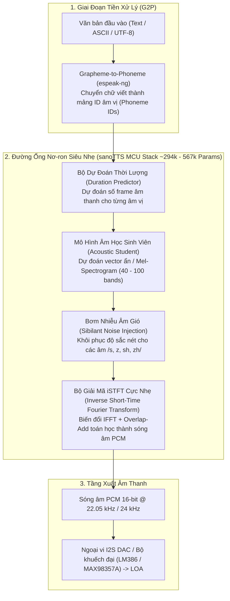

# Báo Cáo Phân Tích Toàn Diện: Giải Pháp Tổng Hợp Giọng Nói Nhúng Siêu Nhẹ (SanoTTS)

> **Tài liệu tham chiếu dự án**: Phân tích giải pháp kỹ thuật từ repository [`sanoTTS`](file:///E:/UIT/stm32-develop/sanoTTS)  
> **Thư mục lưu trữ**: `docs/tasks/llm-tts/researcher/sanoTTS/`  
> **Ngày lập báo cáo**: Tháng 10/2026  
> **Mục tiêu**: Nghiên cứu kiến trúc mô hình Text-to-Speech (TTS) siêu nhỏ gọn, vocoder iSTFT, cơ chế quản lý bộ nhớ không cấp phát động, hiệu năng trên vi điều khiển (ESP32-S3 / STM32H7 / STM32F4) và tích hợp vào hệ thống Voice AI Assistant cục bộ.

---

## 1. Tóm Tắt Điều Hành (Executive Summary)

Repository [`sanoTTS`](file:///E:/UIT/stm32-develop/sanoTTS) (từ tiếng Nepal ***sano*** - सानो có nghĩa là **"nhỏ"**) hiện thực hóa một cột mốc đáng kinh ngạc trong lĩnh vực học sâu nhúng (TinyML Audio): **Một hệ thống tổng hợp giọng nói nơ-ron hoàn chỉnh (Neural Text-to-Speech) chỉ có quy mô từ 294k đến 2.3M tham số, dung lượng tệp trọng số nén chỉ từ 337 KB đến 8.7 MB, có thể chạy thời gian thực (Real-Time) trên một vi điều khiển giá 3 USD (như ESP32-S3 hoặc STM32) mà không cần đám mây và không cần bộ tăng tốc NPU!**

Dự án phá vỡ rào cản truyền thống vốn coi các mô hình Neural TTS (như Tacotron, FastSpeech, VITS, Kokoro với hàng chục triệu tham số) là điều bất khả thi đối với vi điều khiển:
1. **Dung lượng siêu nhỏ**: Dòng mô hình `heart-nano` gói gọn toàn bộ kiến trúc (Duration + Acoustic + iSTFT Vocoder) trong **294,279 tham số**, được lượng tử hóa `int8` chỉ nặng **337 KB**.
2. **Tốc độ vượt thời gian thực (Faster than Real-Time)**:
   - Trên **ESP32-S3 (240MHz, Xtensa PIE SIMD)**: Đo đạc thực tế đạt **RTF = 0.383 (nhanh hơn thời gian phát âm thực tế 2.6 lần)** qua thư viện Arduino, và đạt **RTF = 0.185 (nhanh hơn 5.4 lần)** khi dùng ESP-IDF với bộ kernel tối ưu của `esp-nn`.
   - Trên **STM32 Nucleo-H755ZI-Q (Cortex-M7 @ 480MHz)**: Đo đạc thực tế bằng C vô hướng (scalar C thuần túy, chưa cần SIMD) đạt **RTF = 0.3498 (nhanh hơn thời gian thực 2.9 lần)**!
3. **Đa ngôn ngữ & Hỗ trợ Tiếng Việt (Vietnamese)**: Cung cấp **30 giọng đọc** trên **16 ngôn ngữ** khác nhau (Anh, Đức, Pháp, Tây Ban Nha, Ý, Bồ Đào Nha, Nga, Séc, Romania, Thổ Nhĩ Kỳ, Ả Rập, Nepal, Hindi, Indonesia, Trung Quốc và **Tiếng Việt**).
4. **Kiến trúc Engine C99 thuần túy**: Toàn bộ runtime nhúng trong thư mục `mcu/` được viết bằng C99 chuẩn, **tuyệt đối không dùng hàm `malloc` động khi chạy (Zero-allocation Bump Arena)**, dễ dàng nhúng vào Arduino, PlatformIO, ESP-IDF hoặc STM32CubeIDE.

---

## 2. Bảng Đo Đạc Phần Cứng Thực Tế (Measured Hardware Benchmarks)

Các thông số dưới đây được trích xuất trực tiếp từ tài liệu đo đạc thực tế [`BOARDS.md`](file:///E:/UIT/stm32-develop/sanoTTS/BOARDS.md) trên bài kiểm thử chuẩn `en_us_e12nano` (294k params, 255 frames, 2.95 giây âm thanh):

| Bo mạch thử nghiệm | Vi điều khiển & Lõi CPU | Xung nhịp | Bộ Kernel tính toán | Chỉ số RTF (Real-Time Factor) | Tốc độ so với thời gian thực | Bộ nhớ Arena đỉnh (`arena_peak`) | Độ tương quan âm thanh (Corr) |
|---|---|---|---|---|---|---|---|
| **STM32 Nucleo-H755ZI-Q** | **ARM Cortex-M7** | **480 MHz** | **C vô hướng (Scalar C)** | **0.3498** | **2.9x nhanh hơn** | **98,224 Bytes** | **1.000000 (Khớp tuyệt đối)** |
| **ESP32-S3 (Arduino Lib)** | Xtensa Dual-Core LX7 | 240 MHz | **PIE SIMD (Mặc định)** | **0.3828** | **2.6x nhanh hơn** | 98,224 Bytes | 0.994664 |
| **ESP32-S3 (ESP-IDF tuned)**| Xtensa Dual-Core LX7 | 240 MHz | PIE SIMD + esp-nn | **0.1850** | **5.4x nhanh hơn** | 98,224 Bytes | 0.984800 |
| **ESP32-S3 (Scalar C)** | Xtensa Dual-Core LX7 | 240 MHz | C vô hướng thuần | 1.5825 | 0.63x (Chậm hơn âm thanh) | 98,224 Bytes | 0.994664 |
| **ESP32 Classic (ESP-WROOM)**| Xtensa Dual-Core LX6 | 240 MHz | C vô hướng (Không SIMD) | 2.1720 | 0.46x (Chậm hơn âm thanh) | 98,224 Bytes | 1.000000 |
| **ESP32-C3** | RISC-V 32-bit RV32IMC | 160 MHz | C vô hướng (Không FPU) | 5.7200 | 0.17x (Chạy offline) | 98,224 Bytes | Đạt chuẩn (Pass) |

> [!NOTE]
> **Giải thích thuật ngữ then chốt:**
> - **Chỉ số RTF (Real-Time Factor)**: Số giây CPU phải tính toán để tạo ra 1 giây âm thanh.
>   * $\text{RTF} < 1.0$: Mô hình chạy **nhanh hơn thời gian phát âm** $\rightarrow$ Thiết bị có thể vừa tổng hợp vừa phát ra loa mượt mà không bị giật (Buffer Underrun).
>   * $\text{RTF} > 1.0$: Mô hình chạy chậm hơn $\rightarrow$ Bắt buộc phải tính toán offline lưu vào RAM/Flash trước khi phát.
> - **Độ tương quan (Correlation - Corr)**: Đánh giá độ trung thực số học so với mô hình gốc float32 trên PyTorch. Chuẩn yêu cầu bắt buộc $\text{corr} > 0.98$. Mọi bản build trên STM32 và ESP32-S3 đều đạt $> 0.994$.

---

## 3. Bản Đồ So Sánh Kích Thước & Chất Lượng (Size-Quality Landscape)

So sánh sanoTTS với các mô hình TTS mã nguồn mở tiêu biểu trên thang đo khách quan UTMOS và SCOREQ (điểm càng cao càng tự nhiên):

| Hệ thống TTS | Số lượng tham số | Dung lượng tệp trọng số | Điểm tự nhiên UTMOS | Chất lượng âm thanh (DNS-SIG) | Khả năng chạy trên Vi điều khiển $3 |
|---|---|---|---|---|---|
| **sanoTTS (heart-nano)** | **0.29 M (294k)** | **337 KB (int8)** | **2.45** | 3.35 | **Cực tốt (RTF 0.18 - 0.38)** |
| **sanoTTS (kristin r7)** | **0.57 M (567k)** | **680 KB (int8)** | **3.85** | 3.55 | **Chạy tốt (RTF 0.22 - 0.45)** |
| **sanoTTS (amy)** | **1.46 M** | **2.8 MB (fp16)** | **4.10** | 3.61 | Cần RAM lớn (> 1.5MB) |
| **TinyTTS** | 1.62 M | 3.5 MB (fp16) | 3.65 | **3.62** | Khó chạy trên MCU nhỏ |
| **Inflect Nano** | 4.63 M | ~9.0 MB | 3.65 | 3.58 | Không hỗ trợ MCU |
| **Kitten TTS nano** | 15.0 M | ~30 MB | 3.58 | 3.43 | Chỉ chạy trên PC / NPU |
| **Kokoro** | 82.0 M | ~330 MB | 4.52 | 3.69 | Bắt buộc chạy trên Server / GPU |

> [!IMPORTANT]
> **Điểm mấu chốt**: sanoTTS (phiên bản `amy` 1.46M và `kristin` 567k) đạt điểm số tự nhiên UTMOS vượt trội hơn cả các mô hình lớn gấp 3 đến 10 lần (như TinyTTS 1.62M và Kitten TTS 15M). `sanoTTS` là giải pháp **duy nhất trên thế giới hiện nay** đưa một mô hình Neural TTS hoàn chỉnh chạy thời gian thực trên vi điều khiển chỉ có vài trăm KB RAM!

---

## 4. Cấu Trúc Bộ Tài Liệu Nghiên Cứu

Bộ tài liệu phân tích chi tiết trong thư mục `docs/tasks/llm-tts/researcher/sanoTTS/` bao gồm 5 chuyên đề chuyên sâu:

| Tập tin | Tiêu đề chuyên đề | Nội dung tóm tắt |
|---|---|---|
| [`01-neural-architecture-and-istft.md`](file:///E:/UIT/stm32-develop/docs/tasks/llm-tts/researcher/sanoTTS/01-neural-architecture-and-istft.md) | **Kiến Trúc Mạng Nơ-ron & Bộ Giải Mã Sóng Âm iSTFT** | Đường ống từ văn bản đến âm thanh, cơ chế chưng cất tri thức (Knowledge Distillation) từ Piper, tại sao iSTFT thay thế được các vocoder nặng nề, cơ chế bơm nhiễu âm gió (Sibilant Noise Injection) và các biến thể mô hình (`heart-nano`, `r7`, `amy`). |
| [`02-mcu-runtime-and-memory.md`](file:///E:/UIT/stm32-develop/docs/tasks/llm-tts/researcher/sanoTTS/02-mcu-runtime-and-memory.md) | **C-Runtime Nhúng & Cơ Chế Quản Lý Bộ Nhớ Không Malloc** | Phân tích mã nguồn `mcu/src/snt_tts.c` và `snt_nano.c`, cơ chế quản lý bộ nhớ đệm Bump Arena (~98-128 KB), hợp đồng cổng chuyển giao (Porting Contract) 8 hàm trong `snt_port.h`, bẫy đọc Flash-XIP và cổng kiểm chứng bit-exact golden gates. |
| [`03-hardware-classes-and-benchmarks.md`](file:///E:/UIT/stm32-develop/docs/tasks/llm-tts/researcher/sanoTTS/03-hardware-classes-and-benchmarks.md) | **Phân Hạng Vi Điều Khiển & Phép Đo Phần Cứng Thực Tế** | Quy tắc phân loại 4 tầng (Tier V - SIMD, Tier D - Dual MAC, Tier S - Scalar, Tier N - NPU), phân tích chi tiết nguyên nhân Nucleo-H755ZI-Q đạt RTF 0.35, và cách giải quyết sự cố thiếu RAM heap của stm32duino bằng AXI SRAM `0x24000000`. |
| [`04-multilingual-and-vietnamese-support.md`](file:///E:/UIT/stm32-develop/docs/tasks/llm-tts/researcher/sanoTTS/04-multilingual-and-vietnamese-support.md) | **Năng Lực Đa Ngôn Ngữ & Mô Hình Tiếng Việt (Tiếng Việt)** | Khảo sát 16 ngôn ngữ được hỗ trợ, đi sâu vào mô hình tiếng Việt (`vi` / `vietnamese`, 1.57M params), xử lý âm vị thanh điệu bằng espeak-ng, đánh giá chất lượng và quy trình tự huấn luyện/chưng cất giọng đọc tiếng Việt mới. |
| [`05-stm32-integration-and-llm-tts-pipeline.md`](file:///E:/UIT/stm32-develop/docs/tasks/llm-tts/researcher/sanoTTS/05-stm32-integration-and-llm-tts-pipeline.md) | **Triển Khai Trên STM32F429 & Tích Hợp Hệ Thống Voice AI** | Đánh giá tính khả thi tuyệt đối trên bo mạch STM32F429ZI (ROM 2MB, RAM 256KB), cấu hình xuất âm thanh qua I2S DAC / PWM DMA, và ghép nối với `esp32-ai` hoặc `picolm` để tạo thành một hệ thống **Voice AI Assistant (Hỏi - Đáp bằng giọng nói cục bộ 100%)**. |

---

## 5. Kết Luận Nhanh

SanoTTS là mảnh ghép hoàn hảo cuối cùng cho mục tiêu phát triển hệ thống **Edge AI Đàm Thoại (Local Voice Agent)** trong dự án `stm32-develop`:
- `esp32-ai` / `picolm`: Giải quyết bài toán **Tư duy / Lập luận ngôn ngữ (Cognitive Brain)**.
- `sanoTTS`: Giải quyết bài toán **Phát âm tiếng nói con người (Vocal Tract)** một cách tự nhiên, tức thì và chiếm tài nguyên bộ nhớ cực thấp trên vi điều khiển STM32.
