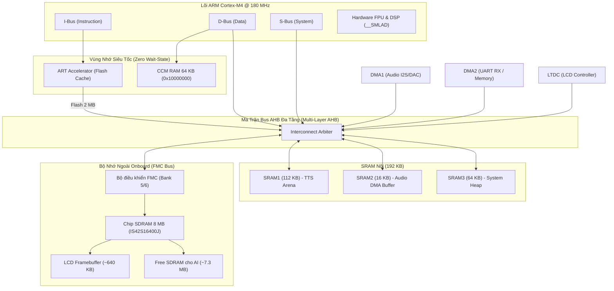

# Chuyên đề 01: Kiến Trúc Phần Cứng & Phân Bổ Bản Đồ Bộ Nhớ trên STM32F429I-DISC1

Tài liệu này phân tích chi tiết cấu trúc phần cứng của vi điều khiển **STM32F429ZIT6** và bo mạch **STM32F429I-DISC1**, thiết lập cấu hình bộ điều khiển bộ nhớ ngoài **FMC (Flexible Memory Controller)** cho chip SDRAM 8MB onboard, và cung cấp bản thiết kế Linker Script tối ưu để phân bổ trọng số mô hình AI/TTS và các vùng nhớ hoạt động.

---

## 1. Bản Đồ Bộ Nhớ Toàn Diện (Complete Memory Map)

Vi điều khiển STM32F429ZIT6 sở hữu kiến trúc bộ nhớ phân tầng rất độc đáo với 4 không gian vật lý riêng biệt:

```
Địa chỉ vật lý   Kích thước   Loại bộ nhớ            Đặc tính truy xuất & Đối tượng sử dụng
┌──────────────┐
│  0x08000000  │ 2048 KB    Internal Flash (ROM)   0-wait state qua ART Accelerator; chứa Code & Weights int8
├──────────────┤
│  0x10000000  │ 64 KB      CCM Data RAM           0-wait state (Nối thẳng CPU D-bus, KHÔNG qua DMA); Stack & Scratch
├──────────────┤
│  0x20000000  │ 112 KB     SRAM1                  BusMatrix đa tầng; DMA truy xuất được; Chứa TTS Bump Arena
├──────────────┤
│  0x2001C000  │ 16 KB      SRAM2                  BusMatrix đa tầng; Chứa Audio DMA Ping-Pong Buffer & OS Queue
├──────────────┤
│  0x20020000  │ 64 KB      SRAM3                  BusMatrix đa tầng; Bộ đệm UART streaming & G2P dictionary
├──────────────┤
│  0xD0000000  │ 8192 KB    External SDRAM (FMC)   16-bit bus @ 90 MHz; Framebuffer LCD & KV-Cache / Model weights
└──────────────┘
```



---

## 2. Đặc Tính Từng Phân Vùng Bộ Nhớ

### 2.1 Flash Nội 2048 KB (Internal Flash with ART Accelerator)
- **Tốc độ:** Ở tần số 180 MHz, Flash nội của STM32F4 yêu cầu 5 chu kỳ chờ (5 wait states = 6 chu kỳ xung nhịp).
- **Bộ tăng tốc ART (Adaptive Real-Time Memory Accelerator):** ST tích hợp bộ đệm chỉ lệnh (Instruction Cache 64 lines $\times$ 128 bits) và bộ đệm dữ liệu (Data Cache 8 lines $\times$ 128 bits). Khi bật ART, tỷ lệ trúng cache đạt >98%, mô phỏng hiệu năng tương đương 0 chu kỳ chờ (0 wait-state).
- **Ứng dụng:**
  - Chứa mã máy Firmware (`.text`).
  - Chứa toàn bộ mảng hằng số trọng số nơ-ron của `sanoTTS` dạng `const int8_t snt_weights[]` (337 KB cho Nano hoặc 750 KB cho mô hình Tiếng Việt `vi_VN`).
  - Đọc trực tiếp từ Flash qua con trỏ bộ nhớ mà không cần nạp vào RAM!

### 2.2 CCM RAM 64 KB (Core Coupled Memory)
- **Đặc điểm sống còn:** Được kết nối trực tiếp vào D-bus của nhân Cortex-M4. Tốc độ đọc ghi đúng bằng 1 chu kỳ xung nhịp 180 MHz (thực sự 0 wait-state), **nhanh hơn SRAM1 khoảng 15–25%**.
- **Cảnh báo giới hạn:** **DMA và LTDC KHÔNG THỂ truy xuất CCM RAM.** Bất kỳ cố gắng nào cấu hình DMA truyền nhận vào địa chỉ `0x10000000` đều gây lỗi BusFault.
- **Ứng dụng tối ưu:**
  - Cấp phát Stack cho toàn bộ các Task FreeRTOS (đặc biệt là Task chạy thuật toán nơ-ron TTS).
  - Chứa các mảng tính toán trung gian cục bộ của thuật toán iSTFT / FFT (`float scratch[1024]`).

### 2.3 SRAM Nội 192 KB (SRAM1 + SRAM2 + SRAM3)
- Nằm trên ma trận bus AHB, hỗ trợ truy xuất đồng thời từ CPU, DMA1, DMA2 và LTDC.
- **SRAM1 (112 KB @ `0x20000000`):** Cấp phát trọn vẹn làm **Bump Arena của sanoTTS**. Với công thức $46.5\text{ KB} + 195.7\text{ B/frame}$, vùng 112 KB này đủ để tổng hợp câu thoại dài tới **4 giây** liên tục trong 1 lần gọi mà không cần tràn sang SDRAM.
- **SRAM2 (16 KB @ `0x2001C000`):** Dành riêng cho vùng đệm âm thanh DMA Double-Buffering (Ping-Pong buffer $2 \times 2048$ mẫu int16 = 8 KB).
- **SRAM3 (64 KB @ `0x20020000`):** Dành cho biến toàn cục hệ thống, hàng đợi FreeRTOS và bảng tra ký tự âm vị Tiếng Việt (Vietnamese G2P Trie).

---

## 3. Cấu Hình Bộ Nhớ Ngoài SDRAM 8MB (IS42S16400J) qua FMC

Bo mạch STM32F429I-DISC1 được tích hợp sẵn chip SDRAM **ISSI IS42S16400J** (hoặc tương đương) có dung lượng **64 Mbits = 8 MBytes**, độ rộng bus 16-bit.

### 3.1 Sơ Đồ Chân FMC Kết Nối SDRAM trên Board
Tất cả các chân này đã được đấu dây cố định trên bo mạch STM32F429I-DISC1 (xem schematic MB1075):
- **Address Bus (A0 – A11):** `PF0, PF1, PF2, PF3, PF4, PF5, PF12, PF13, PF14, PF15, PG0, PG1`
- **Bank Address (BA0, BA1):** `PG4, PG5`
- **Data Bus (D0 – D15):** `PD14, PD15, PD0, PD1, PE7, PE8, PE9, PE10, PE11, PE12, PE13, PE14, PE15, PD8, PD9, PD10`
- **Control Signals:** 
  - `SDCLK`: `PG8` (Xung nhịp FMC SDRAM = HCLK / 2 = 90 MHz)
  - `SDCKE1`: `PB5` (Clock Enable cho SDRAM Bank 2)
  - `SDNE1`: `PB6` (Chip Select cho SDRAM Bank 2 - ánh xạ `0xD0000000`)
  - `NRAS`: `PF11` (Row Address Strobe)
  - `NCAS`: `PG15` (Column Address Strobe)
  - `SDNWE`: `PC0` (Write Enable)
  - `NBL0, NBL1`: `PE0, PE1` (Byte Mask / DQM)

### 3.2 Tính Toán Thông Số Thời Gian (Timing & Refresh Rate Math)
Với $HCLK = 180\text{ MHz}$, xung nhịp cấp cho SDRAM là:
$$f_{\text{SDCLK}} = \frac{180\text{ MHz}}{2} = 90\text{ MHz} \implies T_{\text{SDCLK}} = 11.11\text{ ns}$$

Datasheet IS42S16400J yêu cầu:
- Tự làm mới (Self-refresh): **4096 chu kỳ trong 64 ms**.
- Chu kỳ làm mới mỗi hàng:
  $$T_{\text{refresh}} = \frac{64\text{ ms}}{4096} = 15.625\ \mu\text{s}$$
- Công thức thanh ghi `FMC_SDRTR` (SDRAM Refresh Timer Register):
  $$\text{Refresh Count} = (T_{\text{refresh}} \times f_{\text{SDCLK}}) - 20 = (15.625\ \mu\text{s} \times 90\text{ MHz}) - 20 = 1406 - 20 = 1386$$

### 3.3 Mã Nguồn Khởi Tạo SDRAM Hoàn Chỉnh (`bsp_sdram.c`)

```c
#include "stm32f4xx_hal.h"

#define SDRAM_DEVICE_ADDR  ((uint32_t)0xD0000000)
#define SDRAM_DEVICE_SIZE  ((uint32_t)0x800000)   /* 8 MBytes */

#define SDRAM_MODEREG_BURST_LENGTH_1             ((uint16_t)0x0000)
#define SDRAM_MODEREG_BURST_TYPE_SEQUENTIAL      ((uint16_t)0x0000)
#define SDRAM_MODEREG_CAS_LATENCY_3              ((uint16_t)0x0030)
#define SDRAM_MODEREG_OPERATING_MODE_STANDARD    ((uint16_t)0x0000)
#define SDRAM_MODEREG_WRITEBURST_MODE_SINGLE     ((uint16_t)0x0200)

SDRAM_HandleTypeDef hsdram;

void BSP_SDRAM_Init(void) {
    FMC_SDRAM_TimingTypeDef Timing;
    FMC_SDRAM_CommandTypeDef Command;

    hsdram.Instance = FMC_SDRAM_DEVICE;
    hsdram.Init.SDBank = FMC_SDRAM_BANK2; // Bank 2 tương ứng 0xD0000000
    hsdram.Init.ColumnBitsNumber = FMC_SDRAM_COLUMN_BITS_NUM_8;
    hsdram.Init.RowBitsNumber = FMC_SDRAM_ROW_BITS_NUM_12;
    hsdram.Init.MemoryDataWidth = FMC_SDRAM_MEM_BUS_WIDTH_16;
    hsdram.Init.InternalBankNumber = FMC_SDRAM_INTERN_BANKS_NUM_4;
    hsdram.Init.CASLatency = FMC_SDRAM_CAS_LATENCY_3;
    hsdram.Init.WriteProtection = FMC_SDRAM_WRITE_PROTECTION_DISABLE;
    hsdram.Init.SDClockPeriod = FMC_SDRAM_CLOCK_PERIOD_2; // 90 MHz
    hsdram.Init.ReadBurst = FMC_SDRAM_RBURST_DISABLE;
    hsdram.Init.ReadPipeDelay = FMC_SDRAM_RPIPE_DELAY_1;

    // Cấu hình Timing theo datasheet IS42S16400J @ 90MHz (1 chu kỳ = 11.11ns)
    Timing.LoadToActiveDelay = 2;    // TMRD: 2 chu kỳ
    Timing.ExitSelfRefreshDelay = 7; // TXSR: min 70ns (~7 chu kỳ)
    Timing.ActiveToSelfRefreshDelay = 4; // TRAS: min 42ns
    Timing.RowCycleDelay = 7;        // TRC: min 63ns
    Timing.WriteRecoveryTime = 2;    // TWR: 2 chu kỳ
    Timing.RPDelay = 2;              // TRP: min 15ns (~2 chu kỳ)
    Timing.RCDDelay = 2;             // TRCD: min 15ns (~2 chu kỳ)

    HAL_SDRAM_Init(&hsdram, &Timing);

    // Chuỗi lệnh kích hoạt chip SDRAM chuẩn JEDEC
    // 1. Clock Configuration Enable
    Command.CommandMode = FMC_SDRAM_CMD_CLK_ENABLE;
    Command.CommandTarget = FMC_SDRAM_CMD_TARGET_BANK2;
    Command.AutoRefreshNumber = 1;
    Command.ModeRegisterDefinition = 0;
    HAL_SDRAM_SendCommand(&hsdram, &Command, 0x1000);
    HAL_Delay(1);

    // 2. Precharge All Banks
    Command.CommandMode = FMC_SDRAM_CMD_PALL;
    HAL_SDRAM_SendCommand(&hsdram, &Command, 0x1000);

    // 3. Auto Refresh (ít nhất 4 đến 8 chu kỳ)
    Command.CommandMode = FMC_SDRAM_CMD_AUTOREFRESH_MODE;
    Command.AutoRefreshNumber = 8;
    HAL_SDRAM_SendCommand(&hsdram, &Command, 0x1000);

    // 4. Load Mode Register
    Command.CommandMode = FMC_SDRAM_CMD_LOAD_MODE;
    Command.AutoRefreshNumber = 1;
    Command.ModeRegisterDefinition = SDRAM_MODEREG_BURST_LENGTH_1 |
                                     SDRAM_MODEREG_BURST_TYPE_SEQUENTIAL |
                                     SDRAM_MODEREG_CAS_LATENCY_3 |
                                     SDRAM_MODEREG_OPERATING_MODE_STANDARD |
                                     SDRAM_MODEREG_WRITEBURST_MODE_SINGLE;
    HAL_SDRAM_SendCommand(&hsdram, &Command, 0x1000);

    // 5. Thiết lập tốc độ Refresh Timer (1386 đã tính toán ở mục 3.2)
    HAL_SDRAM_ProgramRefreshRate(&hsdram, 1386);
}
```

---

## 4. Phân Chia Không Gian SDRAM 8MB

Do màn hình LCD ILI9341 trên board cũng dùng SDRAM làm Framebuffer thông qua ngoại vi LTDC, ta cần phân chia không gian 8MB này một cách rõ ràng để tránh ghi đè làm rác màn hình:

```
Địa chỉ bắt đầu   Địa chỉ kết thúc   Kích thước   Mục đích sử dụng
0xD0000000        0xD004FFFF         320 KB       LCD Layer 1 Framebuffer (240x320 ARGB1555 / RGB565)
0xD0050000        0xD009FFFF         320 KB       LCD Layer 2 Framebuffer (Dùng cho UI Overlay / Subtitles)
──────────────────────────────────────────────────────────────────────────────────────────────────────────
0xD00A0000        0xD07FFFFF         7,360 KB     VÙNG NHỚ KHỔNG LỒ DÀNH CHO AI & TTS (FREE FOR USER)
                                     (~7.18 MB)   - KV-Cache cho mô hình ngôn ngữ
                                                  - Bộ đệm lưu trữ trọng số nơ-ron mở rộng
                                                  - Audio Ring Buffer cho câu phát âm siêu dài (>30s)
```

---

## 5. Tùy Biến Linker Script (`STM32F429ZITX_FLASH.ld`)

Dưới đây là đoạn cấu hình Linker Script chuẩn cho dự án STM32CubeIDE, khai báo rõ ràng các vùng nhớ `CCMRAM` và `SDRAM_USER`:

```ld
/* Memory Spaces Definitions */
MEMORY
{
  CCMRAM     (rw)  : ORIGIN = 0x10000000, LENGTH = 64K
  RAM        (xrw) : ORIGIN = 0x20000000, LENGTH = 192K   /* SRAM1 + SRAM2 + SRAM3 */
  FLASH      (rx)  : ORIGIN = 0x08000000, LENGTH = 2048K  /* Flash nội 2 MB */
  SDRAM_LCD  (rw)  : ORIGIN = 0xD0000000, LENGTH = 640K   /* Dành riêng cho Framebuffer */
  SDRAM_USER (rwx) : ORIGIN = 0xD00A0000, LENGTH = 7360K  /* 7.18 MB cho AI / TTS */
}

SECTIONS
{
  /* Các section chuẩn: .isr_vector, .text nằm trong FLASH */

  /* Section đặt Stack và Scratch Buffer siêu tốc vào CCMRAM */
  .ccmram (NOLOAD) :
  {
    . = ALIGN(4);
    _sccmram = .;
    *(.ccmram)
    *(.ccmram*)
    . = ALIGN(4);
    _eccmram = .;
  } >CCMRAM

  /* Section đặt Bump Arena của sanoTTS vào đầu vùng RAM nội (SRAM1) */
  .snt_arena (NOLOAD) :
  {
    . = ALIGN(16);
    _ssnt_arena = .;
    *(.snt_arena*)
    . = ALIGN(16);
    _esnt_arena = .;
  } >RAM

  /* Section lưu trữ dữ liệu AI mở rộng trong SDRAM ngoài */
  .sdram_user (NOLOAD) :
  {
    . = ALIGN(16);
    _ssdram_user = .;
    *(.sdram_user*)
    . = ALIGN(16);
    _esdram_user = .;
  } >SDRAM_USER
}
```

### Cách Sử Dụng trong Mã Nguồn C:
```c
// 1. Đặt biến ccmram (0-wait state, CPU only)
__attribute__((section(".ccmram"))) float istft_scratch[1024];

// 2. Đặt Bump Arena của sanoTTS vào SRAM1 (112 KB)
__attribute__((section(".snt_arena"), aligned(16))) uint8_t s_tts_arena[114688];

// 3. Đặt bộ đệm âm thanh lớn hoặc mô hình AI mở rộng vào SDRAM ngoài 7.18 MB
__attribute__((section(".sdram_user"), aligned(16))) uint8_t g_ai_external_pool[4 * 1024 * 1024];
```

---

## 6. Chiến Lược Tránh Tắc Nghẽn Bus (BusMatrix Contention Avoidance)

Trên STM32F429, ngoại vi **LTDC quét dữ liệu từ SDRAM liên tục ở tần số 60 Hz** để hiển thị lên LCD. Nếu không phân bổ hợp lý, LTDC và DMA audio sẽ tranh chấp bus:
1. **Ưu tiên trọng tài Bus (Arbitration Priority):** Cấu hình thanh ghi `GPV_BURST` để DMA1 (Audio DAC) có mức ưu tiên cao hơn LTDC. Nhờ đó, luồng âm thanh không bao giờ bị khựng (underrun glitch).
2. **Tách biệt phân vùng:**
   - Hoạt động tính toán nơ-ron trọng số cao của `sanoTTS` diễn ra giữa lõi CPU và Flash/SRAM1/CCM RAM.
   - Hoạt động hiển thị diễn ra giữa LTDC và SDRAM.
   - Nhờ kiến trúc ma trận bus 8-layer của STM32F429, **CPU tính toán TTS và LTDC quét màn hình chạy hoàn toàn song song 100% không làm giảm tốc độ của nhau!**
