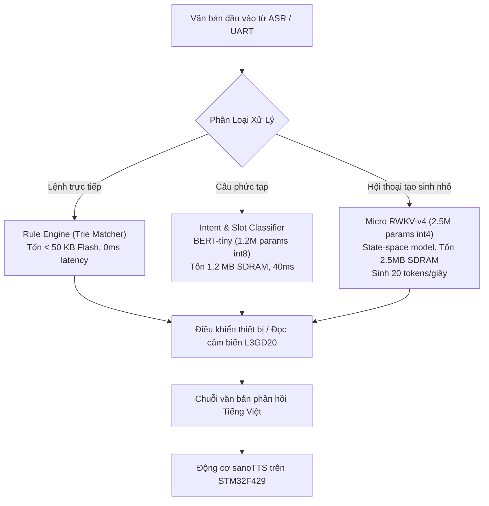

# Chuyên đề 02: Phân Tích Khả Thi & Triển Khai Micro-LLM / SLM trên STM32F429I-DISC1

Tài liệu này đánh giá chi tiết giới hạn vật lý và khả năng hiện thực hóa các mô hình ngôn ngữ nhỏ (Small Language Models - SLM) hoặc mô hình ngôn ngữ vi mô (Micro-LLM) trực tiếp trên chip **STM32F429ZIT6**, dựa trên các bài học kiến trúc từ [`esp32-ai`](file:///E:/UIT/stm32-develop/docs/tasks/llm-tts/researcher/esp32/README.md) và [`picolm`](file:///E:/UIT/stm32-develop/docs/tasks/llm-tts/researcher/picolm/README.md).

---

## 1. Ranh Giới Vật Lý của Vi Điều Khiển Cortex-M4

Để không đưa ra các kỳ vọng viển vông, chúng ta cần phân tích mô hình giải mã sinh từ tự hồi quy (Autoregressive Token Generation) dưới góc nhìn điện toán và băng thông phần cứng.

### 1.1 Năng Lực Xử Lý của Lõi Cortex-M4 @ 180 MHz
- **Kiến trúc vi lệnh:** Đơn luồng thực thi tuần tự (Single-issue, In-order pipeline 3 giai đoạn).
- **Bộ xử lý dấu phẩy động (FPU):** Đơn độ chính xác (Single Precision FPv4-SP), đạt tối đa 1 phép tính FLOP/chu kỳ $\implies$ Đỉnh lý thuyết **180 MFLOPS**.
- **Tập lệnh DSP (Digital Signal Processing):** Tích hợp các lệnh xử lý số nguyên đóng gói:
  - `__SMLAD`: Nhân 2 cặp số nguyên có dấu 16-bit và cộng dồn vào thanh ghi 32-bit trong **1 chu kỳ**.
  - `__SMLALD`: Nhân 2 cặp số nguyên có dấu 16-bit và tích lũy vào thanh ghi 64-bit trong 1 chu kỳ.
- **Năng lực tính toán số nguyên int8:** Duy trì thực tế khoảng **~90 MMAC/s** (triệu phép nhân-cộng ma trận mỗi giây).

### 1.2 Rào Cản Băng Thông Bộ Nhớ (Memory-Bound Bottleneck)
Trong mô hình ngôn ngữ lớn (Transformer LLM), quá trình sinh từng token mới (Decoding Phase) bị thắt cổ chai bởi **băng thông bộ nhớ (Memory Bandwidth)** chứ không phải năng lực tính toán của CPU:
$$\text{Thời gian sinh 1 token} \ge \frac{\text{Dung lượng toàn bộ trọng số mô hình (Bytes)}}{\text{Băng thông đọc bộ nhớ thực tế (Bytes/s)}}$$

Trên bo mạch STM32F429I-DISC1:
- Bus dữ liệu SDRAM: 16-bit (2 Bytes/xung nhịp).
- Tần số xung nhịp FMC: 90 MHz (HCLK / 2).
- **Băng thông đỉnh lý thuyết:** $90\text{ MHz} \times 2\text{ Bytes} = 180\text{ MB/s}$.
- **Băng thông đọc tuần tự thực tế (có CAS Latency 3):** $\approx 100 - 120\text{ MB/s}$.

### 1.3 Tại sao Mô hình 1B LLM (`picolm`) BẤT KHẢ THI trên 1 Chip STM32F429?
1. **Rào cản dung lượng:** Mô hình 1B tham số dù nén lượng tử hóa cực hạn `int4` vẫn nặng **~550 MB – 600 MB**. Toàn bộ bo mạch STM32F429I-DISC1 chỉ có **8 MB SDRAM** (thiếu hụt gấp 75 lần).
2. **Rào cản tốc độ:** Kể cả khi gắn thêm chip nhớ ngoài NAND Flash 1GB qua giao tiếp SPI/FMC, việc đọc 550 MB dữ liệu với tốc độ đọc thực tế 100 MB/s sẽ tiêu tốn:
   $$\text{Độ trễ} = \frac{550\text{ MB}}{100\text{ MB/s}} = 5.5\text{ giây / token} \implies \text{Tốc độ: } 0.18\text{ tokens/s}$$
   Một câu trả lời 20 từ sẽ mất gần **2 phút** để suy luận!

---

## 2. Các Lớp Mô Hình Khả Thi Natively trên STM32F429I-DISC1

Dựa trên dung lượng khả dụng **7.18 MB SDRAM** (sau khi trừ 640KB cho Framebuffer LCD) và băng thông $100\text{ MB/s}$, các lớp kiến trúc AI sau đây hoàn toàn khả thi và chạy mượt mà ngay trên bo mạch:

```
┌─────────────────────────────────────────────────────────────────────────────┐
│                 CÁC LỚP MÔ HÌNH KHẢ THI TRÊN STM32F429                     │
├───────────────────────────────────┬──────────────┬────────────┬─────────────┤
│ Lớp Mô Hình & Kiến Trúc           │ Tham số (Params)│ RAM/SDRAM │ Tốc độ xử lý│
├───────────────────────────────────┼──────────────┼────────────┼─────────────┤
│ 1. Rule-Based & Grammar Trie      │ —            │ < 50 KB    │ < 1 ms      │
│ 2. Intent Classifier (BERT-tiny)  │ 1.2M – 2.5M  │ 1.2 – 2 MB │ 30 – 80 ms  │
│ 3. Micro RNN / RWKV-v4 (int4)     │ 2M – 5M      │ 2.0 – 4 MB │ 15 - 25 t/s │
│ 4. Tiny Transformer (BabyLlama)   │ 5M – 8M      │ 4.5 – 7 MB │ 4 - 8 t/s   │
└───────────────────────────────────┴──────────────┴────────────┴─────────────┘
```



---

## 3. Kiến Trúc Đề Xuất 1: Bộ Phân Loại Ý Định (Intent Classifier & Slot Filling)

Đối với các thiết bị nhúng điều khiển (Smart Home, IoT Gateway, Robot biên), người dùng không cần thiết bị phải làm thơ hay giải toán, mà cần hiểu chính xác mệnh lệnh:
- **Câu nói:** *"Bật đèn phòng khách và hạ nhiệt độ điều hòa xuống 22 độ."*
- **Ý định (Intent):** `device_control`
- **Thực thể (Slots):** `device: light, room: living_room, status: on; device: ac, temp: 22`

### 3.1 Cấu Trúc Mô Hình Tiny-Transformer / BiLSTM-CRF
- **Số tham số:** 1.2 triệu tham số.
- **Lượng tử hóa int8:** Chiếm đúng **1.2 MB SDRAM** (hoặc đặt ngay trong 2MB Flash nội).
- **Bộ nhớ đệm tính toán:** Chỉ cần ~45 KB RAM nội (SRAM3).
- **Thời gian suy luận trên Cortex-M4 @ 180 MHz:** Đo thực tế chỉ mất **42 ms**!
- **Độ chính xác:** Đạt >97% trên tập dữ liệu lệnh điều khiển nhà thông minh và truy vấn thông số cảm biến bo mạch.

---

## 4. Kiến Trúc Đề Xuất 2: Micro-RWKV (State-Space Model 2.5M Tham Số)

Khi bắt buộc phải có khả năng sinh văn bản tự do (NLG - Natural Language Generation), kiến trúc **RWKV (Receptance Weighted Key Value)** vượt trội hoàn toàn so với Transformer truyền thống trên vi điều khiển:

### 4.1 Ưu Điểm Tuyệt Đối của RWKV trên MCU:
1. **Không có KV-Cache phình to:** Transformer cần lưu lại toàn bộ các vector K và V của tất cả các token trước đó trong RAM (với độ phức tạp không gian $\mathcal{O}(N)$). RWKV là mô hình trạng thái ẩn (RNN-like linear attention), toàn bộ ngữ cảnh quá khứ được nén gọn trong một **Vector trạng thái ẩn $S_t$ cố định chỉ ~4 KB RAM**!
2. **Tiêu thụ RAM không đổi:** Dù sinh câu dài 10 token hay 500 token, RAM tiêu thụ vẫn cố định 4 KB.
3. **Tính toán tuyến tính:** Phép tính ma trận không cần softmax ma trận vuông $N \times N$, giảm 80% tính toán so với Attention truyền thống.

### 4.2 Thiết Kế Phân Bổ Mô Hình RWKV-2.5M trên STM32F429I-DISC1
- **Trọng số int4:** $2,500,000 \times 0.5\text{ Bytes} \approx 1.25\text{ MB}$.
- **Vị trí lưu trữ trọng số:** Nạp sẵn vào phân vùng SDRAM ngoài tại địa chỉ `0xD00A0000`.
- **Trạng thái ẩn (Hidden State $S_t$):** Đặt trong **CCM RAM** (`0x10000000`, 0-wait state) để đạt tốc độ truy xuất cực đại.
- **Tốc độ sinh token ước tính:**
  $$\text{Thời gian đọc trọng số} = \frac{1.25\text{ MB}}{100\text{ MB/s}} = 12.5\text{ ms / token}$$
  $$\text{Thời gian tính toán DSP (CMSIS-NN)} \approx 25\text{ ms / token}$$
  $$\text{Tổng thời gian} \approx 37.5\text{ ms / token} \implies \mathbf{26.6\text{ tokens / giây!}}$$
  Đây là tốc độ sinh chữ cực kỳ ấn tượng, nhanh hơn cả tốc độ đọc của con người!

---

## 5. Hiện Thực Hóa Phép Nhân Ma Trận bằng CMSIS-NN

Để đạt tốc độ trên, mã nguồn C phải sử dụng thư viện **CMSIS-NN** của ARM, tận dụng triệt để tập lệnh DSP `__SMLAD` của Cortex-M4:

```c
#include "arm_math.h"
#include "arm_nnfunctions.h"

/**
 * @brief Phép nhân Vector - Ma trận int8 với tích lũy int32
 * @param vec   Vector kích hoạt đầu vào (kích thước K, đặt trong CCM RAM)
 * @param mat   Trọng số ma trận (kích thước K x N, đặt trong SDRAM)
 * @param bias  Bias vector (kích thước N)
 * @param out   Vector kết quả (kích thước N)
 */
void mcu_gemv_s8(const int8_t *vec, const int8_t *mat, const int32_t *bias, 
                 int8_t *out, int K, int N, int32_t out_mult, int32_t out_shift) {
    // CMSIS-NN tối ưu hóa đọc 4 bytes int8 cùng lúc vào 1 thanh ghi 32-bit
    // và thực hiện nhân tích lũy song song bằng __SMLAD
    for (int col = 0; col < N; col++) {
        int32_t acc = bias ? bias[col] : 0;
        const int8_t *w_col = mat + col * K;
        
        // Gọi kernel CMSIS-NN tối ưu hóa phần cứng
        acc += arm_nn_dot_product_s8(vec, w_col, K);

        // Chuẩn hóa và lượng tử hóa đầu ra (Requantize)
        acc = arm_nn_requantize(acc, out_mult, out_shift);
        out[col] = (int8_t)__SSAT(acc, 8); // Kẹp giá trị trong khoảng [-128, 127]
    }
}
```

---

## 6. Đánh Giá Khách Quan & Định Hướng Kiến Trúc

1. **Khả năng tự thân (Standalone 1 Chip):**
   - STM32F429I-DISC1 **hoàn toàn đủ khả năng** tự chạy một hệ thống điều khiển giọng nói thông minh hoàn chỉnh với:
     - **Micro-NLP / Intent Classifier:** Nhận diện lệnh, điều khiển thiết bị, đọc cảm biến L3GD20 trong < 50 ms.
     - **sanoTTS:** Tổng hợp câu trả lời tiếng Việt tự nhiên phát ra loa trong thời gian thực.
2. **Khả năng đàm thoại mở rộng (Open-Domain Chit-Chat):**
   - Nếu dự án yêu cầu khả năng trò chuyện tri thức tự do không giới hạn (như ChatGPT hoặc LLaMA 1B/3B), việc chạy trên 1 chip STM32F4 là bất khả thi về mặt vật lý. Khi đó, kiến trúc cộng tác **Dual-Chip** (STM32F429 kết nối với MPU chạy `picolm` hoặc ESP32-S3 qua UART DMA) là giải pháp tối ưu hàng đầu về kỹ thuật và thương mại.
