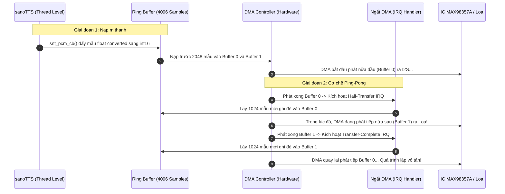

# Chuyên đề 04: Thiết Kế & Cấu Hình Hệ Thống Âm Thanh (Audio I/O Subsystem) trên STM32F429I-DISC1

Tài liệu này giải quyết một vấn đề phần cứng thực tế quan trọng: **Bo mạch STM32F429I-DISC1 không tích hợp sẵn chip giải mã âm thanh chuyên dụng (Audio Codec DAC như CS43L22 trên dòng Discovery F407)**. Tài liệu phân tích chi tiết hai phương án xuất âm thanh (I2S ngoài và DAC nội 12-bit), cấu hình xung nhịp `PLLI2S`, thiết kế bộ đệm đôi (Ping-Pong Double Buffering) và sơ đồ đấu nối phần cứng không gây xung đột với màn hình LCD hay chip SDRAM.

---

## 1. Khảo Sát Ngoại Vi & Sơ Đồ Chân Không Xung Đột

Trên bo mạch STM32F429I-DISC1, rất nhiều chân GPIO đã được gán cho chip SDRAM 8MB (FMC), màn hình LCD ILI9341 (LTDC/SPI5) và cảm biến con quay hồi chuyển L3GD20 (SPI5).

Qua rà soát sơ đồ nguyên lý MB1075 và file BSP [`stm32f429i_discovery.h`](file:///E:/UIT/stm32-develop/workspace_0.0.1/lcd-gyro-bsp/Drivers/BSP/STM32F429I-Discovery/stm32f429i_discovery.h), các chân ngoại vi âm thanh sau đây **hoàn toàn tự do (Free Pins)** trên hai hàng rào cắm mở rộng P1 và P2:

```
┌─────────────────────────────────────────────────────────────────────────────┐
│                 BẢNG CHÂN ÂM THANH KHẢ DỤNG TRÊN STM32F429I-DISC1           │
├──────────────┬──────────────┬──────────────┬────────────────────────────────┤
│ Ngoại vi     │ Chân MCU     │ Vị trí Header│ Chức năng tín hiệu âm thanh    │
├──────────────┼──────────────┼──────────────┼────────────────────────────────┤
│ **I2S2**     │ **PB12**     │ Header P1    │ I2S2_WS (LRCK - Word Select)   │
│              │ **PB13**     │ Header P1    │ I2S2_CK (BCLK - Bit Clock)     │
│              │ **PB15**     │ Header P1    │ I2S2_SD (DIN - Serial Data Out)│
├──────────────┼──────────────┼──────────────┼────────────────────────────────┤
│ **DAC Nội**  │ **PA4**      │ Header P1    │ DAC_Channel_1 (Analog Out 1)   │
│              │ **PA5**      │ Header P1    │ DAC_Channel_2 (Analog Out 2)   │
├──────────────┼──────────────┼──────────────┼────────────────────────────────┤
│ **I2S3 (Mic)│ **PC10**     │ Header P2    │ I2S3_CK (BCLK cho INMP441)     │
│              │ **PC11**     │ Header P2    │ I2S3_EXT_SD (Data In từ Mic)   │
│              │ **PA15**     │ Header P1    │ I2S3_WS (LRCK cho Mic)         │
└──────────────┴──────────────┴──────────────┴────────────────────────────────┘
```

---

## 2. Phương Án 1 (Khuyến Nghị Sản Xuất): Giao Tiếp I2S2 với Module MAX98357A

Đây là giải pháp chuyên nghiệp, cho chất lượng âm thanh $22.05\text{ kHz}$ trung thực, không nhiễu ù nền và chi phí cực thấp (< 35.000 VNĐ cho 1 module khuếch đại tích hợp DAC I2S).

### 2.1 Sơ Đồ Đấu Nối Module MAX98357A vào STM32F429I-DISC1
```
  STM32F429I-DISC1 (Header P1)            Module MAX98357A (I2S Mono 3W Amp)
  ┌───────────────────────────┐            ┌────────────────────────────────┐
  │ PB12 (I2S2_WS)            ├───────────►│ LRC   (Left/Right Word Clock)  │
  │ PB13 (I2S2_CK)            ├───────────►│ BCLK  (Bit Clock)              │
  │ PB15 (I2S2_SD)            ├───────────►│ DIN   (Digital Audio In)       │
  │ GND                       ├───────────►│ GND   (Ground)                 │
  │ 5V (hoặc 3V3)             ├───────────►│ VIN   (Power Supply)           │
  │                           │            │ GAIN  (Nối GND = 9dB gain)     │
  │                           │            │ SD_MODE (Hở = (L+R)/2 Mix)     │
  └───────────────────────────┘            └───────────────┬────────────────┘
                                                           │
                                                      ┌────┴────┐
                                                      │ Loa 3W  │ (4 Ohm / 8 Ohm)
                                                      └─────────┘
```

### 2.2 Tính Toán Xung Nhịp Xử Lý Âm Thanh `PLLI2S`
Chuẩn âm thanh của `sanoTTS` là **$f_s = 22,050\text{ Hz}$**, độ sâu mẫu **16-bit stereo** (hoặc 16-bit mono đóng khung 32-bit slot).
$$\text{Tần số xung nhịp Bit Clock } (BCLK) = f_s \times 16\text{ bits} \times 2\text{ kênh} = 705.6\text{ kHz}$$

Để đạt được sai số tần số nhỏ nhất (< 0.05%), cấu hình bộ nhân tần chuyên dụng `PLLI2S`:
- Nguồn cấp: $HSE = 8\text{ MHz}$.
- `PLLI2SM` = 8 $\implies f_{\text{VCO\_IN}} = 1\text{ MHz}$.
- `PLLI2SN` = 271 $\implies f_{\text{VCO\_OUT}} = 271\text{ MHz}$.
- `PLLI2SR` = 2 $\implies f_{\text{PLLI2S\_CLK}} = 135.5\text{ MHz}$.
- Bộ chia I2S trong thanh ghi `SPI_I2SPR`:
  $$I2SDIV = 96, \quad ODD = 0 \implies f_{\text{actual}} = 22,054\text{ Hz} \quad (\text{Sai số chỉ } 0.018\%!)$$

### 2.3 Mã Khởi Tạo I2S2 & DMA trên STM32F429
```c
I2S_HandleTypeDef hi2s2;
DMA_HandleTypeDef hdma_spi2_tx;

void MX_I2S2_Init(void) {
    hi2s2.Instance = SPI2;
    hi2s2.Init.Mode = I2S_MODE_MASTER_TX;
    hi2s2.Init.Standard = I2S_STANDARD_PHILIPS;
    hi2s2.Init.DataFormat = I2S_DATAFORMAT_16B;
    hi2s2.Init.MCLKOutput = I2S_MCLKOUTPUT_DISABLE;
    hi2s2.Init.AudioFreq = I2S_AUDIOFREQ_22K; // 22050 Hz
    hi2s2.Init.CPOL = I2S_CPOL_LOW;
    hi2s2.Init.ClockSource = I2S_CLOCK_PLL;
    HAL_I2S_Init(&hi2s2);

    // Cấu hình DMA1 Stream 4 Channel 0 (SPI2_TX)
    __HAL_RCC_DMA1_CLK_ENABLE();
    hdma_spi2_tx.Instance = DMA1_Stream4;
    hdma_spi2_tx.Init.Channel = DMA_CHANNEL_0;
    hdma_spi2_tx.Init.Direction = DMA_MEMORY_TO_PERIPH;
    hdma_spi2_tx.Init.PeriphInc = DMA_PINC_DISABLE;
    hdma_spi2_tx.Init.MemInc = DMA_MINC_ENABLE;
    hdma_spi2_tx.Init.PeriphDataAlignment = DMA_PDATAALIGN_HALFWORD;
    hdma_spi2_tx.Init.MemDataAlignment = DMA_MDATAALIGN_HALFWORD;
    hdma_spi2_tx.Init.Mode = DMA_CIRCULAR; // Chế độ vòng tròn Ping-Pong
    hdma_spi2_tx.Init.Priority = DMA_PRIORITY_HIGH;
    hdma_spi2_tx.Init.FIFOMode = DMA_FIFOMODE_DISABLE;
    HAL_DMA_Init(&hdma_spi2_tx);

    __HAL_LINKDMA(&hi2s2, hdmatx, hdma_spi2_tx);
}
```

---

## 3. Phương Án 2 (Không Cần Mua Module Ngoài): Sử Dụng DAC Nội 12-Bit

Nếu đang trong giai đoạn thử nghiệm phòng lab và không có sẵn module I2S, ta có thể xuất âm thanh analog trực tiếp từ chân **`PA4` (DAC1_OUT)**.

### 3.1 Mạch Lọc Thông Thấp RC Thụ Động (Passive Reconstruction Filter)
Tín hiệu DAC 12-bit là tín hiệu bậc thang (Zero-Order Hold), cần một mạch lọc RC đơn giản để khử nhiễu tần số cao trước khi đưa vào tai nghe hoặc loa nhỏ:

```
  STM32F429I-DISC1                 Mạch Lọc RC 2 Tầng             Ngõ Ra Âm Thanh
  ┌───────────────┐                  R1 (1 kOhm)      C_block (10 uF)
  │ PA4 (DAC_OUT1)├───────────┬─────────████───────────────██────────► Audio Tip (+)
  │               │           │                                       (Tai nghe / PAM8403)
  │               │         ───── C1 (10 nF)
  │               │         ─────
  │               │           │
  │ GND           ├───────────┴──────────────────────────────────────► Audio Sleeve (GND)
  └───────────────┘
```
- Tần số cắt: $f_c = \frac{1}{2\pi \cdot R_1 \cdot C_1} = \frac{1}{2\pi \times 1000 \times 10^{-8}} \approx 15.9\text{ kHz}$ (Khử sạch hài lượng tử hóa trên $22.05\text{ kHz}$).

### 3.2 Cấu Hình Timer 6 Kích Hoạt DAC qua DMA
Timer 6 được cấu hình làm nguồn kích hoạt (Trigger Source TRGO) chạy đúng ở tần số $22,050\text{ Hz}$:
- Tần số cấp cho Timer 6 (APB1 Timer Clock): $90\text{ MHz}$.
- `Prescaler` = 0 $\implies$ Bộ đếm chạy ở 90 MHz.
- `Period (ARR)`:
  $$ARR = \frac{90,000,000}{22,050} - 1 = 4081.63 - 1 \approx 4081$$
  Tần số thực tế đạt **$22,053.4\text{ Hz}$** (sai số $0.015\%$).

```c
DAC_HandleTypeDef hdac;
TIM_HandleTypeDef htim6;

void MX_DAC_TIM6_Init(void) {
    // 1. Cấu hình Timer 6 phát TRGO ở 22050 Hz
    htim6.Instance = TIM6;
    htim6.Init.Prescaler = 0;
    htim6.Init.CounterMode = TIM_COUNTERMODE_UP;
    htim6.Init.Period = 4081;
    HAL_TIM_Base_Init(&htim6);

    TIM_MasterConfigTypeDef sMasterConfig = {0};
    sMasterConfig.MasterOutputTrigger = TIM_TRGO_UPDATE; // Kích hoạt khi tràn Timer
    HAL_TIMEx_MasterConfigSynchronization(&htim6, &sMasterConfig);

    // 2. Cấu hình DAC Channel 1 (PA4) nhận kích hoạt từ TIM6 TRGO
    hdac.Instance = DAC;
    HAL_DAC_Init(&hdac);

    DAC_ChannelConfTypeDef sConfig = {0};
    sConfig.DAC_Trigger = DAC_TRIGGER_T6_TRGO;
    sConfig.DAC_OutputBuffer = DAC_OUTPUTBUFFER_ENABLE; // Bật đệm Op-Amp nội
    HAL_DAC_ConfigChannel(&hdac, &sConfig, DAC_CHANNEL_1);

    // 3. Khởi động Timer 6
    HAL_TIM_Base_Start(&htim6);
}
```

---

## 4. Cơ Chế Double-Buffering (Ping-Pong DMA) Phát m Thanh Không Giật

Để âm thanh phát ra liên tục mà không bao giờ bị khựng ngắt quãng (audio starvation), hệ thống triển khai kiến trúc **Ping-Pong Buffer** kết hợp **Ring Buffer an toàn luồng**:



### 4.1 Triển Khai Mã Nguồn Ping-Pong Buffer Chuẩn trong `audio_player.c`

```c
#include "stm32f4xx_hal.h"
#include <stdint.h>

#define PING_PONG_HALF_SIZE   1024
#define PING_PONG_TOTAL_SIZE  (PING_PONG_HALF_SIZE * 2)

// Đặt bộ đệm DMA vào SRAM2 (0x2001C000) để không tranh chấp với TTS Arena trong SRAM1
static int16_t s_ping_pong_buffer[PING_PONG_TOTAL_SIZE];
static volatile int s_dma_is_active = 0;

// Hàng đợi Ring Buffer chứa các mẫu do sanoTTS sinh ra
#define RING_BUF_SIZE  8192
static int16_t s_ring_buf[RING_BUF_SIZE];
static volatile uint32_t s_ring_head = 0;
static volatile uint32_t s_ring_tail = 0;

void audio_ring_push(int16_t sample) {
    uint32_t next_head = (s_ring_head + 1) % RING_BUF_SIZE;
    if (next_head != s_ring_tail) {
        s_ring_buf[s_ring_head] = sample;
        s_ring_head = next_head;
    }
}

int audio_ring_pop_block(int16_t *dest, int count) {
    for (int i = 0; i < count; ++i) {
        if (s_ring_tail != s_ring_head) {
            dest[i] = s_ring_buf[s_ring_tail];
            s_ring_tail = (s_ring_tail + 1) % RING_BUF_SIZE;
        } else {
            dest[i] = 0; // Chèn khoảng lặng nếu thiếu mẫu
        }
    }
    return count;
}

/* Callback được sanoTTS gọi liên tục khi hoàn tất tính toán từng frame âm thanh */
int snt_stm32_pcm_callback(const float *pcm, int n_samples, void *user) {
    (void)user;
    for (int i = 0; i < n_samples; ++i) {
        float s = pcm[i];
        if (s > 1.0f) s = 1.0f;
        if (s < -1.0f) s = -1.0f;

        // Chuyển float [-1.0, 1.0] sang signed int16 [-32767, 32767]
        int16_t val16 = (int16_t)(s * 32767.0f);
        audio_ring_push(val16);
    }

    // Khi đã tích lũy đủ nửa đệm (1024 mẫu), tự động kích hoạt DMA
    if (!s_dma_is_active && ((s_ring_head - s_ring_tail + RING_BUF_SIZE) % RING_BUF_SIZE >= PING_PONG_HALF_SIZE)) {
        audio_ring_pop_block(&s_ping_pong_buffer[0], PING_PONG_TOTAL_SIZE);
        HAL_I2S_Transmit_DMA(&hi2s2, (uint16_t *)s_ping_pong_buffer, PING_PONG_TOTAL_SIZE);
        s_dma_is_active = 1;
    }
    return 0; // Trả về 0 để tiếp tục sinh âm thanh
}

/* Ngắt phát xong Nửa Đầu (Buffer 0 hoàn tất): nạp dữ liệu mới vào Buffer 0 */
void HAL_I2S_TxHalfCpltCallback(I2S_HandleTypeDef *hi2s) {
    if (hi2s->Instance == SPI2) {
        audio_ring_pop_block(&s_ping_pong_buffer[0], PING_PONG_HALF_SIZE);
    }
}

/* Ngắt phát xong Nửa Sau (Buffer 1 hoàn tất): nạp dữ liệu mới vào Buffer 1 */
void HAL_I2S_TxCpltCallback(I2S_HandleTypeDef *hi2s) {
    if (hi2s->Instance == SPI2) {
        audio_ring_pop_block(&s_ping_pong_buffer[PING_PONG_HALF_SIZE], PING_PONG_HALF_SIZE);
    }
}
```
