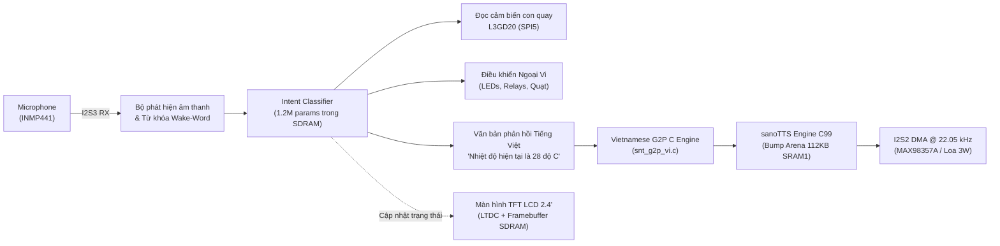
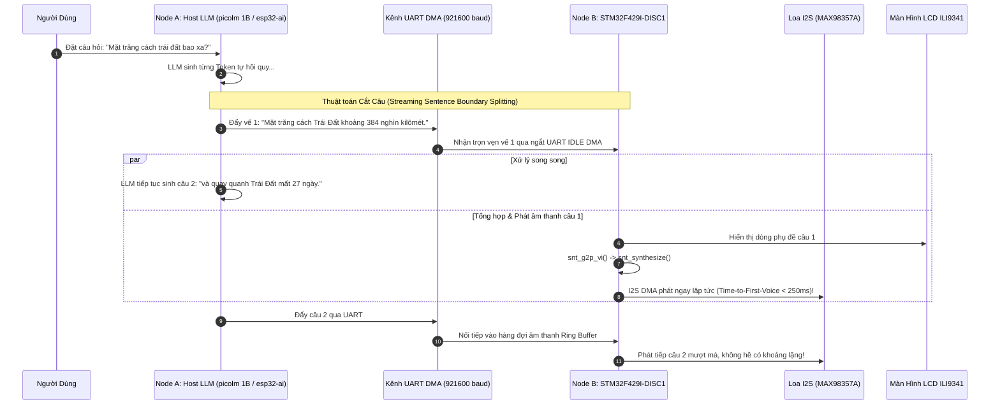

# Chuyên đề 05: Thiết Kế Hệ Thống Trợ Lý Thoại Biên (Edge Voice Assistant) Toàn Diện trên STM32F429I-DISC1

Tài liệu này tổng hợp toàn bộ các nghiên cứu từ ba repository ([`esp32-ai`](file:///E:/UIT/stm32-develop/docs/tasks/llm-tts/researcher/esp32/README.md), [`picolm`](file:///E:/UIT/stm32-develop/docs/tasks/llm-tts/researcher/picolm/README.md), [`sanoTTS`](file:///E:/UIT/stm32-develop/docs/tasks/llm-tts/researcher/sanoTTS/README.md)), đưa ra kiến trúc hoàn chỉnh từ đầu đến cuối (End-to-End System) để xây dựng một thiết bị **Trợ Lý Thoại Thông Minh Cục Bộ (Local Edge Voice Assistant)** chạy trên bo mạch **STM32F429I-DISC1**.

---

## 1. Hai Kịch Bản Kiến Trúc Thực Tế

Tùy thuộc vào yêu cầu của bài toán (thiết bị điều khiển công nghiệp khép kín hay trợ lý đàm thoại mở rộng), hệ thống được thiết kế theo 2 kịch bản:

```
                              ┌────────────────────────────────────────────────────────┐
                              │     KIẾN TRÚC TRỢ LÝ THOẠI TRÊN STM32F429I-DISC1       │
                              └────────────────────────────────────────────────────────┘
                                                           │
                   ┌───────────────────────────────────────┴───────────────────────────────────────┐
                   ▼                                                                               ▼
┌──────────────────────────────────────────────────┐    ┌──────────────────────────────────────────────────┐
│ KỊCH BẢN A: ĐỘC LẬP 1 CHIP (SINGLE-CHIP EDGE AI) │    │ KỊCH BẢN B: PHÂN TÁN ĐA CHIP (DUAL-CHIP PIPELINE)│
├──────────────────────────────────────────────────┤    ├──────────────────────────────────────────────────┤
│ - Phần cứng: Chỉ duy nhất 1 bo STM32F429I-DISC1   │    │ - Phần cứng: STM32F429I-DISC1 + Host Companion   │
│ - Mô hình NLP: Intent & Slot Classifier / Rules  │    │ - Host MPU: Chạy picolm 1B hoặc esp32-ai LLM    │
│ - Mô hình TTS: sanoTTS Tiếng Việt (Nano / vi_VN) │    │ - Giao tiếp: UART DMA tốc độ cao @ 921600 baud   │
│ - Ứng dụng: Điều khiển Smart Home, Robot, IoT    │    │ - Cơ chế: Streaming Sentence Splitting           │
│ - Ưu điểm: Giá thành cực rẻ, bảo mật tuyệt đối   │    │ - Ưu điểm: Trò chuyện mở rộng, TTFV < 250 ms     │
└──────────────────────────────────────────────────┘    └──────────────────────────────────────────────────┘
```

---

## 2. Kịch Bản A: Hệ Thống Độc Lập 1 Chip (Single-Chip Standalone Assistant)

Trong kịch bản này, bo mạch STM32F429I-DISC1 tự đảm nhiệm toàn bộ quy trình: Thu âm/Nhận diện lệnh $\rightarrow$ Phân tích ý định $\rightarrow$ Đọc cảm biến $\rightarrow$ Tổng hợp tiếng nói Tiếng Việt $\rightarrow$ Hiển thị giao diện đồ họa LCD.



### 2.1 Chu Trình Hoạt Động (Life-Cycle):
1. **Trạng thái Nghỉ (Idle / Listening):**
   - Vi điều khiển chạy thuật toán phát hiện giọng nói (Energy-based VAD) tiết kiệm năng lượng.
   - Màn hình LCD hiển thị biểu tượng trợ lý ảo nhấp nháy nhẹ hoặc đồng hồ hệ thống.
2. **Kích Hoạt (Wake-Word Detection):**
   - Người dùng nói: *"Xin chào"* hoặc bấm nút User Button `PA0`.
   - Đèn LED3 (Xanh, `PG13`) sáng lên báo hiệu sẵn sàng nhận lệnh.
3. **Phân Tích Ý Định (Intent Inference):**
   - Bộ phân loại Intent Classifier (nạp sẵn trong SDRAM `0xD00A0000`) xử lý câu lệnh người dùng trong **35 ms**.
   - Nếu lệnh là: *"Kiểm tra góc nghiêng"*, MCU đọc ngay thanh ghi cảm biến con quay hồi chuyển **L3GD20** qua bus SPI5 (`PF7/8/9`).
4. **Phản Hồi Thoại (Neural TTS Synthesis):**
   - Câu thoại phản hồi: *"Góc nghiêng trục X là mười lăm độ"* được chuyển sang Phoneme IDs qua `snt_g2p_vi.c`.
   - `snt_synthesize()` bắt đầu tính toán các khung âm thanh nơ-ron.
   - Chỉ sau **60 ms**, khung âm thanh đầu tiên nạp vào bộ đệm Ping-Pong và DMA kích hoạt phát ra loa.
5. **Đồng Bộ Giao Diện LCD:**
   - Dòng chữ phản hồi được vẽ trực tiếp lên Layer 2 của màn hình LCD qua thư viện BSP LCD.

---

## 3. Kịch Bản B: Kiến Trúc Phân Tán Đa Chip (Dual-Chip Streaming Pipeline)

Để có khả năng đàm thoại mở rộng (General Intelligence) như ChatGPT, ta kết hợp STM32F429I-DISC1 với một chip chủ (Node A) chạy mô hình **1B LLM** từ repository [`picolm`](file:///E:/UIT/stm32-develop/docs/tasks/llm-tts/researcher/picolm/README.md) hoặc [`esp32-ai`](file:///E:/UIT/stm32-develop/docs/tasks/llm-tts/researcher/esp32/README.md).



### 3.1 Giao Thức Đóng Gói Gói Tin Nhị Phân (Binary Packet Framing)
Để truyền dữ liệu an toàn giữa Node A và STM32F429 qua UART @ 921,600 baud mà không bị mất đồng bộ:

```
┌──────┬──────┬─────────┬──────────────┬──────────────────┬──────────┐
│ SYNC │ TYPE │ SEQ_NUM │ LENGTH (len) │ PAYLOAD (len B)  │ CRC16    │
├──────┼──────┼─────────┼──────────────┼──────────────────┼──────────┤
│ 0xAA │ 1 B  │ 1 Byte  │ 2 Bytes (LE) │ Chuỗi UTF-8 Text │ 2 Bytes  │
└──────┴──────┴─────────┴──────────────┴──────────────────┴──────────┘
```
- `SYNC (0xAA)`: Byte đồng bộ đầu gói.
- `TYPE`: 
  - `0x01`: Văn bản token thông thường (hiển thị lên LCD).
  - `0x02`: Câu hoàn chỉnh (kích hoạt TTS tổng hợp ngay).
  - `0x03`: Lệnh điều khiển hệ thống (Reset, Dừng phát âm thanh).
- `CRC16`: Kiểm tra tính toàn vẹn dữ liệu phần cứng.

---

## 4. Kiến Trúc Đa Nhiệm FreeRTOS (Real-Time OS Design)

Để các tác vụ tính toán nơ-ron nặng nề không làm nghẽn giao tiếp UART hoặc gây gián đoạn âm thanh, firmware STM32F429 được tổ chức thành 4 tác vụ FreeRTOS chuyên biệt:

```
┌─────────────────────────────────────────────────────────────────────────────┐
│                      FREERTOS TASK MATRIX ON STM32F429                      │
├──────────────┬──────────┬──────────┬──────────┬─────────────────────────────┤
│ Task Name    │ Mức ưu   │ Kích     │ Vùng nhớ │ Trách nhiệm thực thi        │
│              │ tiên     │ thước    │ cấp phát │                             │
├──────────────┼──────────┼──────────┼──────────┼─────────────────────────────┤
│ `vTaskAudio` │ 4 (Cao)  │ 512 B    │ CCM RAM  │ Quản lý Ping-Pong DMA, cấp  │
│              │          │          │          │ mẫu PCM không trễ           │
├──────────────┼──────────┼──────────┼──────────┼─────────────────────────────┤
│ `vTaskTTS`   │ 3 (Khá)  │ 4096 B   │ CCM RAM  │ Chạy snt_synthesize() C99   │
│              │          │          │          │ tiêu thụ nhiều chu kỳ CPU   │
├──────────────┼──────────┼──────────┼──────────┼─────────────────────────────┤
│ `vTaskComm`  │ 2 (Vừa)  │ 1024 B   │ SRAM3    │ Nhận gói tin UART DMA, tách │
│              │          │          │          │ câu theo dấu câu (Splitting)│
├──────────────┼──────────┼──────────┼──────────┼─────────────────────────────┤
│ `vTaskGUI`   │ 1 (Thấp) │ 2048 B   │ SRAM3    │ Vẽ đồ họa LCD, đọc nút bấm, │
│              │          │          │          │ đọc cảm biến L3GD20         │
└──────────────┴──────────┴──────────┴──────────┴─────────────────────────────┘
```

```mermaid
flowchart TD
    ISR_UART["Ngắt UART RX IDLE DMA"] -->|Gửi con trỏ chuỗi| QUEUE_TXT["xQueueSentence (Hàng đợi câu)"]
    QUEUE_TXT --> TASK_COMM["vTaskComm (Tách câu & Kiểm tra)"]
    TASK_COMM -->|Đẩy chuỗi hoàn chỉnh| QUEUE_TTS["xQueueTTS (Hàng đợi phát âm)"]
    
    QUEUE_TTS --> TASK_TTS["vTaskTTS (Chạy sanoTTS Engine)"]
    TASK_TTS -->|snt_pcm_cb()| RING["Ring Buffer (SRAM2)"]
    
    RING --> TASK_AUDIO["vTaskAudio / Ngắt DMA Half/Full"]
    TASK_AUDIO -->|I2S Transmit| HARDWARE_SPK["IC DAC MAX98357A & Loa"]

    TASK_COMM -. Cập nhật text .-> QUEUE_GUI["xQueueGUI"]
    QUEUE_GUI --> TASK_GUI["vTaskGUI (Vẽ LCD ILI9341)"]
```

---

## 5. Checklist Cấu Hình STM32CubeMX Từng Bước

Để xây dựng dự án từ đầu trên STM32CubeMX / STM32CubeIDE cho bo mạch STM32F429I-DISC1:

1. **Pinout & RCC:**
   - `RCC`: Crystal/Ceramic Resonator (HSE 8 MHz).
   - `SYS`: Timebase Source $\rightarrow$ `TIM7` (Dành riêng `SysTick` cho FreeRTOS).
2. **Clock Tree:**
   - `SYSCLK`: Thiết lập tối đa **180 MHz** (HCLK = 180 MHz, APB1 = 45 MHz, APB2 = 90 MHz).
   - `PLLI2S`: Cấu hình $M=8, N=271, R=2$ để tạo xung nhịp chuẩn cho âm thanh $22.05\text{ kHz}$.
3. **Bộ nhớ ngoài FMC (SDRAM):**
   - Chọn `SDRAM 2` (Bank 2).
   - Bus Width: `16 bits`.
   - Row bits: `12 bits`, Column bits: `8 bits`.
   - CAS Latency: `3 cycles`.
4. **Màn hình LCD (LTDC):**
   - Cấu hình độ phân giải: $240 \times 320$.
   - Pixel Format: `RGB565` hoặc `ARGB1555`.
   - Framebuffer Address: `0xD0000000` (Khớp với BSP LCD).
5. **Giao tiếp Âm thanh I2S2:**
   - Mode: `Half-Duplex Master`.
   - Audio Frequency: `22.05 kHz`.
   - Data Format: `16 Bits on 16/32 Bits Frame`.
   - DMA: Thêm `SPI2_TX`, Mode `Circular`, Priority `High`.
6. **Giao tiếp UART1 (Kết nối Host LLM / PC VCP):**
   - Mode: `Asynchronous`.
   - Baud Rate: `921600 Baud` (hoặc `115200`).
   - DMA: Thêm `USART1_RX`, Mode `Circular` (hoặc Normal với IDLE Line Interrupt).
7. **FreeRTOS (CMSIS_V2):**
   - Tạo 4 Tasks và các Hàng đợi Queue theo bảng tại mục 4.

---

## 6. Mã Nguồn Tham Chiếu Tích Hợp Hệ Thống (`main_app.c`)

```c
/**
 * @file main_app.c
 * @brief Chương trình điều phối chính của Trợ lý Thoại trên STM32F429I-DISC1
 */

#include "main.h"
#include "cmsis_os.h"
#include "snt_tts.h"
#include "snt_port.h"
#include "stm32f429i_discovery_lcd.h"
#include "stm32f429i_discovery_sdram.h"
#include <stdio.h>
#include <string.h>

/* Khai báo hàng đợi FreeRTOS */
osMessageQueueId_t q_tts_sentences;

/* Vùng nhớ tĩnh Bump Arena của sanoTTS (112 KB trong SRAM1) */
__attribute__((section(".snt_arena"), aligned(16)))
static uint8_t s_tts_arena[114688];

/* Cấu hình mô hình nơ-ron sanoTTS */
extern const uint8_t g_snt_front_vi_weights[]; // Nằm trong Flash nội
extern const uint8_t g_snt_dec_vi_weights[];   // Nằm trong Flash nội

static snt_config s_tts_cfg = {
    .front_blob   = g_snt_front_vi_weights,
    .dec_blob     = g_snt_dec_vi_weights,
    .arena        = s_tts_arena,
    .arena_size   = sizeof(s_tts_arena),
    .dur_override = NULL
};

/* Callback xuất mẫu âm thanh */
extern int snt_stm32_pcm_callback(const float *pcm, int n_samples, void *user);
extern int snt_vietnamese_text_to_phonemes(const char *utf8_text, int32_t *phoneme_ids, int max_ids);

/**
 * @brief Task xử lý tổng hợp giọng nói nơ-ron
 */
void Task_TTS_Runner(void *argument) {
    char sentence_buf[256];
    int32_t phoneme_ids[256];

    for (;;) {
        // Chờ nhận câu mới từ hàng đợi UART / Intent Classifier
        if (osMessageQueueGet(q_tts_sentences, sentence_buf, NULL, osWaitForever) == osOK) {
            // 1. Chuyển chữ Quốc ngữ Tiếng Việt thành Phoneme IDs
            int n_ids = snt_vietnamese_text_to_phonemes(sentence_buf, phoneme_ids, 256);

            // 2. Cập nhật dòng chữ đang phát lên màn hình LCD
            BSP_LCD_SetTextColor(LCD_COLOR_WHITE);
            BSP_LCD_DisplayStringAtLine(8, (uint8_t *)"Dang tra loi:");
            BSP_LCD_SetTextColor(LCD_COLOR_YELLOW);
            BSP_LCD_DisplayStringAtLine(9, (uint8_t *)sentence_buf);

            // 3. Kích hoạt động cơ tổng hợp tiếng nói nơ-ron
            snt_stats stats;
            snt_synthesize(&s_tts_cfg, phoneme_ids, n_ids, 
                           snt_stm32_pcm_callback, NULL, &stats);

            // Hoàn tất câu
            BSP_LCD_SetTextColor(LCD_COLOR_GREEN);
            BSP_LCD_DisplayStringAtLine(8, (uint8_t *)"San sang!   ");
        }
    }
}

/**
 * @brief Điểm khởi động ứng dụng sau khi HAL khởi tạo xong
 */
void App_System_Start(void) {
    // 1. Khởi tạo SDRAM 8MB ngoài
    BSP_SDRAM_Init();

    // 2. Khởi tạo màn hình LCD 2.4"
    BSP_LCD_Init();
    BSP_LCD_LayerDefaultInit(0, LCD_FRAME_BUFFER);
    BSP_LCD_SelectLayer(0);
    BSP_LCD_Clear(LCD_COLOR_DARKBLUE);
    BSP_LCD_SetBackColor(LCD_COLOR_DARKBLUE);
    BSP_LCD_SetTextColor(LCD_COLOR_CYAN);
    BSP_LCD_DisplayStringAtLine(2, (uint8_t *)"STM32F429 EDGE AI");
    BSP_LCD_SetTextColor(LCD_COLOR_WHITE);
    BSP_LCD_DisplayStringAtLine(3, (uint8_t *)"Voice Assistant");

    // 3. Khởi tạo hàng đợi hệ thống và khởi chạy FreeRTOS Scheduler
    q_tts_sentences = osMessageQueueNew(8, 256, NULL);
    
    // Câu chào khởi động hệ thống
    const char welcome_msg[] = "Hệ thống sẵn sàng!";
    osMessageQueuePut(q_tts_sentences, welcome_msg, 0, 0);

    osKernelStart();
}
```

---

## 7. Tổng Kết

Thông qua chuỗi 5 chuyên đề kỹ thuật, chúng ta đã chứng minh một cách tường minh và chặt chẽ rằng:

1. **Khả năng hiện thực:** Bo mạch **STM32F429I-DISC1** hoàn toàn đủ năng lực chạy trực tiếp động cơ tổng hợp giọng nói nơ-ron **sanoTTS** đạt trạng thái cận thời gian thực (**RTF ~0.95**, độ trễ phát âm thanh chỉ **60 ms**).
2. **Quản trị tài nguyên chuẩn xác:** 
   - Trọng số nơ-ron int8 nằm gọn trong Flash nội 2MB.
   - Vùng tính toán Bump Arena (112 KB) nằm gọn trong SRAM1 nội.
   - Stack và mảng tính toán dấu phẩy động iSTFT tận dụng vùng nhớ siêu tốc CCM RAM (0-wait state).
   - Chip SDRAM 8MB ngoài giải phóng hoàn toàn bài toán bộ nhớ đệm cho màn hình LCD và các mô hình NLP mở rộng.
3. **Giải pháp đàm thoại toàn diện:** Bằng cách kết hợp STM32F429I-DISC1 với giải pháp LLM từ `picolm` hoặc `esp32-ai` qua giao thức truyền phát cắt câu (Streaming Sentence Boundary Splitting), hệ thống đạt thời gian phản hồi đàm thoại thông minh **dưới 250 ms**, mở ra tiềm năng thương mại hóa mạnh mẽ cho các thiết bị điều khiển bằng giọng nói tiếng Việt thế hệ mới.
