# Báo Cáo Chiến Lược: Triển Khai LLM & Neural TTS trên Bo Mạch STM32F429I-DISC1

Tài liệu này tổng hợp toàn bộ phân tích kỹ thuật, đối sánh kiến trúc và lộ trình chuyển giao công nghệ từ ba repository nghiên cứu ([`esp32-ai`](file:///E:/UIT/stm32-develop/docs/tasks/llm-tts/researcher/esp32/README.md), [`picolm`](file:///E:/UIT/stm32-develop/docs/tasks/llm-tts/researcher/picolm/README.md), [`sanoTTS`](file:///E:/UIT/stm32-develop/docs/tasks/llm-tts/researcher/sanoTTS/README.md)) lên phần cứng thực tế của bo mạch **STM32F429I-DISC1** (Vi điều khiển **STM32F429ZIT6**).

---

## 1. Đặt Vấn Đề & Mục Tiêu Nghiên Cứu

### 1.1 Thách Thức Kỹ Thuật
Đưa trí tuệ nhân tạo tạo sinh (Generative AI) gồm **Mô hình Ngôn ngữ Lớn (LLM)** và **Bộ tổng hợp Giọng nói Nơ-ron (Neural TTS)** xuống hệ nhúng vi điều khiển biên (Edge MCU) là một bài toán khắc nghiệt về tài nguyên:
- **LLM truyền thống:** Cần hàng Gigabyte RAM và băng thông nhớ hàng chục GB/s để giải mã token.
- **Neural TTS truyền thống:** Các mô hình phổ biến (HiFi-GAN, Kokoro, VITS) tiêu tốn 15M – 80M tham số, cần từ 80MB đến 300MB RAM, bất khả thi đối với vi điều khiển.
- **Phần cứng mục tiêu STM32F429ZI:** Là vi điều khiển lõi ARM Cortex-M4 hoạt động ở tần số 180 MHz, sở hữu 2MB Flash nội và 256KB RAM nội.

### 1.2 Bài Học Đột Phá Rút Ra Từ 3 Repository Nghiên Cứu
Qua khảo sát chuyên sâu 3 giải pháp tiên tiến nhất:
1. **Từ `esp32-ai`:** 
   - Kỹ thuật phân tách bộ nhớ và phân cấp Cache (KV-cache paging).
   - Cơ chế Streaming trọng số từ bộ nhớ ngoài (Flash/PSRAM) theo khối (chunk-based offloading) để giải quyết giới hạn RAM.
   - Lượng tử hóa cực hạn (int4, int2, ternary).
2. **Từ `picolm`:**
   - Động cơ suy luận C thuần túy độc lập hoàn toàn, không phụ thuộc thư viện bên ngoài.
   - Kỹ thuật ánh xạ bộ nhớ trực tiếp (`mmap` / direct address mapping) không qua copy đệm.
   - Cơ chế chạy mô hình 1B tham số với chỉ 256MB RAM thông qua truy xuất bộ nhớ tuần tự (Sequential Memory Access).
3. **Từ `sanoTTS`:**
   - **Đột phá nén TTS nơ-ron xuống 294k – 1.57M tham số** (trọng số int8 chỉ nặng 337 KB – 750 KB, vừa vặn trong 2MB Flash nội của STM32F429!).
   - **Thay thế hoàn toàn Neural Vocoder bằng thuật toán iSTFT cổ điển** (IFFT + Overlap-Add), cắt giảm 98% khối lượng tính toán.
   - **Quản lý bộ nhớ Bump Arena tuyến tính:** Không dùng `malloc`, đỉnh tiêu thụ RAM chỉ **98 KB – 128 KB**, hoàn toàn nằm gọn trong 192KB SRAM nội của STM32F429.
   - Hỗ trợ mô hình giọng nói Tiếng Việt (`vi_VN-vais1000-medium`) đã được kiểm chứng.

---

## 2. Hồ Sơ Năng Lực Phần Cứng Bo Mạch STM32F429I-DISC1

Bo mạch **STM32F429I-DISC1** (Mã phần cứng MB1075) là nền tảng đánh giá hoàn hảo với các thông số vật lý then chốt:

```
┌─────────────────────────────────────────────────────────────────────────────┐
│                    STM32F429I-DISC1 HARDWARE SPECS                          │
├──────────────────────┬──────────────────────────────────────────────────────┤
│ Vi điều khiển (MCU)  │ STM32F429ZIT6 (LQFP144)                              │
│ Lõi xử lý & Tần số   │ ARM 32-bit Cortex-M4 CPU with FPU, 180 MHz (225 DMIPS)│
│ Tập lệnh gia tốc     │ DSP Instructions (SMLAD, SMLALD, PKHBT) + FPU Đơn     │
├──────────────────────┼──────────────────────────────────────────────────────┤
│ Flash nội (ROM)      │ 2048 KB (2 MB) với ART Accelerator (0-wait state)    │
│ RAM nội              │ 256 KB Tổng cộng:                                    │
│                      │  - 112 KB SRAM1 (BusMatrix)                          │
│                      │  - 16 KB SRAM2 (BusMatrix)                           │
│                      │  - 64 KB SRAM3 (BusMatrix)                           │
│                      │  - 64 KB CCM RAM (Core Coupled Memory, 0-wait state) │
├──────────────────────┼──────────────────────────────────────────────────────┤
│ RAM Mở Rộng Onboard  │ 64 Mbits (8 MBytes) SDRAM (IS42S16400J) qua bus FMC  │
│                      │ Bus dữ liệu 16-bit, xung nhịp 90 MHz (HCLK/2)         │
│                      │ Ánh xạ địa chỉ cố định: 0xD0000000 - 0xD07FFFFF      │
├──────────────────────┼──────────────────────────────────────────────────────┤
│ Màn hình hiển thị    │ 2.4" QVGA TFT LCD (240x320) điều khiển bởi ILI9341   │
│                      │ Giao tiếp LTDC (RGB565) với Framebuffer trong SDRAM  │
├──────────────────────┼──────────────────────────────────────────────────────┤
│ Cảm biến onboard     │ L3GD20 (ST MEMS 3-axis digital gyroscope qua SPI5)   │
├──────────────────────┼──────────────────────────────────────────────────────┤
│ Âm thanh (Audio)     │ Không có DAC audio chuyên dụng onboard!              │
│                      │  - Phương án A: DAC nội 12-bit (PA4/PA5) + DMA       │
│                      │  - Phương án B: Chân I2S (I2S2/I2S3) ra module ngoài │
├──────────────────────┼──────────────────────────────────────────────────────┤
│ Giao tiếp nạp/debug  │ ST-LINK/V2-B tích hợp USB VCP (Virtual COM Port)      │
│                      │ Nối trực tiếp vào USART1 (PA9/PA10)                  │
└──────────────────────┴──────────────────────────────────────────────────────┘
```

---

## 3. Ma Trận Khả Thi: Các Giải Pháp Công Nghệ trên STM32F429I-DISC1

Dựa trên phân tích vật lý về dung lượng bộ nhớ và năng lực tính toán (~180 MIPS, ~45 MMAC/s cho TTS):

| Hạng mục chức năng | Giải pháp đề xuất | Yêu cầu Flash / RAM | Tính khả thi trên STM32F429 | Đánh giá hiệu năng |
| :--- | :--- | :--- | :--- | :--- |
| **Neural TTS (sanoTTS Nano)** | Chạy trực tiếp trên lõi Cortex-M4 | **Flash:** ~337 KB<br>**RAM:** ~98 KB (SRAM1) | **Khả thi 100% (Native)** | RTF $\approx 0.85 - 1.10$<br>(Near-Real-Time) |
| **Neural TTS (sanoTTS vi_VN)** | Chạy trực tiếp trên lõi Cortex-M4 | **Flash:** ~750 KB<br>**RAM:** ~128 KB (SRAM1) | **Khả thi 100% (Native)** | RTF $\approx 0.95 - 1.25$<br>(Tổng hợp câu 3s trong ~3.2s) |
| **Micro Intent Classifier** | Tiny Transformer / MobileBERT nén | **Flash/SDRAM:** 1 - 2 MB<br>**RAM:** ~500 KB (SDRAM) | **Khả thi 100% (Native)** | Xử lý lệnh trong < 150 ms |
| **Micro LLM / SLM (10M - 20M)** | Mô hình RNN / RWKV-v4 int4 | **SDRAM:** 5 - 7 MB<br>**RAM:** ~1 MB (SDRAM) | **Khả thi (Thử nghiệm)** | Tốc độ: 1.5 – 3.0 tokens/s |
| **1B LLM (`picolm`)** | Chạy toàn bộ trên 1 chip STM32F429 | **Flash/RAM:** Cần > 550 MB | **BẤT KHẢ THI**<br>(Board chỉ có 8MB SDRAM) | Phải dùng mô hình phân tán |
| **Hệ thống Thoại Hoàn Chỉnh** | **Dual-Chip Architecture:**<br>Host LLM + STM32F429 Audio/TTS | **STM32:** Chạy sanoTTS + UI<br>**Host:** Chạy picolm/esp32 | **HOÀN HẢO CHO SẢN PHẨM** | Độ trễ phản hồi thoại < 250ms |

---

## 4. Ba Kiến Trúc Triển Khai Thực Tế

```mermaid
graph TD
    subgraph KienTruc_1["Kiến Trúc 1: Độc Lập 1 Chip (Single-Chip Standalone Edge AI)"]
        MIC1[Micro In] --> VAD1[VAD & KWS]
        VAD1 --> INTENT1[Tiny Intent Classifier / Rules]
        INTENT1 --> TTS1[sanoTTS C99 Engine]
        TTS1 --> DAC1[Internal DAC / I2S DMA]
        DAC1 --> SPK1[Loa]
        INTENT1 -. Trạng thái .-> LCD1[Màn hình TFT LCD ILI9341]
    end

    subgraph KienTruc_2["Kiến Trúc 2: Phân Tán Đa Chip (Dual-Chip Pipeline - Đề Xuất Sản Xuất)"]
        HOST[Node A: Host MPU / ESP32-S3<br>Chạy picolm 1B LLM hoặc esp32-ai]
        HOST -->|UART DMA @ 921600 baud<br>Streaming Token / Cắt Câu| STM[Node B: STM32F429I-DISC1<br>Audio Processor & sanoTTS Engine]
        STM --> G2P[Tiny Vietnamese G2P]
        G2P --> TTS2[sanoTTS Neural Engine]
        TTS2 --> I2S[I2S DMA / MAX98357A]
        I2S --> SPK2[Loa]
        STM --> LCD2[Hiển thị Text / Avatar lên LCD]
    end
```



### Kiến trúc 1: Độc lập 100% trên STM32F429 (Thiết bị Điều khiển Nhà thông minh / Smart Home Hub)
- **Đặc điểm:** Không cần thêm bất kỳ vi xử lý phụ nào.
- **Khả năng:** Nhận diện lệnh giọng nói cục bộ (Offline Keyword Spotting), phân loại ý định điều khiển (bật/tắt đèn, điều hòa, đọc cảm biến con quay hồi chuyển L3GD20), và phát phản hồi bằng giọng nói Tiếng Việt tự nhiên thông qua `sanoTTS`.
- **Hiển thị:** Màn hình LCD 2.4" hiển thị giao diện đồ họa trạng thái, nhiệt độ và phụ đề câu trả lời.

### Kiến trúc 2: Cộng tác Đa chip (Dual-Chip Heterogeneous - Trợ lý Đàm thoại Toàn năng)
- **Đặc điểm:** Kết hợp sức mạnh suy luận của Node A (chạy `picolm` trên chip Linux MPU 256MB RAM hoặc `esp32-ai` trên ESP32-S3) với năng lực xử lý ngoại vi, bộ nhớ FMC và động cơ âm thanh của STM32F429.
- **Kỹ thuật then chốt:** Cơ chế **Streaming Sentence Boundary Splitting** (Cắt câu theo dấu câu). Khi LLM sinh xong vế câu đầu tiên, STM32 lập tức dịch âm vị và phát âm thanh ra loa. Độ trễ từ lúc người dùng dứt lời đến lúc nghe thấy câu trả lời đầu tiên đạt **dưới 250 ms**.

---

## 5. Mục Lục Hệ Thống Tài Liệu Kỹ Thuật

Bộ tài liệu chuyên sâu được cấu trúc thành 5 chuyên đề chi tiết:

1. [**`01-hardware-architecture-and-memory-mapping.md`**](file:///E:/UIT/stm32-develop/docs/tasks/llm-tts/researcher/stm32/01-hardware-architecture-and-memory-mapping.md)  
   *Kiến trúc phần cứng chi tiết của STM32F429ZIT6 & STM32F429I-DISC1. Phân bổ bản đồ bộ nhớ (Flash 2MB, SRAM1/2/3 192KB, CCM RAM 64KB, SDRAM 8MB FMC). Cấu hình FMC điều khiển IS42S16400J và thiết lập Linker Script đa vùng nhớ.*

2. [**`02-on-device-micro-llm-feasibility.md`**](file:///E:/UIT/stm32-develop/docs/tasks/llm-tts/researcher/stm32/02-on-device-micro-llm-feasibility.md)  
   *Phân tích tính khả thi và ranh giới vật lý khi chạy mô hình ngôn ngữ trên Cortex-M4 180MHz. Tận dụng 8MB SDRAM cho KV-cache và weights. Đánh giá throughput và các lớp mô hình SLM / Intent Classifier khả thi.*

3. [**`03-sanotts-neural-tts-implementation.md`**](file:///E:/UIT/stm32-develop/docs/tasks/llm-tts/researcher/stm32/03-sanotts-neural-tts-implementation.md)  
   *Triển khai chi tiết động cơ sanoTTS trên STM32F429. Hiện thực cổng phần cứng `snt_port_stm32.c` với tập lệnh DSP `__SMLAD`. Tối ưu iSTFT bằng CMSIS-DSP `arm_cfft_f32`. Bộ chuyển đổi âm vị Tiếng Việt C thuần (`snt_g2p_vi.c`).*

4. [**`04-audio-io-and-peripherals-subsystem.md`**](file:///E:/UIT/stm32-develop/docs/tasks/llm-tts/researcher/stm32/04-audio-io-and-peripherals-subsystem.md)  
   *Thiết kế hệ thống xuất nhập âm thanh Audio I/O trên STM32F429I-DISC1. Cấu hình I2S DMA ra module giải mã ngoài (MAX98357A / PCM5102A) và cấu hình DAC nội 12-bit (PA4/PA5) kết hợp Timer TRGO + DMA. Cơ chế Double Buffering (Ping-Pong).*

5. [**`05-end-to-end-voice-assistant-system.md`**](file:///E:/UIT/stm32-develop/docs/tasks/llm-tts/researcher/stm32/05-end-to-end-voice-assistant-system.md)  
   *Thiết kế hệ thống Trợ lý Thoại Nhúng hoàn chỉnh. Giao thức UART DMA tốc độ cao kết nối với host LLM. Quản trị đa nhiệm FreeRTOS (Task Audio, TTS, Comm, GUI). Checklist cấu hình STM32CubeMX và mã nguồn tích hợp `main.c` tham chiếu.*
